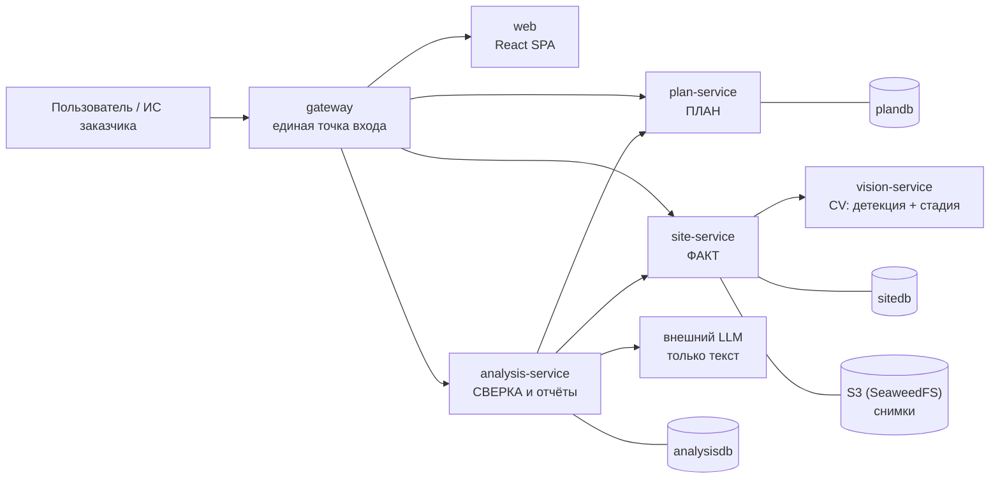

# СтройКонтроль — мониторинг строительной площадки по снимкам камер

> **ЛЦТ 2026, кейс 07.** Система определяет по снимкам камер, какие работы фактически ведутся
> на стройплощадке, сравнивает факт с календарным графиком и выдаёт объяснимые предупреждения
> об отставании, опережении и нарушениях, а также прогноз даты завершения этапов.
>
> Заказчик — Департамент градостроительной политики г. Москвы. Продукт проектируется как
> **модуль, встраиваемый в существующую ИС заказчика**: всё доступно по REST API, всё
> настраивается данными, всё запускается одной командой.

| | |
| :--- | :--- |
| **Вход** | Снимки с камер (JPEG/PNG), календарный график (CSV/XLSX) или тип и параметры объекта для генерации графика по МРР, справочник работ (XLSX) |
| **Выход** | Статус объекта «в графике / отставание N дней / опережение», лента объяснимых отклонений со снимками-доказательствами, Гант план-факт, прогноз завершения, PDF-отчёт |
| **Запуск** | Только Docker: скачать модели и кадры → `docker compose up` → демо-данные → `http://localhost:8080` ([раздел 3](#3-быстрый-старт), Linux и Windows) |
| **Интеграция** | Единая точка входа `http://localhost:8080/api/v1/...`, OpenAPI/Swagger по каждому сервису |

---

## 1. Документация

Начинать чтение здесь — в этом порядке:

| Документ | О чём |
| :--- | :--- |
| [CONTRIBUTING.md](CONTRIBUTING.md) | **Правила разработки:** границы сервисов, куда класть код, стиль, тесты, определение готовности |
| [docs/architecture.md](docs/architecture.md) | Архитектура: сервисы, границы, потоки данных, масштабирование |
| [packages/contracts/interservice.md](packages/contracts/interservice.md) | Контракты между сервисами: весь план, факты за период, распознавание, прогон |
| [docs/methodology.md](docs/methodology.md) | Методика план-факт: участки, статус техники, отклонения D1–D10, прогноз, объяснимость |
| [docs/data-model.md](docs/data-model.md) | Модель данных каждого сервиса: таблицы, поля, индексы |
| [docs/api-guidelines.md](docs/api-guidelines.md) | Единые правила REST API: пути, ошибки, пагинация, версионирование |
| [docs/glossary.md](docs/glossary.md) | Словарь предметной области (этап, участок, сессия, сигнатура, SPI) |
| [docs/code-style.md](docs/code-style.md) | Правила написания кода, комментариев и документации |
| [docs/testing.md](docs/testing.md) | Что и как тестируем |
| [docs/runbook.md](docs/runbook.md) | Запуск, переменные окружения, Windows, диагностика, демо-сценарий |
| [docs/traceability.md](docs/traceability.md) | Матрица «требование ТЗ → сервис → модуль» |
| [docs/metrics.md](docs/metrics.md) | Качество распознавания: тесты на Лиме и на снимках организаторов, скорость |
| [docs/decisions/](docs/decisions/) | ADR — зафиксированные архитектурные решения и их обоснование |
| [docs/documentation.md](docs/documentation.md) · [PDF](docs/documentation.pdf) | **Сопроводительная документация:** модель данных, архитектура кода, ограничения, инструкция по запуску (по разделу 5 ТЗ) |
| [docs/presentation.pdf](docs/presentation.pdf) · [PPTX](docs/presentation.pptx) | **Презентация** по разделу 4 ТЗ: концепция, архитектура, технологии, прототип, связь снимков с графиком, качество и скорость, камеры, развитие |
| [docs/ТЗ ... кейс 07.md](<docs/ТЗ Мониторинг строительной площадки по снимкам камер (ЛЦТ 2026, кейс 07).md>) | Техническое задание: требования ТЗ, методика сопоставления, стек, камеры и масштабирование |
| [docs/official-tz.md](docs/official-tz.md) | Официальный текст ТЗ конкурса (документ-источник из PDF) |
| [docs/official-readme.md](docs/official-readme.md) | README кейса от организаторов: задача, ресурсы, этапы конкурса |
| [data/README.md](data/README.md) | Справочники, материалы организаторов (справочник работ, датасеты, снимки), демо-данные |

## 2. Из чего состоит система

Монорепозиторий: четыре backend-сервиса, gateway и SPA. Каждый сервис — отдельный контейнер,
общаются **только по HTTP REST**, у каждого сервиса с состоянием — **своя база**.



| Сервис | Ответственность в одной фразе | Состояние |
| :--- | :--- | :--- |
| [`gateway`](services/gateway/README.md) | Единая точка входа, маршрутизация, отдача SPA, сводный Swagger | нет |
| [`plan-service`](services/plan-service/README.md) | **План:** объекты, справочник работ, график (импорт или генерация по МРР), этапы, правила «этап → техника» | `plandb` |
| [`site-service`](services/site-service/README.md) | **Факт:** камеры, зоны, снимки, окна наблюдения, детекции, видимость участков — только наблюдения, без оценок | `sitedb` + S3 |
| [`analysis-service`](services/analysis-service/README.md) | **Сверка:** статус техники, отклонения D1–D10, прогресс, SPI, прогноз; PDF-отчёт и LLM-резюме | `analysisdb` + S3 |
| [`vision-service`](services/vision-service/README.md) | Компьютерное зрение: детекция техники, стадия объекта, качество кадра | нет |
| [`apps/web`](apps/web/README.md) | Дашборд, Гант план-факт, лента предупреждений, просмотр камер, редактор правил, отчёты | нет |

Почему границы проведены именно так — [ADR-0002](docs/decisions/0002-service-boundaries.md),
[ADR-0011](docs/decisions/0011-generator-and-reports-as-modules.md),
[ADR-0012](docs/decisions/0012-facts-without-judgement.md). Коротко:
- **План, факт и сверка** — три разные предметные области с разными владельцами данных и разным
  темпом изменений.
- **Распознавание** вынесено отдельно из-за GPU и тяжёлых зависимостей.
- **Генератор графика и отчёты** — модули внутри plan и analysis, а не отдельные сервисы.

## 3. Быстрый старт

Команды ниже поднимают ровно то, что показываем мы: готовые образы из ghcr, дообученный
детектор, 56 демо-кадров, локальную LLM Gemma 4 E4B для резюме отчётов и демо-объект
с графиком, камерами, зонами и отклонениями. Python на машине не нужен: скрипты идут
в контейнере `tools`.

**Что нужно.** git и Docker: на Linux — Docker Engine с плагином compose, на Windows —
Docker Desktop с бэкендом WSL2. Место на диске — около 35 ГБ: образы около 22 ГБ, модели
и кадры около 7 ГБ. Память — от 16 ГБ. Видеокарта NVIDIA не обязательна, но без неё
распознавание и резюме считаются в разы дольше. Для карты на Linux нужны драйвер и
[NVIDIA Container Toolkit](https://docs.nvidia.com/datacenter/cloud-native/container-toolkit/latest/install-guide.html),
на Windows — только свежий драйвер.

### Linux

```bash
git clone https://github.com/cerXXXX/ConstructionSupervision.git
cd ConstructionSupervision
cp .env.example .env
```

Только если есть видеокарта NVIDIA:

```bash
echo "COMPOSE_FILE=docker-compose.yml:docker-compose.gpu.yml" >> .env
```

Модели и демо-кадры, стек, демо-данные:

```bash
docker compose run --rm tools python scripts/fetch_models.py
docker compose pull
docker compose up -d --wait
docker compose run --rm tools python scripts/seed.py
```

### Windows (PowerShell)

```powershell
chcp 65001
git clone https://github.com/cerXXXX/ConstructionSupervision.git
cd ConstructionSupervision
copy .env.example .env
```

Только если есть видеокарта NVIDIA:

```powershell
Add-Content .env "COMPOSE_FILE=docker-compose.yml;docker-compose.gpu.yml"
```

Модели и демо-кадры, стек, демо-данные:

```powershell
docker compose run --rm tools python scripts/fetch_models.py
docker compose pull
docker compose up -d --wait
docker compose run --rm tools python scripts/seed.py
```

`chcp 65001` включает UTF-8 в консоли: без него русский вывод скриптов из контейнера
превращается в кракозябры.

### Что происходит и что открыть

| Шаг | Что делает | Время |
| :--- | :--- | :--- |
| `fetch_models.py` | Веса детектора и стадии, 56 демо-кадров, Gemma 4 E4B (~7 ГБ) с проверкой sha256 | зависит от сети |
| `pull` | Образы сервисов из ghcr и llama.cpp для LLM (~22 ГБ распакованными: vision с CUDA — 12, llama.cpp с CUDA — 7) | зависит от сети |
| `up -d --wait` | Поднимает стек и ждёт, пока все сервисы ответят готовностью | 2–4 мин |
| `seed.py` | Демо-объект, график, правила, кадры, зоны; ждёт распознавания и прогоняет анализ | около минуты |

- Интерфейс — <http://localhost:8080>
- Сводный Swagger по всем сервисам — <http://localhost:8080/docs>
- Веб-интерфейс хранилища SeaweedFS — <http://localhost:23646> (вход — `S3_ACCESS_KEY` /
  `S3_SECRET_KEY` из `.env`)

Проверить, что система нашла ровно заложенные в демо отклонения:

```bash
docker compose run --rm tools python scripts/e2e.py
```

**Если порт 8080 занят**, поставьте в `.env` другой `GATEWAY_PORT` до `up`. **`API_KEY`
не меняйте**: интерфейс в опубликованном образе ходит с ключом из `.env.example`. Для работы
с другой машины (локальная сеть, туннель) достаточно открыть наружу один этот порт.
Остановить стек — `docker compose down`, удалить ещё и данные — `docker compose down -v`.

### Своя LLM вместо Gemma

Резюме отчёта пишет любая модель с OpenAI-совместимым API. В модель уходят только готовые
факты — названия этапов, даты, числа, коды отклонений; ни снимков, ни персональных данных.
Не ответила за `LLM_TIMEOUT_S` — в отчёте шаблонное резюме, это не ошибка. Настройки —
в `.env`, после правки — `docker compose up -d`:

| Вариант | Что поставить в `.env` |
| :--- | :--- |
| Gemma в контейнере (по умолчанию) | ничего менять не нужно |
| Облачный API: OpenAI, OpenRouter, шлюз к GigaChat или YandexGPT | `COMPOSE_PROFILES=`, `LLM_BASE_URL=https://api.openai.com/v1`, `LLM_MODEL=gpt-4o-mini`, `LLM_API_KEY=<ключ>` |
| Свой сервер на этой машине: Ollama, LM Studio, llama.cpp | `COMPOSE_PROFILES=`, `LLM_BASE_URL=http://host.docker.internal:11434/v1` (порт вашего сервера), `LLM_MODEL=<имя модели>` |
| Без модели | `COMPOSE_PROFILES=`, `LLM_ENABLED=false` |

Пустой `COMPOSE_PROFILES` выключает контейнер с Gemma: он занимает ~3,3 ГБ видеопамяти или
~5 ГБ памяти. Тогда `fetch_models.py` можно запускать с `--skip llm`, и Gemma не скачается.
Кто и как написал резюме, видно в отчёте и в поле `summary_generated_by` API.

**Сборка из исходников** вместо готовых образов — `docker compose up -d --build` вместо
`pull` и `up`. Образ vision-service с CUDA собирается около 30 минут. Подробности,
разработка и эквиваленты команд `make` для PowerShell — [docs/runbook.md](docs/runbook.md).

## 4. Карта репозитория

```text
ConstructionSupervision/
├── CONTRIBUTING.md        # правила разработки
├── README.md              # этот файл
├── Makefile               # все команды проекта
├── docker-compose.yml     # запуск всего стека
├── docker-compose.dev.yml # оверлей для разработки: hot-reload, проброс портов
├── .env.example           # шаблон конфигурации
│
├── services/              # backend-сервисы, по одному контейнеру на каталог
├── apps/web/              # React SPA
├── packages/              # общее между сервисами
│   ├── contracts/         #   межсервисные контракты, классы техники, enum-ы, события
│   ├── py-common/         #   инфраструктурная python-библиотека (логи, ошибки, http)
│   └── ts-api-client/     #   TS-клиент, генерируется из OpenAPI
├── docs/                  # проектная документация, ADR, метрики
├── data/                  # справочники, демо-данные, веса моделей
├── ml/                    # офлайн-обучение моделей и метрики (не сервис)
├── scripts/               # seed, демо, e2e, генерация контрактов
└── tools/                 # конфигурация линтеров и CI
```

Все сервисы устроены одинаково, по образцу `plan-service`: «чужой сервис читается как свой»
([CONTRIBUTING.md](CONTRIBUTING.md), раздел 3).

## 5. Ключевые свойства продукта

1. **Объяснимость.** Каждое предупреждение содержит правило, числа, на которых оно построено,
   и снимки с рамками. `GET /api/v1/analysis/deviations/{id}/explain` возвращает полную
   выкладку — это ответ на главный критерий оценки.
2. **Настройка данными, а не кодом.** Новый класс техники, новая камера, новый тип объекта,
   новое правило «этап → техника» — это записи в файлах и таблицах, а не правки в коде.
   Подробно — [«Как система расширяется»](docs/architecture.md#9-как-система-расширяется-без-переделки-кода).
3. **Нормативная обоснованность.** Черновой график строится по МРР-3.2.81 (последняя редакция).
   Каждое число генератора сопровождается ссылкой на пункт и таблицу документа.
4. **Честность к неопределённости.** Участок, которого не видно, помечается «вне контроля ИИ —
   проверить вручную», а не додумывается. LLM пишет только текст поверх готовых чисел и
   не имеет права придумывать факты.
5. **Готовность к интеграции.** Никакого общего состояния между сервисами, синхронные вызовы
   изолированы клиентами с таймаутами, все переходы состояний названы как доменные события —
   перевод на брокер сообщений не требует переписывания логики.

## 6. Ограничения

Что система на 28.09 не умеет или умеет с оговоркой. Подробности — по ссылкам.

**Распознавание.**
- На снимках организаторов детектор находит каждую седьмую машину (83 из 600 при рабочем
  пороге), буровые установки не распознаёт вовсе ([docs/metrics.md](docs/metrics.md), §2).
  Дообучение на открытых наборах приостановлено: наборов с буровыми и гусеничными кранами
  под подходящей лицензией нет ([ml/README.md](ml/README.md)).
- Демо построено на датасете Лимы: одна стройка, лето, день. Часть демо-кадров из обучающих
  серий, поэтому демо показывает работу системы, а качество распознавания — только тест.
- Дообученные веса и демо-кадры раздаются ассетами релиза `demo-data-v1`, их скачивает
  `fetch_models.py`. Детектор один — `ce-ulima-v1`, на нём проверен сценарий демо (`e2e.py`).
- Качество классификатора стадии не измерено; процента готовности по снимку (F13) нет.

**Методика и интерфейс** ([docs/traceability.md](docs/traceability.md)).
- На демо-данных проверены отклонения D1–D4 и D10; D5–D9 — только unit-тестами.
- Импорт графика из файла и выбор папки со снимками диалогом браузера через интерфейс не
  проверялись: они работают через API. Загрузка техники по дням есть только в PDF-отчёте.
- Плановая стадия на дату берётся от активного этапа с наибольшим порядковым номером, и
  параллельный этап может дать ложное D7 ([docs/methodology.md](docs/methodology.md), раздел 14).
- Зоны рассчитаны на неподвижные камеры: снимки одной папки-камеры должны быть сделаны с
  одной точки.
- LLM-резюме пишет локальная Gemma 4 E4B (контейнер `llm`) или любая OpenAI-совместимая модель
  из `.env` (раздел 3). Текст с числом или ссылкой, которых нет в фактах, отбрасывается, и
  резюме становится шаблонным.

**Эксплуатация.**
- Контейнеры сервисов получают весь `.env`, включая пароли чужих баз (runbook, раздел 9).
- Интерфейс ходит в API с ключом `dev-key-change-me`, вшитым при сборке: другой `API_KEY`
  в `.env` закрывает API и для интерфейса.
- Смена весов детектора не пересчитывает уже распознанные снимки: новые веса действуют на новые
  снимки, старые распознаются заново через `POST /api/v1/site/images/reanalyze`.
- Резервного копирования одной командой нет; дамп баз — вручную (runbook, раздел 8).
- Сводный Swagger (`/docs`) грузит Swagger UI с CDN и без интернета не откроется.
