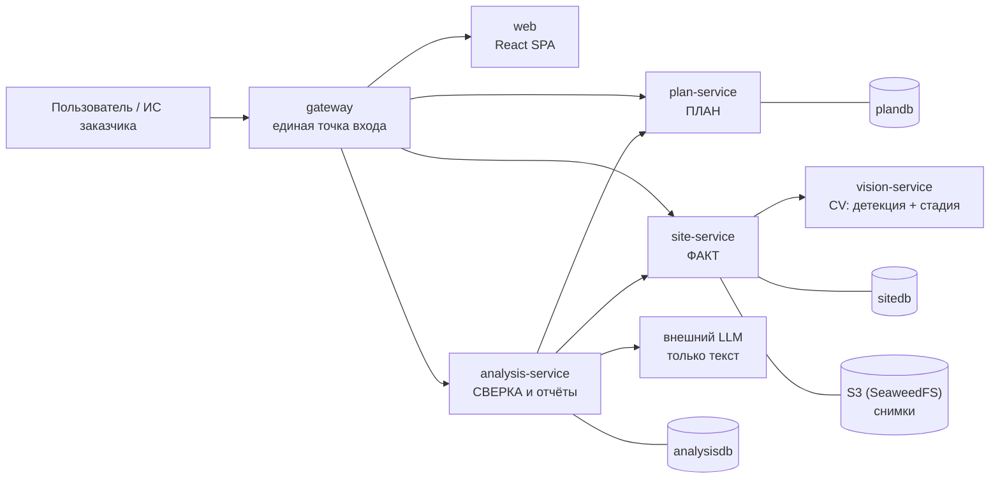

# СтройКонтроль — мониторинг строительной площадки по снимкам камер

> **ЛЦТ 2026, кейс 07.** Система определяет по снимкам камер, какие работы фактически ведутся
> на стройплощадке, сравнивает факт с календарным графиком и выдаёт объяснимые предупреждения
> об отставании, опережении и нарушениях, а также прогноз даты завершения этапов.
>
> Заказчик — Департамент градостроительной политики г. Москвы. Продукт проектируется как
> **модуль, встраиваемый в существующую ИС заказчика**: всё доступно по REST API, всё
> настраивается данными, всё запускается одной командой.

| | |
| :--- | :--- |
| **Вход** | Снимки с камер (JPEG/PNG), календарный график (CSV/XLSX) или тип и параметры объекта для генерации графика по МРР, справочник работ (XLSX) |
| **Выход** | Статус объекта «в графике / отставание N дней / опережение», лента объяснимых отклонений со снимками-доказательствами, Гант план-факт, прогноз завершения, PDF-отчёт |
| **Запуск** | `docker compose up -d` (или `make up`) → `make seed` → `http://localhost:8080` |
| **Интеграция** | Единая точка входа `http://localhost:8080/api/v1/...`, OpenAPI/Swagger по каждому сервису |

---

## 1. Документация

Начинать чтение здесь — в этом порядке:

| Документ | О чём |
| :--- | :--- |
| [AGENTS.md](AGENTS.md) | **Свод правил для всех, кто пишет код** (людей и агентов). Обязателен к прочтению перед первой строкой кода |
| [docs/board.md](docs/board.md) | **Порядок работ:** задачи по порядку, статусы, протокол «начинай / продолжай» для агента |
| [docs/architecture.md](docs/architecture.md) | Архитектура: сервисы, границы, потоки данных, масштабирование |
| [packages/contracts/interservice.md](packages/contracts/interservice.md) | Контракты между сервисами: весь план, факты за период, распознавание, прогон |
| [docs/methodology.md](docs/methodology.md) | Методика план-факт: участки, статус техники, отклонения D1–D10, прогноз, объяснимость |
| [docs/data-model.md](docs/data-model.md) | Модель данных каждого сервиса: таблицы, поля, индексы |
| [docs/api-guidelines.md](docs/api-guidelines.md) | Единые правила REST API: пути, ошибки, пагинация, версионирование |
| [docs/glossary.md](docs/glossary.md) | Словарь предметной области (этап, участок, сессия, сигнатура, SPI) |
| [docs/code-style.md](docs/code-style.md) | Правила написания кода, комментариев и документации |
| [docs/testing.md](docs/testing.md) | Что и как тестируем |
| [docs/runbook.md](docs/runbook.md) | Запуск, переменные окружения, Windows, диагностика, демо-сценарий |
| [docs/roadmap.md](docs/roadmap.md) | Рубежи до 29.09, риски, что режем при нехватке времени |
| [docs/traceability.md](docs/traceability.md) | Матрица «требование ТЗ → сервис → модуль» |
| [docs/decisions/](docs/decisions/) | ADR — зафиксированные архитектурные решения и их обоснование |
| [docs/ТЗ ... кейс 07.md](<docs/ТЗ Мониторинг строительной площадки по снимкам камер (ЛЦТ 2026, кейс 07).md>) | Исходное ТЗ и разбор требований заказчика |
| [docs/official-readme.md](docs/official-readme.md) | README кейса от организаторов: задача, ресурсы, этапы конкурса |
| [data/README.md](data/README.md) | Справочники, материалы организаторов (справочник работ, датасеты, снимки), демо-данные |

## 2. Из чего состоит система

Монорепозиторий: четыре backend-сервиса, gateway и SPA. Каждый сервис — отдельный контейнер,
общаются **только по HTTP REST**, у каждого сервиса с состоянием — **своя база**.



| Сервис | Ответственность в одной фразе | Состояние |
| :--- | :--- | :--- |
| [`gateway`](services/gateway/README.md) | Единая точка входа, маршрутизация, отдача SPA, сводный Swagger | нет |
| [`plan-service`](services/plan-service/README.md) | **План:** объекты, справочник работ, график (импорт или генерация по МРР), этапы, правила «этап → техника» | `plandb` |
| [`site-service`](services/site-service/README.md) | **Факт:** камеры, зоны, снимки, окна наблюдения, детекции, видимость участков — только наблюдения, без оценок | `sitedb` + S3 |
| [`analysis-service`](services/analysis-service/README.md) | **Сверка:** статус техники, отклонения D1–D10, прогресс, SPI, прогноз; PDF-отчёт и LLM-резюме | `analysisdb` + S3 |
| [`vision-service`](services/vision-service/README.md) | Компьютерное зрение: детекция техники, стадия объекта, качество кадра | нет |
| [`apps/web`](apps/web/README.md) | Дашборд, Гант план-факт, лента предупреждений, просмотр камер, редактор правил, отчёты | нет |

Почему границы проведены именно так — [ADR-0002](docs/decisions/0002-service-boundaries.md),
[ADR-0011](docs/decisions/0011-generator-and-reports-as-modules.md),
[ADR-0012](docs/decisions/0012-facts-without-judgement.md). Коротко:
- **План, факт и сверка** — три разные предметные области с разными владельцами данных и разным
  темпом изменений.
- **Распознавание** вынесено отдельно из-за GPU и тяжёлых зависимостей.
- **Генератор графика и отчёты** — модули внутри plan и analysis, а не отдельные сервисы.

## 3. Быстрый старт

```bash
cp .env.example .env          # секреты и адреса сервисов
make models                   # скачать веса моделей в data/models
docker compose up -d --build  # поднять весь стек (то же, что make up)
make seed                     # демо-объект, график, камеры, зоны, снимки, анализ
make health                   # проверить, что все сервисы живы
make e2e                      # лента демо-объекта совпадает со сценарием
```

Для демо нужны ещё две вещи, которых нет в git: дообученные веса детектора и кадры датасета
Лимы для демо-хронологии. Полный порядок с нуля, для Windows и GPU — [docs/runbook.md](docs/runbook.md),
раздел 2; эквиваленты команд `make` для PowerShell — там же, раздел 3.

Открыть:

- UI — <http://localhost:8080>
- Сводный Swagger по всем сервисам — <http://localhost:8080/docs>
- Веб-интерфейс хранилища SeaweedFS — <http://localhost:23646>

## 4. Карта репозитория

```text
ConstructionSupervision/
├── AGENTS.md              # правила для разработчиков и агентов (читать первым)
├── README.md              # этот файл
├── Makefile               # все команды проекта
├── docker-compose.yml     # запуск всего стека
├── docker-compose.dev.yml # оверлей для разработки: hot-reload, проброс портов
├── .env.example           # шаблон конфигурации
│
├── services/              # backend-сервисы, по одному контейнеру на каталог
├── apps/web/              # React SPA
├── packages/              # общее между сервисами
│   ├── contracts/         #   межсервисные контракты, классы техники, enum-ы, события
│   ├── py-common/         #   инфраструктурная python-библиотека (логи, ошибки, http)
│   └── ts-api-client/     #   TS-клиент, генерируется из OpenAPI
├── docs/                  # проектная документация, ADR, порядок работ
├── data/                  # справочники, демо-данные, веса моделей
├── ml/                    # офлайн-обучение моделей и метрики (не сервис)
├── scripts/               # seed, демо, e2e, генерация контрактов
└── tools/                 # конфигурация линтеров и CI
```

Что уже сделано и что делать дальше — [docs/board.md](docs/board.md). Остальные сервисы строятся
по образцу `plan-service`: «чужой сервис читается как свой» — правило из [AGENTS.md](AGENTS.md).

## 5. Ключевые свойства продукта

1. **Объяснимость.** Каждое предупреждение содержит правило, числа, на которых оно построено,
   и снимки с рамками. `GET /api/v1/analysis/deviations/{id}/explain` возвращает полную
   выкладку — это ответ на главный критерий оценки.
2. **Настройка данными, а не кодом.** Новый класс техники, новая камера, новый тип объекта,
   новое правило «этап → техника» — это записи в файлах и таблицах, а не правки в коде.
   Подробно — [«Как система расширяется»](docs/architecture.md#9-как-система-расширяется-без-переделки-кода).
3. **Нормативная обоснованность.** Черновой график строится по МРР-3.2.81 (последняя редакция).
   Каждое число генератора сопровождается ссылкой на пункт и таблицу документа.
4. **Честность к неопределённости.** Участок, которого не видно, помечается «вне контроля ИИ —
   проверить вручную», а не додумывается. LLM пишет только текст поверх готовых чисел и
   не имеет права придумывать факты.
5. **Готовность к интеграции.** Никакого общего состояния между сервисами, синхронные вызовы
   изолированы клиентами с таймаутами, все переходы состояний названы как доменные события —
   перевод на брокер сообщений не требует переписывания логики.

## 6. Ограничения

Что система на 27.09 не умеет или умеет с оговоркой. Подробности — по ссылкам.

**Распознавание.**
- На снимках организаторов детектор находит каждую седьмую машину (83 из 600 при рабочем
  пороге), буровые установки не распознаёт вовсе ([docs/metrics.md](docs/metrics.md), §2).
  Дообучение на открытых наборах приостановлено: наборов с буровыми и гусеничными кранами
  под подходящей лицензией нет ([docs/board.md](docs/board.md), T42).
- Демо построено на датасете Лимы: одна стройка, лето, день. Часть демо-кадров из обучающих
  серий, поэтому демо показывает работу системы, а качество распознавания — только тест.
- Дообученные веса и демо-кадры не раздаются скриптами: веса переносятся со стенда, кадры
  собираются из датасета ([docs/runbook.md](docs/runbook.md), раздел 2). Сценарий демо
  проверен на весах `ulima-v3`; с `ce-ulima-v1` в нём появляется лишний простой крана.
- Качество классификатора стадии не измерено; процента готовности по снимку (F13) нет.

**Методика и интерфейс** ([docs/traceability.md](docs/traceability.md)).
- На демо-данных проверены отклонения D1–D4 и D10; D5–D9 — только unit-тестами.
- Нет экранов загрузки снимков, импорта и генерации графика — это делается через API.
  Загрузка техники по дням есть только в PDF-отчёте.
- Плановая стадия на дату берётся от активного этапа с наибольшим порядковым номером, и
  параллельный этап может дать ложное D7 (board.md, раздел 9).
- Зоны рассчитаны на неподвижные камеры: снимки одной папки-камеры должны быть сделаны с
  одной точки.
- LLM-резюме пишет локальная Gemma 4 E4B. Текст с числом или ссылкой, которых нет в фактах,
  отбрасывается, и резюме становится шаблонным.

**Эксплуатация.**
- Контейнеры сервисов получают весь `.env`, включая пароли чужих баз (runbook, раздел 9).
- `scripts/backup.py` не реализован; дамп баз — вручную (runbook, раздел 8).
- Сводный Swagger (`/docs`) грузит Swagger UI с CDN и без интернета не откроется.
