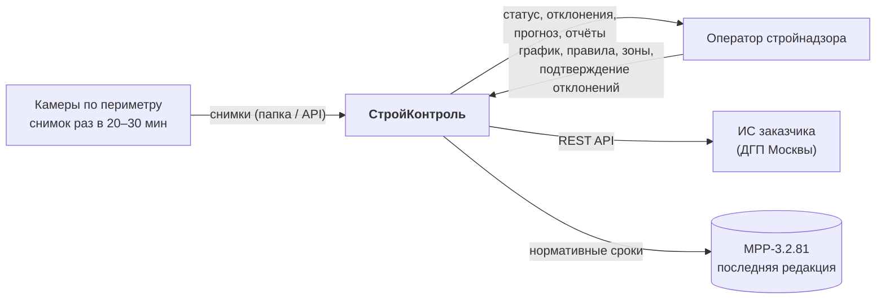
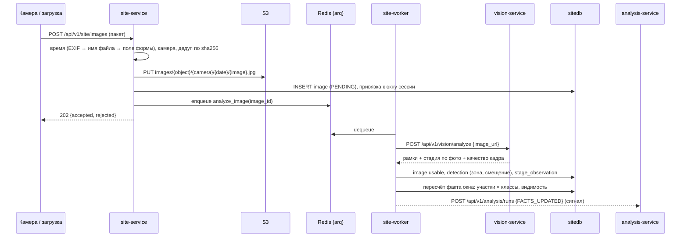
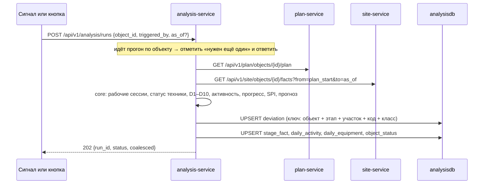
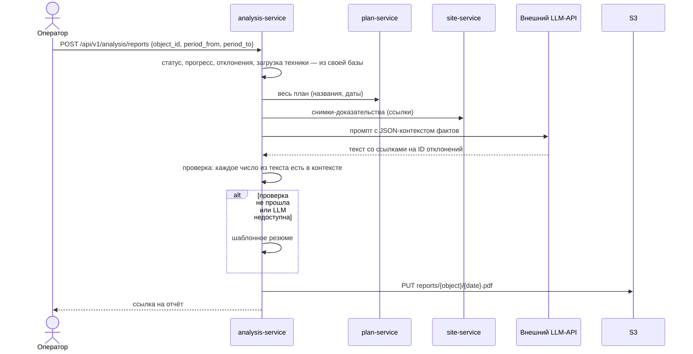

# Архитектура системы

Документ описывает, из чего состоит система, почему она разделена именно так, как части
взаимодействуют и как система расширяется. Модель данных вынесена в [data-model.md](data-model.md),
контракты между сервисами — в [packages/contracts/interservice.md](../packages/contracts/interservice.md),
общие правила API — в [api-guidelines.md](api-guidelines.md), методика расчётов — в
[methodology.md](methodology.md).

---

## 1. Контекст



Система отвечает на один вопрос: **идёт ли объект по графику, и если нет — почему и насколько**.
Всё остальное — способ обосновать этот ответ.

## 2. Принципы

| Принцип | Как выражается в коде |
| :--- | :--- |
| **План, факт и сверка — разные области** | Три сервиса с тремя базами и тремя владельцами данных |
| **Факт без оценок** | site-service описывает, что видно. Работает ли техника, рабочее ли время, есть ли отклонение — решает только analysis-service ([ADR-0012](decisions/0012-facts-without-judgement.md)) |
| **Настройка данными, а не кодом** | Классы техники — файл, правила «этап → техника» и пороги — таблицы, зоны — полигоны. Код при их изменении не меняется |
| **Объяснимость важнее точности** | У каждого отклонения сохранены исходные числа (`facts`) и снимки-доказательства (`evidence`) |
| **Тяжёлое отделено от быстрого** | Распознавание — отдельный сервис без состояния, масштабируется репликами и живёт на GPU |
| **Чистое ядро** | Правила и формулы — чистые функции в `core/`, тестируются без БД и сети |
| **Простота вместо запаса прочности** | Нет брокера, service mesh и Kubernetes. Генератор графика и отчёты — модули, а не сервисы ([ADR-0011](decisions/0011-generator-and-reports-as-modules.md)) |
| **Честность к неизвестному** | Невидимый участок помечается «вне контроля ИИ» и никогда не считается пустым |

## 3. Состав системы

### 3.1. Прикладные сервисы

| Сервис | Роль | Стек | Состояние | Масштабирование |
| :--- | :--- | :--- | :--- | :--- |
| `gateway` | Единая точка входа: маршрутизация по префиксу, отдача SPA, `X-Request-Id`, сводный Swagger | nginx | нет | реплики |
| `plan-service` | **План.** Объекты, справочник работ, календарный график (импорт или генерация по МРР), этапы, правила «этап → техника», рабочий календарь, классы техники из файла | FastAPI | `plandb` | реплики |
| `site-service` | **Факт.** Камеры, зоны, снимки, сессии, детекции, видимость участков, факты сессий. API и воркер из одного образа | FastAPI + arq-воркер | `sitedb`, S3, Redis | реплики API + N воркеров |
| `analysis-service` | **Сверка.** Рабочее время, статус техники, отклонения D1–D10, прогресс, SPI, прогноз, статус объекта. Отчёт PDF и LLM-резюме | FastAPI + WeasyPrint | `analysisdb`, S3 | реплики |
| `vision-service` | Распознавание: детекция техники, стадия объекта по фото, качество кадра | FastAPI + Ultralytics + OpenCLIP | нет | реплики; на демо-стенде — GPU |
| `web` | SPA: дашборд, Гант план-факт, лента предупреждений, камеры, загрузка, редактор правил, отчёты | React + Vite | нет | статика в образе gateway |

В compose девять контейнеров: шесть прикладных процессов (`gateway`, `plan-service`,
`site-service`, `site-worker`, `analysis-service`, `vision-service`) и три
инфраструктурных.

### 3.2. Инфраструктура

| Компонент | Назначение | Замена в проде заказчика |
| :--- | :--- | :--- |
| PostgreSQL 16 | Три независимые базы: `plandb`, `sitedb`, `analysisdb` | Три инстанса или управляемый кластер |
| SeaweedFS | S3-совместимое хранилище: оригиналы снимков и готовые отчёты ([ADR-0016](decisions/0016-seaweedfs-instead-of-minio.md)) | Любой S3 |
| Redis 7 | Очередь задач воркера site-service (arq) | Redis или брокер заказчика |
| Ollama (профиль `llm`) | Локальная LLM для закрытого контура; по умолчанию не поднимается | Остаётся как есть |

**LLM внешняя.** По умолчанию `analysis-service` обращается к внешнему API
(`LLM_PROVIDER=openai_compatible`), и видеопамять демо-стенда целиком отдана распознаванию.
Наружу уходят только структурированные факты: названия этапов, даты, числа, коды отклонений.
Снимки и персональные данные не уходят. Профиль `llm` с локальной моделью включается одной
переменной окружения: для заказчика, которому нельзя выходить за периметр, это ответ без
переписывания кода ([ADR-0008](decisions/0008-llm-narrative-only.md)).

**Целевой стенд:** ноутбук Ryzen 5 5600H, 32 ГБ, RTX 3060 Laptop 6 ГБ, Windows 10 и
Docker Desktop на WSL2. Видеокарту использует только `vision-service`.

### 3.3. Порты

Внутри сети Docker **все FastAPI-сервисы слушают порт 8000**. Наружу порты проброшены
только для отладки, продуктовый трафик идёт через `gateway`.

| Сервис | Порт на хосте | Внутренний адрес |
| :--- | :--- | :--- |
| gateway | 8080 | `http://gateway:80` |
| plan-service | 8001 | `http://plan-service:8000` |
| site-service | 8002 | `http://site-service:8000` |
| analysis-service | 8003 | `http://analysis-service:8000` |
| vision-service | 8004 | `http://vision-service:8000` |
| web (dev, Vite) | 5173 | — |
| postgres | 5432 | `postgres:5432` |
| s3 (SeaweedFS) | 8333 / 23646 (веб-интерфейс) | `s3:8333` |
| redis | 6379 | `redis:6379` |
| ollama | 11434 | `ollama:11434` |

## 4. Почему именно такие границы

Разделение проведено по **владению данными и темпу изменений**, а не по техническим слоям.

- **`plan-service` — «как должно быть».** Данные редактирует человек, они меняются редко.
  Здесь же генератор графика по МРР: он лишь один из способов получить план, наравне с
  импортом из файла.
- **`site-service` — «что видно».** Данные поступают потоком и не правятся вручную, а их объём
  растёт линейно с числом камер. Здесь живёт вся работа с изображениями. Сервис не знает
  про график и поэтому ничего не оценивает: он говорит «экскаватор в котловане, с прошлой
  сессии не сдвигался», но не говорит «простой».
- **`analysis-service` — «совпадает ли одно с другим и что из этого следует».** Первичными
  данными не владеет вообще: план и факт читает по API, оба одним запросом, и производит
  выводы. Здесь же отчёты, потому что они оформляют выводы этого сервиса. Состояние целиком
  пересчитывается с нуля, поэтому методику можно править даже во время демо.
- **`vision-service` — «знание без данных».** Функция «картинка → факты о картинке» с
  тяжёлыми зависимостями (torch, CUDA). Вынесена, чтобы её можно было масштабировать,
  заменить и отлаживать отдельно, а падение распознавания не роняло остальную систему.

Главное следствие: **методика, за которую нас оценивают, сосредоточена в `analysis-service`,
а не размазана по системе.** Её можно показать, объяснить и протестировать без единого
снимка — на фикстурах двух контрактов. Обоснование и альтернативы —
[ADR-0002](decisions/0002-service-boundaries.md), [ADR-0011](decisions/0011-generator-and-reports-as-modules.md),
[ADR-0012](decisions/0012-facts-without-judgement.md).

## 5. Потоки данных

### 5.1. Объект и график

```mermaid
sequenceDiagram
    actor U as Оператор
    participant GW as gateway
    participant PL as plan-service
    participant DB as plandb
    participant AN as analysis-service

    U->>GW: POST /api/v1/plan/objects {name, object_type, plan_start, tep}
    GW->>PL: то же
    PL->>DB: INSERT object
    alt график из файла
        U->>PL: POST /api/v1/plan/objects/{id}/plan/import (CSV/XLSX)
        PL->>PL: core: проверка дат и связей, критический путь
    else генерация по нормативам
        U->>PL: POST /api/v1/plan/objects/{id}/plan/generate {tep, start_date}
        PL->>PL: core: МРР → этапы → даты по календарю → критический путь → правила из шаблона
    end
    PL->>DB: INSERT stage, stage_rule; plan_version + 1
    PL-->>AN: POST /api/v1/analysis/runs {PLAN_CHANGED} (сигнал)
    PL-->>U: план объекта
```

Генерация — это способ быстро получить правдоподобный черновик графика по МРР, к которому
можно привязывать снимки. Дальше оператор правит даты и правила в интерфейсе. Повторная
генерация без `force=true` ручные правки не затирает.

### 5.2. Снимок → факт



- **Снимок без времени не участвует в план-факте.** Он сохраняется со статусом `NEEDS_TIME`
  и ждёт, пока пользователь укажет время. Это требование ТЗ, а не ошибка.
- **Факт окна пересчитывается после каждого обработанного снимка.** Таймера закрытия сессии
  нет. Неполное окно безопасно: участок без пригодного кадра считается невидимым, а не пустым.

### 5.3. Сверка план-факт



- **Прогон идемпотентен.** Повтор на тех же данных не создаёт дублей, а обновляет
  `last_seen_at` и `occurrences`.
- **Отклонения не удаляются.** Отклонение, условие которого перестало выполняться,
  переводится в `RESOLVED`, а не удаляется: лента должна быть историей, а не срезом.
  Исключение — отклонение, которого по пересчитанным фактам и правилам не было вовсе, без
  вердикта оператора: оно удаляется (methodology.md, раздел 9, правило 2). История хранит
  то, что было, а не промежуточные выводы по неполному окну.
- **Прогон считает на момент `as_of`.** По умолчанию это конец последней сессии с фактами,
  поэтому импорт прошлых дней и живой поток обрабатываются одинаково.

### 5.4. Отчёт и резюме



### 5.5. Правка настроек и пересчёт (F11)

Правка дат плана, правил или зон не требует перезапуска и повторного распознавания.

| Что изменилось | Что пересчитывается | Стоимость |
| :--- | :--- | :--- |
| Даты этапов, правила «этап → техника», календарь | plan-service шлёт сигнал, analysis-service делает прогон | секунды |
| Полигоны зон | site-service: задача `reapply_zones` заново относит детекции к зонам и пересчитывает факты окон, затем сигнал и прогон | секунды–минуты |
| Пороги отклонений | только analysis-service: `PATCH /deviation-rules`, затем прогон | секунды |
| Модель распознавания или её порог | site-service: `POST /site/images/reanalyze` — снимки объекта возвращаются в `PENDING` и распознаются заново обычной задачей `analyze_image` | минуты |

Именно этот сценарий показывается жюри: «меняем правило в интерфейсе — вывод меняется
у нас на глазах».

## 6. Правила взаимодействия сервисов

1. **Только HTTP, только синхронно, только через объявленный контракт.** Общих БД, файлов и
   очередей между сервисами нет. Очередь Redis — внутренняя деталь `site-service`. Файлы
   `packages/contracts/*.yaml` — справочные данные, а не канал обмена: они монтируются
   только для чтения.
2. **Граф вызовов:**
   - `web → gateway → {plan, site, analysis}` — всё, что делает пользователь;
   - `site-worker → vision` — распознавание снимка;
   - `analysis → plan` (весь план) и `analysis → site` (факты за период, снимки для отчёта —
     interservice.md, контракт 6);
   - `analysis → LLM` — только текст резюме;
   - **сигналы** `site-worker → analysis` и `plan → analysis` — `POST /analysis/runs`.
     Сигнал не несёт данных, схлопывается и может потеряться без вреда.

   `vision` не вызывает никого. `plan` не вызывает `site`, `site` не вызывает `plan`.
3. **Межсервисные ссылки — только по ID.** `sitedb.image.object_id` — это UUID из `plandb`
   без внешнего ключа. Источник истины — сервис-владелец.
4. **Клиенты изолированы.** Все вызовы наружу идут через `src/clients/*_client.py`: один класс
   на сервис, таймауты, ретраи, перевод чужих ошибок в свои доменные.
5. **Таймауты и ретраи:**

   | Вызов | Таймаут | Ретраи |
   | :--- | :--- | :--- |
   | `site-worker → vision-service` | 30 с | 2, экспоненциальная пауза (задача идемпотентна) |
   | `analysis-service → plan / site` | 10 с | 2, только GET |
   | сигнал `→ analysis-service` | 2 с | 0, ошибка только в лог |
   | `analysis-service → LLM` | `LLM_TIMEOUT_S` (30 с) | 0, сразу шаблонное резюме |

   Ретраи допустимы **только для идемпотентных операций**. Недоступность зависимости — это
   `503` с понятным `code`, а не тихая заглушка с пустыми данными.
6. **Деградация вместо падения:**
   - LLM недоступна — шаблонный текст.
   - `vision-service` недоступен — снимки копятся в статусе `PENDING`, воркер разберёт их позже.
   - Для генератора не хватает норм — график импортируется из CSV/XLSX.
   - `plan-service` или `site-service` недоступен — прогон завершается `FAILED`, прежние
     выводы остаются на экране.
7. **Доменные события названы уже сейчас** ([packages/contracts/events.md](../packages/contracts/events.md)),
   хотя реализованы прямыми вызовами. Переход на брокер — это замена реализации `clients/`
   без правки логики.

## 7. Хранилища данных

### 7.1. PostgreSQL: база на сервис

Один контейнер PostgreSQL, **три базы и три роли**: `plandb/plan_user`, `sitedb/site_user`,
`analysisdb/analysis_user`. Роль имеет права только на свою базу, поэтому граница защищена
самой СУБД, а не соглашением. При этом контейнер один — [ADR-0003](decisions/0003-database-per-service.md).

Миграции — Alembic, у каждого сервиса свои. Они применяются на старте контейнера при
`RUN_MIGRATIONS=true`. Полное описание таблиц — [data-model.md](data-model.md).

**PostGIS не используется.** Зоны — это полигоны в системе координат кадра (нормированные 0…1),
а не географические объекты. Они хранятся в `jsonb`, а проверка «точка в полигоне» делается
через `shapely` в памяти ([ADR-0006](decisions/0006-zones-in-image-space.md)).

### 7.2. S3: объектное хранилище

| Бакет | Что | Жизненный цикл |
| :--- | :--- | :--- |
| `images` | Оригиналы снимков: `{object_id}/{camera_id}/{YYYY-MM-DD}/{image_id}.jpg`. Эталонный кадр камеры — один из этих снимков | хранить |
| `reports` | Сформированные отчёты: `{object_id}/{YYYY-MM-DD}T{HHMMSS}-{period}.pdf`, местное время формирования; каждое формирование — свой файл | хранить |

Снимки наружу отдаются **presigned-ссылками** с ограниченным сроком жизни: ни один сервис
не проксирует байты изображений через себя. Для браузера ссылка подписывается на публичный
адрес `S3_PUBLIC_ENDPOINT` (на стенде — `http://localhost:8333`). Для сервисов внутри сети
подпись делается на `S3_ENDPOINT` (`http://s3:8333`). Подпись привязана к адресу, поэтому
ссылка на `s3:8333` в браузере не откроется.

Рамки детекций на снимке рисуются поверх изображения: интерфейс делает это через SVG, отчёт —
в HTML-шаблоне. Отдельные «кадры с рамками» не генерируются и не хранятся.

### 7.3. Redis

Redis хранит только очередь задач `arq` для `site-service`:
- `analyze_image` — распознать снимок и пересчитать факт его окна;
- `reapply_zones` — заново отнести детекции к зонам после правки.

Повторное распознавание отдельной задачи не требует: `POST /site/images/reanalyze` одним
UPDATE возвращает снимки объекта в `PENDING`, и дальше их берёт обычный `analyze_image`.
Так повтор переживает потерю очереди: проход воркера по базе подберёт эти снимки сам.

Источник истины — `image.status` в `sitedb`, а не очередь. Потеря Redis не теряет данные,
а лишь требует перезапуска обработки.

## 8. Сквозные механизмы

| Механизм | Решение |
| :--- | :--- |
| **Аутентификация** | Статический `X-API-Key` на всех `/api/v1/**`, кроме `/health` и `/docs`. Точка расширения — OIDC/SSO ([ADR-0010](decisions/0010-auth.md)) |
| **Трассировка** | `X-Request-Id` создаётся в gateway, пробрасывается во все вызовы, попадает в каждую строку лога и в тело ошибки |
| **Логи** | JSON в stdout: `ts, level, service, request_id, event, duration_ms, …`. Никаких `print` |
| **Конфигурация** | 12-factor: переменные окружения, один `.env` на весь compose, `Settings` на pydantic-settings в каждом сервисе. Справочные файлы монтируются из `packages/contracts` в `CONTRACTS_DIR` |
| **Здоровье** | `/health` — процесс жив; `/health/ready` — БД, S3 и зависимости отвечают. Compose использует `/health/ready` в `depends_on: condition: service_healthy` |
| **Время** | Хранение и обмен — UTC (`timestamptz`), отображение — `Europe/Moscow`. Рабочий календарь (выходные, праздники, рабочие часы) хранится в `plandb` и приходит в контракте «весь план» |
| **Ошибки** | Единый конверт `{"error": {...}}`, стабильные коды, русские сообщения |
| **Документация API** | Swagger каждого сервиса на `/docs`, сводная страница с выбором сервиса — `gateway:/docs` |

## 9. Как система расширяется без переделки кода

Это прямой ответ на критерий оценки «архитектура: новые типы техники, камер и планов без
переделки кода».

| Что добавляем | Что делаем | Нужен ли код |
| :--- | :--- | :--- |
| **Новый класс техники** | Запись в `packages/contracts/equipment_classes.yaml`, перезапуск plan-service и vision-service; при необходимости — дообучение весов | **Нет** |
| **Новая камера** | Импорт папки со снимками (подпапка = код камеры) или `POST /site/cameras`; разметка зон на её кадре | **Нет** |
| **Новый участок** | Зона с новым названием на кадре одной или нескольких камер | **Нет** |
| **Новый тип зоны** | Значение в `zone_type` и его роль в `zone_type_role` (`enums.yaml`) | **Нет** |
| **Новый объект и план** | `POST /plan/objects` + импорт CSV/XLSX или генерация по нормативам | **Нет** |
| **Новый тип объекта** (школа, дорога) | Шаблон этапов в `plan-service/data/wbs_templates.json` и нормы в `mrr_norms.json` | **Нет** |
| **Новое правило «этап → техника»** | Правка в редакторе правил интерфейса | **Нет** |
| **Новый порог отклонения** | Поле `params` в `deviation_rule` через API или интерфейс | **Нет** |
| **Новый тип отклонения из готовых предикатов** | Строка в `deviation_rule` вместе с шаблоном текста | **Нет** |
| **Новый тип отклонения с новой логикой** | Функция-предикат в `analysis-service/src/core/predicates.py` и её регистрация | ~30 строк |
| **Другая модель распознавания** | Переменные окружения `vision-service` (веса, порог, устройство) | **Нет** |
| **Рост нагрузки** | Реплики `vision-service` и `site-worker`; базы — на отдельные инстансы | **Нет** |
| **Второй источник снимков** (поток, FTP, API камеры) | Адаптер, пишущий в `POST /site/images` | Вне системы |

**Что из этого делается руками в MVP.** Камера заводится автоматически при импорте папки со
снимками: подпапка — это код камеры, а первый снимок становится эталонным кадром. Зоны
приходят из `data/seed/cameras.json` ([data/README.md](../data/README.md)); редактор зон в
интерфейсе — улучшение уровня Could. Таблица выше описывает, как продукт расширяется
**в эксплуатации**, а не объём ручной работы на хакатоне.

Мы не утверждаем «код не понадобится никогда». Мы утверждаем, что **всё, что заказчик меняет
в эксплуатации, меняется данными**. Код нужен только для принципиально новой логики, и для
неё есть заранее определённая точка расширения.

## 10. Нефункциональные требования и как они обеспечиваются

Числа производительности ниже — ожидания, а не замеры. Замер делается отдельной задачей
в [board.md](board.md). До него в документах пишем «не измерено».

| Требование ТЗ | Как обеспечивается |
| :--- | :--- |
| ≤ 100 мс на снимок на GPU | Основной режим: YOLO-World размера `s` на RTX 3060 Laptop. Если не укладывается — меньший вход (`VISION_DET_IMGSZ`) |
| ≤ 1–2 с на снимок на CPU | Запасной режим той же сборки: `VISION_DEVICE=cpu`, вход 960. Open-vocabulary детектор на CPU может не уложиться — это замеряется и честно фиксируется |
| Предупреждение не позднее одной сессии (30 мин) | Факт окна пересчитывается после каждого снимка, сигнал сразу запускает прогон, прогон занимает секунды |
| Запуск одной командой | `docker compose up -d` (`make up` — обёртка; на Windows без bash `make` не работает, см. [runbook.md](runbook.md)) |
| Конфигурация классов, правил и зон — в данных | Раздел 9 |
| Масштабируемость | Сервисы без состояния и реплики; состояние только в БД и S3 |

## 11. Что осознанно не делается

Чтобы архитектура оставалась простой, отказы зафиксированы явно:

- **Нет брокера сообщений** (Kafka, RabbitMQ). Один продюсер и один потребитель на поток,
  синхронный REST и очередь задач покрывают задачу. События уже названы — [ADR-0004](decisions/0004-sync-rest-and-queue.md).
- **Нет отдельных сервисов для графика и отчётов.** Это модули plan и analysis —
  [ADR-0011](decisions/0011-generator-and-reports-as-modules.md).
- **Нет ПОС.** Подбор марок машин по КСР, буфер ОАТИ по 299-ПП, окна тишины по закону № 42:
  заказчик назвал ПОС ненужным. Генератор строит только график по МРР.
- **Нет Kubernetes и service mesh.** Сдача — `docker compose`, заказчику отдаётся набор образов
  и манифест.
- **Нет отдельного сервиса аутентификации.** Используется API-ключ, точка расширения описана.
- **Нет трекинга конкретных машин и видео.** ТЗ прямо выводит это за границы. Поэтому нет и
  геометрической связи камер ([ADR-0013](decisions/0013-zones-and-areas.md)).
- **Нет микро-фронтендов, GraphQL, CQRS, event sourcing.** Задача этого не требует, а
  сложность стоит дороже, чем даёт.
- **Нет общей доменной библиотеки.** `packages/py-common` содержит только инфраструктуру
  (логи, ошибки, health, HTTP-клиент). Доменная логика в общей библиотеке превратила бы
  систему в распределённый монолит.

## 12. Дальнейшее развитие (для питча)

Порядок, в котором продукт достраивается после хакатона, без переделки архитектуры:

1. **Поток вместо пакетов.** Адаптер RTSP → кадры → `POST /site/images`. Ядро не меняется.
2. **Брокер.** Прямые вызовы заменяются публикацией событий из `contracts/events.md`.
3. **Мультиарендность.** `tenant_id` в трёх базах и в API-ключе, изоляция на уровне строк.
4. **SSO Москвы.** Проверка API-ключа заменяется на OIDC в gateway.
5. **Обучение на обратной связи.** Вердикты «подтверждено / ложное» в ленте становятся
   выборкой для калибровки порогов и дообучения модели.
6. **Калибровка камер.** Гомография в план площадки даст точную дедупликацию машин между
   камерами и трекинг, если он понадобится заказчику.
7. **Обмен с ИСУП.** Экспорт план-факта в форматы заказчика — отдельный адаптер поверх API.
