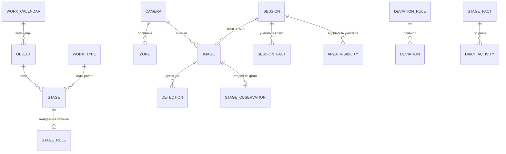

# Модель данных

Три независимые базы PostgreSQL 16 — по одной на сервис с состоянием. Между базами **нет
внешних ключей и нет запросов**: связь только по UUID через API сервиса-владельца. То, что
сервисы передают друг другу, описано в
[packages/contracts/interservice.md](../packages/contracts/interservice.md).

Общие соглашения для всех таблиц:

- **Ключи.** Первичный ключ — `id uuid` (`gen_random_uuid()`), кроме справочников с
  естественным кодом.
- **Отметки времени.** `created_at timestamptz not null default now()` есть везде;
  `updated_at` — там, где строка может меняться.
- **Время и даты.** Все моменты времени — `timestamptz` в UTC. Даты плана — `date` без
  времени, это календарь.
- **Перечисления** хранятся как `text` + `CHECK`, а не как postgres enum. Значения берутся из
  [enums.yaml](../packages/contracts/enums.yaml). Списки в `CHECK` — единственное допустимое
  дублирование перечислений в коде.
- **Слабоструктурированные данные** хранятся в `jsonb`: полигоны, правила, факты отклонений.
- **Поля `*_id`, указывающие на другой сервис**, помечены «внешняя ссылка».
- **Классы техники не хранятся в базах.** Их единственный источник —
  [equipment_classes.yaml](../packages/contracts/equipment_classes.yaml)
  ([ADR-0014](decisions/0014-equipment-classes-file.md)). В таблицах лежит только код класса.
- **Участок — не таблица, а ключ.** Это строка `ТИП:Название`, например `PIT:Котлован`, по
  всем зонам объекта с одинаковыми типом и названием ([ADR-0013](decisions/0013-zones-and-areas.md)).
  Для детекций вне всех зон используется ключ `OUTSIDE`.

---

## 1. `plandb` — сервис плана

### 1.1. `object` — объект строительства

| Поле | Тип | Описание |
| :--- | :--- | :--- |
| `id` | uuid PK | |
| `name` | text | Наименование объекта |
| `object_type` | text | `RESIDENTIAL_MONOLITH` / `RESIDENTIAL_PANEL` / `PUBLIC_BUILDING` / `ROAD` |
| `address` | text | Адрес площадки |
| `tep` | jsonb | Параметры для генератора графика: этажность, площадь, число секций, число свай, сменность |
| `plan_start` | date | Плановая дата начала СМР |
| `calendar_id` | uuid FK | Рабочий календарь |
| `status` | text | `DRAFT` / `ACTIVE` / `ARCHIVED` |
| `plan_version` | int | Растёт при любой правке этапов, правил или календаря объекта. Попадает в прогон анализа |

Индексы: `(status)`, `(object_type)`.

### 1.2. `work_type` — справочник строительных работ

Загружается парсером XLSX «Сводный перечень строительных работ ЛТЦ»
(`data/reference/`, устройство файла — [data/README.md](../data/README.md)). Парсер:
- восстанавливает коды, испорченные Excel: дата `d.m.2025` → код `d.m` (19 кодов:
  `10.1`…`10.12`, `12.1`…`12.7`), число `12` → `12`, точка в конце кода отбрасывается;
- относит строки без кода к 4-му уровню ближайшего кода сверху;
- читает отметку обязательности `˅` по девяти столбцам типов объектов; пустая ячейка —
  «не обязательно».

| Поле | Тип | Описание |
| :--- | :--- | :--- |
| `code` | text PK | `10.1`, `12.3.5`, `12.4.28` |
| `name` | text | Наименование работы |
| `level` | int | 1…4 |
| `parent_code` | text | Код родителя |
| `applicable` | jsonb | Отметки обязательности по столбцам исходного файла: `{"Жильё": true, "Дороги": false, …}` — девять ключей |
| `source` | text | Файл, лист и номер строки — чтобы любую строку можно было проверить |

### 1.3. `work_calendar` — рабочий календарь

| Поле | Тип | Описание |
| :--- | :--- | :--- |
| `id` | uuid PK | |
| `code` | text unique | `moscow-6day`; на него ссылается `DEFAULT_CALENDAR` |
| `name` | text | «Москва, 6-дневная рабочая неделя» |
| `timezone` | text | `Europe/Moscow`: в нём заданы рабочие часы |
| `weekend_days` | jsonb | Выходные по ISO (понедельник = 1). Для 6-дневки `[7]`, для 5-дневки `[6, 7]` |
| `holidays` | jsonb | Список дат |
| `work_hours` | jsonb | `{"start": "07:00", "end": "23:00"}` — местное время. Сессии вне рабочих часов не порождают отклонений |

### 1.4. `stage` — этап календарного графика

Этап — укрупнённая единица работ графика. Создаётся импортом графика, генератором или вручную.

| Поле | Тип | Описание |
| :--- | :--- | :--- |
| `id` | uuid PK | |
| `object_id` | uuid FK | |
| `code` | text | Код по справочнику (`12.3.1`) или диапазон (`10.4-10.8`) |
| `work_codes` | jsonb | Все коды работ, свёрнутые в этап |
| `name` | text | «Разработка котлована» |
| `phase` | text | `PREPARATORY` / `SUBSTRUCTURE` / `SUPERSTRUCTURE` / `ENVELOPE_ROOF` / `NETWORKS` / `LANDSCAPING` |
| `seq` | int | Порядок в графике |
| `zone_type` | text | Тип участка, где идут работы этапа. Только рабочая роль: `PIT` / `BUILDING_FOOTPRINT` / `PERIMETER` / `ROAD` |
| `visual_stage` | text null | Как объект выглядит на фото во время этапа (`stage_label`). Нужен для D7 и ограничения прогресса |
| `plan_start`, `plan_end` | date | Плановые даты, обе включительно. Правятся в интерфейсе |
| `norm_duration_days` | int | Нормативная длительность в рабочих днях — знаменатель прогресса |
| `predecessors` | jsonb | `[{"stage_id": "...", "type": "FS", "lag_days": 0}]` |
| `is_critical` | bool | Лежит на критическом пути |
| `total_float_days` | int | Полный резерв времени |
| `source` | text | `GENERATED` / `IMPORT` / `MANUAL` |
| `basis` | text null | Откуда длительность: норматив и доля этапа для генератора, «импорт» для файла |
| `completed_on` | date null | Отметка оператора «этап выполнен»: последний день работ, включительно ([ADR-0015](decisions/0015-stage-completion-mark.md)) |
| `completed_by` | text null | Кто поставил отметку (`X-Actor`) |
| `completion_note` | text null | Комментарий к отметке: акт, кто принял |

Индексы: `(object_id, seq)`, `(object_id, plan_start)`. Ограничение: `plan_end >= plan_start`.

### 1.5. `stage_rule` — правило «этап → техника»

Главная настраиваемая сущность методики. Создаётся из шаблона этапа при генерации или
импорте, дальше редактируется оператором. У этапа не больше одного правила.

| Поле | Тип | Описание |
| :--- | :--- | :--- |
| `id` | uuid PK | |
| `stage_id` | uuid FK unique | Этап, к которому относится правило. Где искать технику, определяет `stage.zone_type` |
| `required` | jsonb | Группы обязательной техники: `[{"any_of": ["roller", "bulldozer"], "min": 1}, {"any_of": ["dump_truck"], "min": 1}]` |
| `allowed` | jsonb | `["loader", "concrete_mixer"]` — допустимая техника, не вызывает D3 |
| `signature` | jsonb | `{"equipment": ["excavator", "dump_truck"], "stage_label": null}` — что фиксирует фактический старт этапа |
| `min_sessions` | int | Сколько рабочих сессий подряд должно держаться условие, по умолчанию 2 |
| `version` | int | Растёт при каждой правке |
| `is_active` | bool | |

Коды классов в `required`, `allowed` и `signature` при сохранении проверяются по
`equipment_classes.yaml`. Как правило применяется, описано в [methodology.md](methodology.md),
разделы 5 и 8.

---

## 2. `sitedb` — сервис площадки (факт)

Здесь только наблюдения. Рабочего времени, статусов «работает / простой» и отклонений здесь
нет: их вычисляет analysis-service ([ADR-0012](decisions/0012-facts-without-judgement.md)).

### 2.1. `camera`

| Поле | Тип | Описание |
| :--- | :--- | :--- |
| `id` | uuid PK | |
| `object_id` | uuid | внешняя ссылка на `plandb.object` |
| `code` | text | Короткий код, он же имя папки при пакетной загрузке (`cam-north`) |
| `name` | text | «Северная обзорная» |
| `reference_image_id` | uuid null | Эталонный кадр — один из снимков этой камеры, по умолчанию первый. Без внешнего ключа, чтобы не было цикла `camera` ↔ `image` |
| `install_meta` | jsonb | Высота подвеса, азимут, ИК-подсветка — для рекомендаций по камерам |
| `is_active` | bool | |

Уникальность: `(object_id, code)`.

### 2.2. `zone` — зона на кадре камеры

| Поле | Тип | Описание |
| :--- | :--- | :--- |
| `id` | uuid PK | |
| `object_id` | uuid | внешняя ссылка |
| `camera_id` | uuid FK | Камера, на кадре которой нарисован полигон |
| `zone_type` | text | `PIT` / `BUILDING_FOOTPRINT` / `PERIMETER` / `ROAD` / `ENTRY_GATE` / `STORAGE` / `DANGER`; роль типа — в `enums.yaml: zone_type_role` |
| `name` | text | Название участка. По умолчанию — русское название типа («Котлован»). Одинаковые тип и название на разных камерах означают один участок |
| `polygon` | jsonb | `[[x, y], …]`, координаты **нормированы 0…1** от размера кадра |
| `version` | int | Растёт при правке |
| `is_active` | bool | Зоны не удаляются физически, а деактивируются |

Ключ участка: `zone_type || ':' || name`. `zones_version` объекта — сумма `version` всех его
зон, включая неактивные. Зоны не удаляются, поэтому сумма только растёт.

### 2.3. `image` — снимок

| Поле | Тип | Описание |
| :--- | :--- | :--- |
| `id` | uuid PK | |
| `object_id`, `camera_id` | uuid | |
| `captured_at` | timestamptz null | Время съёмки; источник — в `captured_at_source` |
| `captured_at_source` | text | `EXIF` / `FILENAME` / `MANUAL` / `UNKNOWN` |
| `received_at` | timestamptz | Когда снимок попал в систему |
| `session_id` | uuid FK null | Окно сессии; `null`, пока время неизвестно |
| `storage_key` | text | Ключ в бакете `images` |
| `width`, `height` | int | |
| `checksum` | text | sha256; уникален в паре с `object_id` — защита от повторной загрузки |
| `source` | text | `UPLOAD` / `API` / `FOLDER_IMPORT` |
| `exif` | jsonb | Сырые метаданные |
| `quality` | jsonb | `{"brightness": 0.31, "blur": 0.08}` от vision-service |
| `usable` | bool null | Годен ли кадр по порогам `MIN_BRIGHTNESS` и `MAX_BLUR`; `null` до распознавания |
| `usable_reason` | text null | `DARK` / `BLURRED` / `OCCLUDED` для непригодного кадра |
| `status` | text | `NEEDS_TIME` / `PENDING` / `PROCESSING` / `ANALYZED` / `FAILED` |
| `error` | text null | Причина `FAILED` |

Индексы: `(object_id, captured_at)`, `(session_id)`, `(status)`, уникальный `(object_id, checksum)`.

### 2.4. `session` — окно наблюдения

Окно 30 минут по объекту, выровненное по :00 и :30 UTC. Технику считают по окну, а не по
кадру: одна машина, попавшая в две камеры, иначе была бы посчитана дважды. Статусов у окна
нет: его факт пересчитывается после каждого обработанного снимка.

| Поле | Тип | Описание |
| :--- | :--- | :--- |
| `id` | uuid PK | |
| `object_id` | uuid | |
| `window_start`, `window_end` | timestamptz | Границы окна |
| `image_count`, `camera_count` | int | Сколько снимков и камер в окне |
| `stage_label`, `stage_conf` | text null, real null | Стадия по фото за окно: метка с наибольшей суммой уверенности по пригодным кадрам |
| `stage_scores` | jsonb | Сумма уверенности по всем меткам |
| `updated_at` | timestamptz | Когда факт окна пересчитан последний раз |

Уникальность: `(object_id, window_start)`.

### 2.5. `detection` — детекция

| Поле | Тип | Описание |
| :--- | :--- | :--- |
| `id` | uuid PK | |
| `image_id`, `session_id`, `camera_id` | uuid FK | |
| `equipment_class` | text | Код класса из `equipment_classes.yaml` |
| `bbox` | jsonb | `[x1, y1, x2, y2]`, нормировано 0…1 |
| `conf` | real | Уверенность модели |
| `anchor` | jsonb | `[x, y]` — середина нижней стороны рамки, точка контакта с землёй |
| `zone_id` | uuid FK null | Основная зона: самая маленькая не опасная зона камеры, в которую попал `anchor`; `null` — вне зон |
| `moved` | bool null | Сдвинулась ли единица с прошлого окна той же камеры; `null` — прошлого окна нет |
| `displacement` | real null | Смещение центра рамки в долях диагонали кадра |
| `model_version` | text | Какая модель дала детекцию |

Индексы: `(session_id, equipment_class)`, `(image_id)`, `(zone_id)`. Попадание в опасные зоны
не хранится: оно вычисляется по полигонам при пересчёте факта окна.

### 2.6. `stage_observation` — стадия объекта по снимку

| Поле | Тип | Описание |
| :--- | :--- | :--- |
| `id` | uuid PK | |
| `image_id`, `session_id` | uuid FK | |
| `stage_label` | text | `PIT` / `PILES` / `FOUNDATION` / `FRAME` / `FACADE` / `LANDSCAPING` |
| `conf` | real | |
| `scores` | jsonb | Вероятности по всем меткам — нужны для объяснения |

### 2.7. `area_visibility` — видимость участка в окне

| Поле | Тип | Описание |
| :--- | :--- | :--- |
| `session_id` | uuid FK | |
| `area` | text | Ключ участка `ТИП:Название` |
| `zone_type`, `name` | text | Для показа без разбора ключа |
| `cameras_total` | int | Сколько активных камер размечено на участок |
| `cameras_usable` | int | У скольких из них в окне есть пригодный кадр |
| `status` | text | `OK` — все, `PARTIAL` — часть, `BLIND` — ни одной |
| `reason` | text null | `NO_IMAGES` / `DARK` / `BLURRED` / `OCCLUDED` |

Первичный ключ: `(session_id, area)`. Основание для D10 «вне контроля ИИ».

### 2.8. `session_fact` — факт окна

Материализованный результат, который читает analysis-service через контракт «факты за
период». Пересчитывается после каждого обработанного снимка окна и при правке зон.

| Поле | Тип | Описание |
| :--- | :--- | :--- |
| `session_id` | uuid FK | |
| `area` | text | Ключ участка или `OUTSIDE` |
| `equipment_class` | text | |
| `count` | int | Число единиц: максимум по камерам участка, а не сумма |
| `static` | int null | Сколько из `count` не двигались с прошлого окна; `null` — сравнивать не с чем |
| `evidence` | jsonb | `[{"image_id": "...", "detection_id": "...", "camera": "cam-north", "conf": 0.91}]` |

Первичный ключ: `(session_id, area, equipment_class)`. Строки с `count = 0` не хранятся.

---

## 3. `analysisdb` — сервис сверки

Первичных данных здесь нет: только выводы. Любая строка пересчитывается прогоном с нуля.

### 3.1. `analysis_run` — прогон анализа

| Поле | Тип | Описание |
| :--- | :--- | :--- |
| `id` | uuid PK | |
| `object_id` | uuid | |
| `triggered_by` | text | `FACTS_UPDATED` / `PLAN_CHANGED` / `MANUAL` |
| `as_of` | timestamptz | Момент, на который посчитан анализ |
| `plan_version`, `zones_version` | int | Версии входных данных: прогон воспроизводим |
| `status` | text | `RUNNING` / `DONE` / `FAILED` |
| `rerun_requested` | bool | Во время прогона пришёл ещё сигнал — после окончания нужен ещё один прогон |
| `stats` | jsonb | Сессии, открытые и закрытые отклонения |
| `error` | jsonb null | Код и сообщение для `FAILED` |

### 3.2. `deviation` — отклонение

Центральная сущность продукта: то, что видит пользователь и за что нас оценивают.

| Поле | Тип | Описание |
| :--- | :--- | :--- |
| `id` | uuid PK | |
| `object_id` | uuid | внешняя ссылка |
| `stage_id` | uuid null | внешняя ссылка на этап |
| `area` | text null | Ключ участка |
| `equipment_class` | text null | Класс техники — для отклонений про конкретную технику (D3–D6) |
| `session_id` | uuid null | Последняя сессия, в которой условие выполнялось |
| `code` | text | `D1`…`D10` ([methodology.md](methodology.md), раздел 9) |
| `severity` | text | `INFO` / `LOW` / `MEDIUM` / `HIGH` |
| `title` | text | Короткий заголовок карточки |
| `message` | text | Готовый русский текст из шаблона и `facts` |
| `facts` | jsonb | **Все числа, на которых построен вывод** — основа объяснимости |
| `rule_ref` | jsonb | `{"deviation_rule": "D2", "stage_rule_id": "...", "stage_rule_version": 2}` |
| `evidence` | jsonb | `[{"image_id": "...", "detection_ids": ["..."]}]` |
| `status` | text | `NEW` / `CONFIRMED` / `REJECTED` / `RESOLVED` |
| `verdict` | text null | `CONFIRMED` / `REJECTED`: вердикт оператора. У открытого отклонения совпадает со статусом, у закрытого — хранится при `status = RESOLVED` ([methodology.md](methodology.md), раздел 9, правило 3) |
| `verdict_comment`, `verdict_by`, `verdict_at` | text, text, timestamptz | Вердикт оператора: кто, когда и почему подтвердил или отклонил |
| `first_seen_at`, `last_seen_at` | timestamptz | |
| `occurrences` | int | Сколько рабочих сессий подряд условие выполнялось |

Уникальность открытого отклонения: `(object_id, stage_id, area, code, equipment_class)`
с `NULLS NOT DISTINCT` при `status IN ('NEW', 'CONFIRMED')`. Повторный прогон обновляет строку,
а не плодит дубли.

### 3.3. `deviation_rule` — настройка правил отклонений

При первом старте таблица заполняется из `services/analysis-service/data/deviation_rules.yaml`.
Дальше источник истины — таблица: пороги правятся через API и интерфейс.

| Поле | Тип | Описание |
| :--- | :--- | :--- |
| `code` | text PK | `D1`…`D10` |
| `predicate` | text | Имя предиката из реестра `core/predicates.py` |
| `enabled` | bool | |
| `severity` | text | Базовая серьёзность (может повышаться по параметрам эскалации) |
| `params` | jsonb | Пороги: `{"min_sessions": 2, "escalate_after_days": 1}` |
| `title_template` | text | Шаблон заголовка карточки с подстановкой из `facts` |
| `message_template` | text | Шаблон текста с подстановкой из `facts` |

### 3.4. `stage_fact` — факт по этапу

| Поле | Тип | Описание |
| :--- | :--- | :--- |
| `object_id`, `stage_id` | uuid | Первичный ключ |
| `actual_start` | date null | Первая рабочая сессия с сигнатурой этапа |
| `last_activity_at` | timestamptz null | |
| `effective_days` | real | Сумма индексов активности |
| `progress` | real | 0…1, с учётом ограничения по стадии на фото |
| `planned_progress` | real | 0…1 на момент `as_of` |
| `spi` | real null | `progress / planned_progress` |
| `forecast_end` | date null | Прогнозная дата окончания |
| `delay_days` | int null | `forecast_end − plan_end` в рабочих днях |
| `status` | text | `NOT_STARTED` / `IN_PROGRESS` / `DONE` / `LATE` / `AHEAD` |
| `confidence` | text | `LOW` / `MEDIUM` / `HIGH` |
| `facts` | jsonb | Числа прогноза: средний темп, окно, ограничение прогресса и его причина |

### 3.5. `daily_activity` — активность этапа по дням

| Поле | Тип | Описание |
| :--- | :--- | :--- |
| `object_id` | uuid | |
| `stage_id`, `date` | uuid, date | Первичный ключ |
| `sessions_total` | int | Рабочие сессии дня с видимым участком этапа |
| `sessions_working` | int | Из них — с выполненными группами `required` и работающей техникой |
| `activity_index` | real null | `sessions_working / sessions_total`, 0…1; `null` — участок этапа за день ни разу не был виден: «не знаем», а не ноль |
| `blind_sessions` | int | Сессии, где участок был не виден: не штрафуют индекс, а снижают `confidence` |

### 3.6. `daily_equipment` — загрузка техники по дням

Данные для графика «загрузка техники по времени» (F10) в отчёте и интерфейсе.

| Поле | Тип | Описание |
| :--- | :--- | :--- |
| `object_id`, `date`, `equipment_class` | uuid, date, text | Первичный ключ |
| `sessions_seen` | int | В скольких рабочих сессиях дня класс был на площадке |
| `max_count` | int | Наибольшее число единиц за сессию |

### 3.7. `object_status` — сводный статус объекта

| Поле | Тип | Описание |
| :--- | :--- | :--- |
| `object_id` | uuid PK | |
| `computed_at` | timestamptz | |
| `as_of` | timestamptz | На какой момент посчитан статус |
| `status` | text | `ON_TRACK` / `DELAY` / `AHEAD` / `UNKNOWN` |
| `delay_days` | int null | По критическому пути |
| `spi` | real null | По объекту |
| `confidence` | text | `LOW` / `MEDIUM` / `HIGH` |
| `counters` | jsonb | Отклонения по серьёзности, слепые участки, этапы в работе |
| `stages_at_risk` | jsonb | Этапы критического пути с прогнозом позже плана |

---

## 4. Соответствие модели данных требованиям ТЗ

| Таблица из ТЗ (п. 6) | Где реализована |
| :--- | :--- |
| `object` | `plandb.object` |
| `camera`, `zone` | `sitedb.camera`, `sitedb.zone`; участок — ключ `ТИП:Название` |
| `work_type` | `plandb.work_type` |
| `schedule_item` | `plandb.stage` |
| `equipment_class` | `packages/contracts/equipment_classes.yaml` ([ADR-0014](decisions/0014-equipment-classes-file.md)) |
| `stage_rule` | `plandb.stage_rule` |
| `image`, `session`, `detection`, `stage_observation` | `sitedb`, одноимённые (+ `session_fact`, `area_visibility`) |
| `deviation` | `analysisdb.deviation` (+ `deviation_rule`) |
| `progress_snapshot` | `analysisdb.stage_fact` + `daily_activity` + `daily_equipment` + `object_status` |
