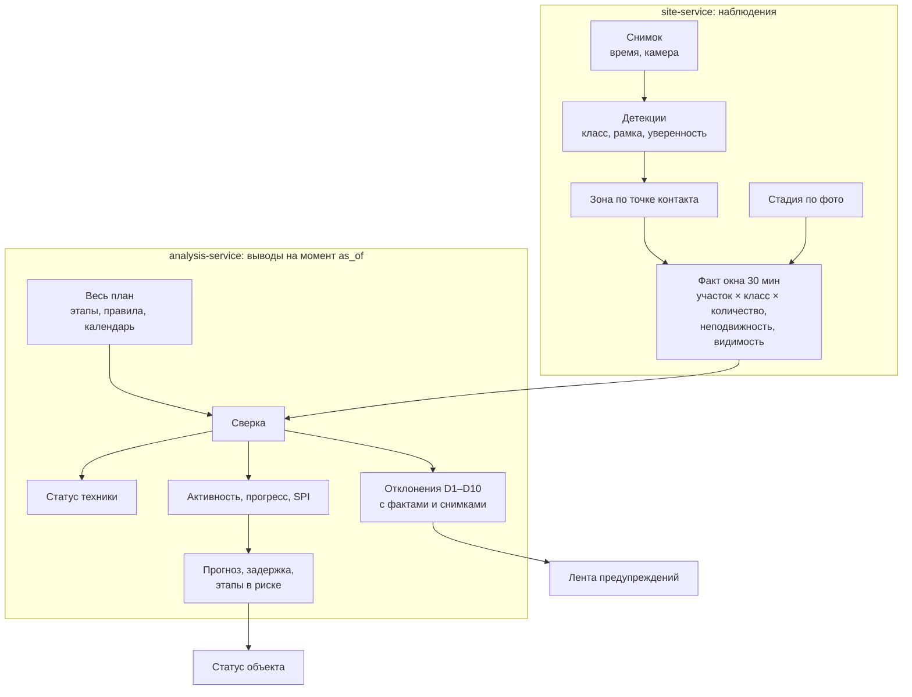

# Методика: от снимка к выводу «отставание N дней»

Это главный содержательный документ проекта. Заказчик оценивает прежде всего методику
сопоставления план-факт и объяснимость предупреждений, а не качество CV-модели.

Методика реализуется **чистыми функциями** в двух местах:
- `site-service/src/core/` — наблюдения: зоны, неподвижность, видимость, факт окна;
- `analysis-service/src/core/` — все выводы: рабочее время, статус техники, отклонения,
  прогресс, прогноз ([ADR-0012](decisions/0012-facts-without-judgement.md)).

Всё покрывается unit-тестами на фикстурах двух контрактов из
[packages/contracts/interservice.md](../packages/contracts/interservice.md).

---

## 1. Цепочка вывода



## 2. Базовые определения

| Термин | Определение |
| :--- | :--- |
| **Сессия (окно)** | 30 минут по объекту (`SESSION_WINDOW_MINUTES`), выровненные по :00 и :30. Все снимки всех камер, попавшие в окно. Единица наблюдения: технику считают по окну, а не по кадру |
| **Рабочая сессия** | Окно рабочего дня календаря объекта, целиком лежащее внутри рабочих часов (`work_hours` в часовом поясе календаря). Выводы строятся только по рабочим сессиям |
| **Зона** | Полигон на кадре конкретной камеры с типом и названием |
| **Участок** | Все зоны объекта с одинаковыми типом и названием, ключ `ТИП:Название` ([ADR-0013](decisions/0013-zones-and-areas.md)). Вне всех зон — ключ `OUTSIDE` |
| **Роль участка** | Задаётся типом (`zone_type_role` в `enums.yaml`): `WORK` — идут работы (котлован, пятно застройки, периметр, дорога), `SERVICE` — машины ждут (въезд, склад), `SAFETY` — опасная зона поверх остальных |
| **Активный этап** | Этап, у которого местная дата сессии лежит в `[plan_start, plan_end]`. Это «по плану» |
| **Этап в работе** | Этап с фактического старта до прогресса 1. Это «по факту», и он может не совпадать с активным |
| **Правило этапа** | `required` — группы обязательной техники, `allowed` — допустимая, `signature` — признак старта, `min_sessions` — сколько сессий подряд держится условие |
| **Транзитная техника** | Классы с `transient: true` в `equipment_classes.yaml`: самосвал, миксер, грузовик. Приезжают и уезжают рейсами, поэтому их присутствие считается за окно `TRANSIENT_WINDOW_SESSIONS` рабочих сессий (по умолчанию 4, то есть 2 часа), а не в одном снимке |
| **Техника, работающая стоя** | Классы с `works_in_place: true` в `equipment_classes.yaml`: башенный кран, автокран, бетононасос. Работают, не сдвигаясь с места: кран стоит на своей башне или на выносных опорах, насос раскладывает стрелу. Поэтому их неподвижность между сессиями не говорит о простое |
| **Индекс активности** | Доля рабочих сессий дня, в которых комплект этапа был и работал, 0…1 |
| **Эффективный день** | Сумма индексов активности: «день, отработанный в полную силу» |
| **Момент расчёта `as_of`** | На какой момент считается анализ. По умолчанию — конец последней сессии с фактами. Во всех формулах ниже «сегодня» — это местная дата `as_of`, а не часы сервера |

## 3. Привязка к зоне (F3) — site-service

Детекция относится к зоне **по середине нижней стороны рамки**: это точка касания машины с
землёй. Центр рамки для высокой техники (кран, бетононасос) дал бы систематическую ошибку.

```
anchor        = ((x1 + x2) / 2, y2)
основная зона = самая маленькая по площади НЕ опасная зона этой камеры, содержащая anchor
опасные зоны  = все зоны типа DANGER этой камеры, содержащие anchor
```

- **Вне зон.** Если `anchor` не попал ни в одну не опасную зону, детекция относится к `OUTSIDE`.
- **Перекрытие зон.** Приоритет у меньшей зоны как у более специфичной.
- **Опасная зона накладывается поверх.** Детекция учитывается и в основном участке, и в опасном.

**Ограничение, которое честно фиксируем:** привязка ведётся в плоскости кадра, а не в плоскости
земли. При сильной перспективе у границ зон возможна ошибка. Она смягчается разметкой зон с
запасом и тем, что решения принимаются по нескольким сессиям.

## 4. Факт окна — site-service, наблюдения без оценок

### 4.1. Пригодность кадра

Кадр непригоден, если `quality.brightness < MIN_BRIGHTNESS` (причина `DARK`) или
`quality.blur > MAX_BLUR` (причина `BLURRED`). Детекции непригодного кадра **в факт не входят**:
тёмный кадр без машин — это «не видно», а не «машин нет».

### 4.2. Количество по участку

Одна и та же машина бывает видна с двух камер, и суммировать нельзя — будет двойной счёт.

```
count(участок, класс) = максимум по камерам участка (
    число рамок класса на пригодных кадрах камеры с anchor внутри её полигонов этого участка
)
```

Если у камеры в окне несколько пригодных кадров, берётся наибольшее число за кадр.

Это приближение: две разные машины одного класса, каждая видимая только своей камерой, будут
посчитаны как одна. Альтернатива (сопоставление по геометрии и внешнему виду) требует калибровки
камер и не укладывается в сроки. Ограничение показано в интерфейсе подсказкой у счётчика.

### 4.3. Неподвижность

Каждая рамка сравнивается с ближайшей рамкой того же класса у той же камеры в прошлом окне
(по расстоянию между центрами).

```
displacement = расстояние между центрами / диагональ кадра
moved        = displacement >= MOVE_THRESHOLD      (по умолчанию 0.01)
moved        = null, если у камеры не было прошлого окна или там нет рамок этого класса
static(участок, класс) = число неподвижных единиц на той камере, что дала максимум count
```

Это не трекинг машин: сопоставление приближённое и нужно только для одного вывода — «с прошлой
сессии ничего не сдвинулось».

### 4.4. Видимость участка (F5)

```
cameras_total  = активные камеры, у которых есть зона этого участка
cameras_usable = из них — с хотя бы одним пригодным кадром в окне
status         = OK, если cameras_usable == cameras_total
                 PARTIAL, если 0 < cameras_usable < cameras_total
                 BLIND, если cameras_usable == 0
reason         = самая частая причина непригодности (NO_IMAGES, если снимков не было)
```

### 4.5. Стадия по фото за окно

Для каждой метки складывается уверенность по пригодным кадрам окна. Побеждает метка с
наибольшей суммой. Её уверенность за окно — среднее по пригодным кадрам.

### 4.6. Когда факт пересчитывается

Факт окна целиком пересчитывается после каждого обработанного снимка этого окна и после правки
зон. Таймера закрытия нет. Неполное окно безопасно: участок без пригодного кадра получает `BLIND`,
а по невидимому участку выводы не делаются (раздел 7).

## 5. Как проверяется правило этапа — analysis-service

Правило этапа проверяется на участках типа `stage.zone_type`. Обычно такой участок на объекте один.

- **Группа `required`** выполнена, если сумма `count` классов из `any_of` не меньше `min`.
  Для транзитного класса берётся максимум `count` за последние `TRANSIENT_WINDOW_SESSIONS`
  рабочих сессий, включая текущую. Для остальных — `count` текущей сессии.
- **Комплект этапа присутствует**, если выполнены все группы `required`.
- **`allowed`** — эти классы не вызывают D3.
- **Сигнатура выполнена в сессии**, если одновременно:
  - все классы `signature.equipment` присутствуют (`count ≥ 1`; транзитные — в окне);
  - если задан `signature.stage_label`, уверенная стадия по фото не раньше этой метки
    (порядок меток — `stage_label` в `enums.yaml`).
- **Только видимые участки.** Если все участки типа этапа в сессии `BLIND`, этап в этой сессии не
  оценивается: ни нехватки техники, ни работы — только D10.
- **`rule = null`.** Для этапа без правила не проверяются D1, D2, D8, D9. Этап участвует в
  графе связей и прогнозе.

## 6. Статус техники: работает / простой / вне зоны (F4) — analysis-service

Заказчик задал базовое правило: **на статичном снимке техника работает, если она в рабочей зоне**.
Рабочая зона — это рабочий участок, где по плану сейчас идут работы. Неподвижность между
сессиями только уточняет это правило. Статус определяется на каждую рабочую сессию для пары
«участок × класс».

| Где техника | Нетранзитный класс | Работает стоя | Транзитный класс |
| :--- | :--- | :--- | :--- |
| Рабочий участок, где активен этап его типа | `WORKING`; `IDLE`, если все единицы неподвижны (`static == count`) | `WORKING` | `WORKING` |
| Рабочий участок, где активных этапов его типа нет | `OUT_OF_ZONE` → D5 | `OUT_OF_ZONE` → D5 | `WORKING` |
| Служебный участок (въезд, склад) | `IDLE` — «простой у въезда» → D4 | `IDLE` → D4 | `WORKING` — заезд, выезд, погрузка |
| Вне всех зон (`OUTSIDE`) | `OUT_OF_ZONE` → D4 | `OUT_OF_ZONE` → D4 | `WORKING` |
| На дату нет ни одного активного этапа | `UNKNOWN` | `UNKNOWN` | `UNKNOWN` |

- **Транзитная техника по месту не простаивает:** движение для неё норма, поэтому D4 и D5 к ней
  не применяются.
- **Техника, работающая стоя** (`works_in_place`), отличается от прочей нетранзитной одним:
  на рабочем участке с активным этапом её неподвижность не делает её `IDLE`. Башенный кран
  весь этап стоит на месте, насос стоит на опорах весь день бетонирования. Всё остальное
  действует как для нетранзитной техники: насос у въезда или на чужом участке — простой или
  не та зона.
- **Точка контакта крупной техники.** У башенного крана рамка захватывает стрелу, и нижняя
  середина рамки может лежать далеко от башни. Зону в таком месте размечают по положению
  крана на кадрах (подсказка «где стояла техника» в редакторе зон), а не по башне.
- **`person` статуса не получает**, этот класс участвует только в D6.
- **Опасная зона проверяется отдельно** от статуса (D6).
- **Обоснование статуса.** Каждый статус сопровождается строкой, которая попадает в `facts`
  отклонения. Например: «экскаватор на участке «Котлован», смещение 0.004 диагонали кадра с
  прошлой сессии — неподвижен».

**Ограничение:** по одному кадру «работает / простой» ненадёжен. Поэтому отклонение порождает
только серия сессий (`min_sessions`), а одиночный кадр — никогда.

## 7. Видимость и «вне контроля ИИ» (F5)

| Видимость участка | Последствие |
| :--- | :--- |
| `OK` | Участок участвует в выводах в полной мере |
| `PARTIAL` | Выводы делаются, `confidence` снижается на шаг |
| `BLIND` | **Выводы по участку не делаются.** После `min_sessions` таких рабочих сессий подряд — D10 «вне контроля ИИ, проверить вручную» |

Отдельный случай: у активного этапа нет ни одного размеченного участка его типа (например, котлован
не обведён ни на одной камере). Тогда D10 привязывается к этапу.

Принципиально: невидимый участок **не считается пустым**. Отсутствие техники на слепом участке
никогда не порождает D1 — вместо этого выдаётся «проверить вручную». Это прямое требование
заказчика и одновременно защита от ложных обвинений подрядчика.

## 8. Стадия объекта по снимку (F6)

Классификатор сцены (OpenCLIP zero-shot, при наличии разметки — линейная голова) относит кадр
к одной из стадий: `PIT`, `PILES`, `FOUNDATION`, `FRAME`, `FACADE`, `LANDSCAPING`. Промпты лежат
в конфигурации vision-service, не в коде. Стадию по окну собирает site-service (раздел 4.5).

- **Уверенная стадия** — стадия окна с уверенностью не ниже `MIN_STAGE_CONF` (по умолчанию 0.5).
  Неуверенная стадия считается неизвестной и ничего не ограничивает.
- **Плановая визуальная стадия на дату** — `visual_stage` той из активных этапов, у которой он задан
  и `seq` наибольший.
- **D7** — уверенная стадия раньше плановой визуальной (отставание) или позже неё (опережение)
  `min_sessions` рабочих сессий подряд.
- **Ограничение прогресса** — пока последняя уверенная стадия раньше `visual_stage` этапа,
  прогресс этого этапа равен 0. Техника может стоять и работать, но если по фото объект ещё не
  дошёл до этапа, прогресс не засчитывается.
- **% готовности (F13, Could)** считается только по стадии. Этажи по фото не считаем: способа,
  который можно честно обосновать, у нас нет.

## 9. Отклонения D1–D10

Каждое отклонение — это предикат над планом на дату, фактом сессии и видимостью.
- **Код.** Предикаты реализованы в `analysis-service/src/core/predicates.py`.
- **Параметры и тексты** лежат в таблице `deviation_rule`. Начальные значения берутся из
  `services/analysis-service/data/deviation_rules.yaml`.
- **Когда проверяются.** Все предикаты, кроме D10, проверяются только по рабочим сессиям
  и видимым участкам.

| Код | Отклонение | Условие | Ключ | Базовая серьёзность | Эскалация |
| :--- | :--- | :--- | :--- | :--- | :--- |
| **D1** | Нет обязательной техники | Этап активен, правило есть; ни в одной группе `required` нет ни одной единицы; `min_sessions` этапа подряд | этап + участок | MEDIUM | HIGH, если держится ≥ 1 рабочего дня |
| **D2** | Неполный комплект | Хотя бы одна группа выполнена, но не все; `min_sessions` этапа подряд | этап + участок | MEDIUM | HIGH, если держится ≥ 3 рабочих дней |
| **D3** | Техника не по этапу | Класс на рабочем участке не входит ни в `required`, ни в `allowed`, ни в `signature` ни одного активного этапа этого типа. Если класс есть в правиле будущего этапа — формулировка «возможное опережение», и ключом становится тот этап | участок + класс (+ будущий этап) | MEDIUM | — |
| **D4** | Простой | Нетранзитная техника в статусе `IDLE` или вне всех зон `min_sessions` подряд (по умолчанию 3) | участок или `OUTSIDE` + класс | LOW | MEDIUM, если держится ≥ 1 рабочего дня |
| **D5** | Не та зона | Нетранзитная техника на рабочем участке, где нет активного этапа его типа; `min_sessions` подряд (по умолчанию 2) | участок + класс | MEDIUM | — |
| **D6** | Опасная зона | Техника или `person` на участке типа `DANGER`; достаточно одной сессии | участок + класс | HIGH | — |
| **D7** | Стадия не совпадает | Уверенная стадия по фото раньше или позже плановой визуальной; `min_sessions` подряд (по умолчанию 2) | этап | HIGH | — |
| **D8** | Этап затянулся | Сигнатура этапа наблюдается после `plan_end`; `min_sessions` этапа подряд | этап + участок | HIGH | — |
| **D9** | Не начат в срок | Сигнатура не появилась за `K` рабочих дней после `plan_start` (по умолчанию 3), при этом участок был видим хотя бы в половине рабочих сессий этих дней | этап + участок | HIGH | — |
| **D10** | Вне контроля ИИ | Участок `BLIND` `min_sessions` рабочих сессий подряд (по умолчанию 2), либо у активного этапа нет размеченного участка его типа | участок или этап | INFO | — |

`min_sessions` этапа — это поле его правила. Для остальных кодов `min_sessions` лежит в `params`
строки `deviation_rule`.

**Правила формирования ленты:**

1. Отклонение однозначно определяется ключом `(object_id, stage_id, area, code, equipment_class)`.
   Незаданные части ключа — `null`. Повторное срабатывание обновляет `last_seen_at` и
   `occurrences`, а не создаёт дубль.
2. Условие перестало выполняться — статус `RESOLVED`, строка остаётся в истории.
   Иное дело — эпизод, которого при пересчёте не оказалось вовсе. Прогон пересчитывает всю
   историю объекта. Если строка целиком лежит в пересчитанном периоде, а пересекающегося с ней
   эпизода нет, то по нынешним фактам и правилам условие не выполнялось никогда. Так бывает,
   когда факты окна пересчитали (дораспознан кадр второй камеры, поправлены зоны) или правило
   изменили. Такая строка удаляется из ленты, чтобы в истории не оставались отклонения,
   которых не было. Строка с вердиктом оператора не удаляется: открытая получает `RESOLVED`,
   `REJECTED` остаётся.
3. Оператор может пометить отклонение `CONFIRMED` или `REJECTED` с комментарием — и открытое,
   и закрытое. Вердикт хранится отдельно от статуса (`verdict`) и переживает закрытие:
   открытое отклонение получает вердикт и в статус, закрытое остаётся `RESOLVED` с вердиктом
   («да, это было» или «это было ложное срабатывание»). `REJECTED` не открывается заново, пока
   условие выполняется непрерывно; закрытый эпизод с вердиктом, который пересчёт снова
   продлил до `as_of`, открывается со статусом своего вердикта, а не `NEW`. Если условие
   пропало и вернулось, это новое отклонение.
4. Отклонения никогда не строятся по невидимым участкам и по сессиям вне рабочего времени.

## 10. Факт выполнения, прогресс и прогноз (F9)

### 10.1. Фактический старт этапа

Первая рабочая сессия, с которой сигнатура этапа выполняется `min_sessions` сессий подряд.
Датой старта считается местная дата первой из них.

```
отклонение_старта = actual_start − plan_start   (в рабочих днях)
```

### 10.2. Индекс активности за день

```
activity_index(день) = sessions_working / sessions_total
```

- `sessions_total` — рабочие сессии дня, в которых участок этапа видим.
- `sessions_working` — из них те, где комплект этапа присутствует **и** хотя бы одна
  нетранзитная единица из `required` в статусе `WORKING`.
- Если в `required` только транзитные классы, достаточно присутствия комплекта.
- Сессии с невидимым участком исключаются из знаменателя (а не считаются нулём) и снижают
  `confidence`.

### 10.3. Прогресс

```
effective_days = Σ activity_index(день)  по рабочим дням от actual_start до as_of
progress_raw   = effective_days / norm_duration_days
progress       = 0, если последняя уверенная стадия по фото раньше visual_stage этапа (раздел 8)
                 иначе min(progress_raw, 1)
```

### 10.3a. До начала наблюдений этап идёт по плану

**Начало наблюдений участка** — местная дата первой рабочей сессии, в которой виден участок
типа этапа. Что было раньше, по снимкам не проверить, а «не видно» — не «не сделано»
(раздел 7). Камеры обычно ставят на уже идущую стройку, поэтому этапы до начала наблюдений
не должны превращаться в опоздание.

- **Участок ни разу не виден** с плановой даты начала этапа — этап идёт по плану
  (`basis: PLAN`), сдвиг только по связям.
- **Плановое окно этапа закончилось до начала наблюдений**, а сигнатура после него не
  появлялась — этап выполнен по плану (`basis: PLAN`). Если сигнатура появилась, этап
  затянулся: это видит D8, а прогресс считается как в следующем пункте.
- **Этап начат по плану до начала наблюдений** и его сигнатура наблюдалась — за дни до
  начала наблюдений засчитывается плановый прогресс, дальше — наблюдения:

```
credited_days  = planned_progress(день перед началом наблюдений) × norm_duration_days
effective_days = credited_days + Σ activity_index по рабочим дням от actual_start до as_of
```

  Фактический старт такого этапа неизвестен: `actual_start` пуст, отклонение старта не
  считается, в `facts` — `started_before_observation`, `observation_start` и `credited_days`.
  Ожидаемое начало для связей — плановое.
- Этап по плану уже должен идти, участок виден, а сигнатура так и не появилась — этап не
  начат и опаздывает: его старт не раньше сегодняшнего дня, прогноз — от него на плановую
  длительность.

### 10.3b. Отметка оператора «этап выполнен»

Оператор может закрыть этап отметкой: последний день работ `completed_on`, кто и комментарий
([ADR-0015](decisions/0015-stage-completion-mark.md)). Отметка — факт сильнее снимков:
работы кончаются и там, куда камера не смотрит.

Если `completed_on` не позже местной даты `as_of`:

- **Этап выполнен:** `status = DONE`, `progress = 1`, окончание и прогноз — `completed_on`,
  `delay_days = completed_on − plan_end` в рабочих днях (плюс — закончили позже плана, минус —
  раньше). Уверенность `HIGH`: это подтверждено человеком.
- **Фактический старт** — по снимкам (10.1), если сигнатура собралась не позже отметки;
  иначе неизвестен, а ожидаемое начало для связей — плановое (не позже отметки).
- **Связи** последователей считаются от `completed_on` (10.6).
- **В SPI этап входит** с прогрессом 1: освоенный объём подтверждён.
- **Со следующего дня после отметки этап не активен:** по нему не ищутся D1, D2, D7, D8 и D10
  «у этапа нет участка», его правило не участвует в D3 и D5, индекс активности не считается,
  а будущим этапом для D3 «возможное опережение» он не бывает. В сам день отметки этап ещё
  активен — работы в этот день идут.
- **D9** по этапу, отмеченному не позже срока старта, не ищется: его выполнили. Отмеченный позже
  срока без наблюдённого старта закрывает D9 последней сессией дня отметки.
- В `facts` этапа — `basis: OPERATOR`, `completed_on`, `completed_by`, `completion_note`.

Отметка с датой позже `as_of` в этом прогоне не действует: анализ считается на свой момент.

### 10.4. SPI (индекс выполнения графика)

```
planned_progress = доля рабочих дней окна [plan_start, plan_end], прошедших к as_of (0…1)
SPI              = progress / planned_progress          (при planned_progress > 0)
```

| SPI | Трактовка |
| :--- | :--- |
| ≥ 1.05 | Опережение |
| 0.95 … 1.05 | В графике |
| 0.85 … 0.95 | Отставание, риск |
| < 0.85 | Существенное отставание |

### 10.5. Прогноз окончания

```
avg_activity   = средний activity_index за FORECAST_WINDOW_DAYS последних рабочих дней (по умолчанию 5)
remaining_days = (1 − progress) × norm_duration_days / max(avg_activity, MIN_ACTIVITY)
forecast_end   = as_of + remaining_days рабочих дней (по календарю объекта)
delay_days     = forecast_end − plan_end (в рабочих днях)
```

`MIN_ACTIVITY` (по умолчанию 0.1) не даёт прогнозу уйти в бесконечность при полном простое.
В этом случае `confidence = LOW`, а текст явно говорит «при сохранении текущего темпа».
Если дней наблюдений меньше `MIN_DAYS_FOR_FORECAST` (по умолчанию 3), прогноз не строится.

### 10.6. Перенос на зависимые этапы

Сдвиг конца этапа распространяется по связям `predecessors` (FS / SS / FF / SF с лагом) вперёд по
графу. Этап, у которого прогнозная дата выходит за `plan_end` при `total_float_days = 0`
(критический путь), попадает в `stages_at_risk`.

### 10.7. Статус объекта

```
delay_days(объект) = наибольшая задержка среди этапов критического пути
```

| Условие | Статус |
| :--- | :--- |
| `\|delay_days\| ≤ ON_TRACK_TOLERANCE_DAYS` (по умолчанию 2) | `ON_TRACK` — в графике |
| `delay_days` больше порога | `DELAY` — отставание |
| `delay_days` меньше минус порога | `AHEAD` — опережение |
| Данных недостаточно (< 3 рабочих дней наблюдений или > 50 % слепых сессий) | `UNKNOWN` |

`UNKNOWN` — полноценный, а не аварийный статус. Система обязана уметь сказать «я пока не знаю»,
а не выдавать уверенное число по двум снимкам.

### 10.8. Уверенность вывода

| `confidence` | Когда |
| :--- | :--- |
| `HIGH` | ≥ 5 рабочих дней наблюдений, участки видимы > 80 % сессий, стадия по фото не противоречит прогрессу |
| `MEDIUM` | ≥ 3 дней, участки видимы > 50 % сессий |
| `LOW` | Меньше данных, либо расчёт упёрся в `MIN_ACTIVITY` |

`confidence` показывается рядом с каждым прогнозом. Это то, что отличает инженерный продукт
от красивой демонстрации.

## 11. Параметры и где они живут

| Параметр | По умолчанию | Где |
| :--- | :--- | :--- |
| `SESSION_WINDOW_MINUTES` | 30 | site-service, окружение |
| `MOVE_THRESHOLD` | 0.01 | site-service, окружение |
| `MIN_BRIGHTNESS` / `MAX_BLUR` | 0.15 / 0.6 | site-service, окружение |
| `TRANSIENT_WINDOW_SESSIONS` | 4 | analysis-service, окружение |
| `MIN_STAGE_CONF` | 0.5 | analysis-service, окружение |
| `MIN_ACTIVITY`, `FORECAST_WINDOW_DAYS`, `MIN_DAYS_FOR_FORECAST`, `ON_TRACK_TOLERANCE_DAYS` | 0.1, 5, 3, 2 | analysis-service, окружение |
| Пороги уверенности и `UNKNOWN` (разделы 10.7–10.8): `CONFIDENCE_HIGH_DAYS`, `CONFIDENCE_HIGH_VISIBLE`, `CONFIDENCE_MEDIUM_VISIBLE`, `UNKNOWN_BLIND_SHARE`; дни для `MEDIUM` — `MIN_DAYS_FOR_FORECAST` | 5, 0.8, 0.5, 0.5 | analysis-service, окружение |
| `min_sessions` этапа | 2 | `stage_rule`, правится в интерфейсе |
| Пороги D1–D10 (`min_sessions`, `escalate_after_days`, `K`) | см. таблицу раздела 9 | `deviation_rule.params`, правится в интерфейсе |

Значения по умолчанию — наши экспертные допущения, а не нормативы. Они выведены в данные, чтобы
их можно было откалибровать на реальной площадке без правки кода.

## 12. Объяснимость: что видит пользователь

Каждое отклонение хранит `facts` — все числа, на которых построен вывод, — и собирается из
шаблона. Пример D2:

```json
{
  "code": "D2", "severity": "MEDIUM", "status": "NEW",
  "stage_id": "7c1e…", "area": "PIT:Котлован", "equipment_class": null,
  "title": "Неполный комплект техники: «Разработка котлована»",
  "message": "Этап «Разработка котлована» идёт по плану с 15.10.2026. На участке «Котлован» за последние 2 рабочие сессии: экскаватор 1 (работает), самосвалов за последние 2 часа — 0 при норме не меньше 2. Правило этапа, версия 2. Возможно снижение темпа: при сохранении текущей активности окончание этапа сдвигается на 04.12.2026 (+12 рабочих дней).",
  "facts": {
    "stage_name": "Разработка котлована",
    "plan_start": "2026-10-15", "plan_end": "2026-11-20",
    "area": "PIT:Котлован", "area_name": "Котлован",
    "sessions_checked": 2,
    "transient_window_sessions": 4,
    "required": [{"any_of": ["excavator"], "min": 1}, {"any_of": ["dump_truck"], "min": 2}],
    "observed": {"excavator": 1, "dump_truck": 0},
    "groups_failed": [{"any_of": ["dump_truck"], "min": 2, "observed": 0}],
    "activity_index_5d": 0.55,
    "forecast_end": "2026-12-04", "delay_days": 12
  },
  "rule_ref": {"deviation_rule": "D2", "stage_rule_id": "a91d…", "stage_rule_version": 2},
  "evidence": [{"image_id": "9e41…", "detection_ids": ["d7a2…"]}]
}
```

`GET /api/v1/analysis/deviations/{id}/explain` возвращает сверх этого:
- текст сработавшего правила и значения его параметров;
- перечень проверенных сессий с их фактами;
- ссылки на снимки с рамками детекций.

Этого достаточно, чтобы оператор за 10 секунд понял, согласен ли он с системой, и нажал
«подтвердить» или «ложное».

**Ни одно предупреждение не имеет права появиться без `facts` и без `evidence`.** Исключение —
D10, когда снимков нет по определению: этап без размеченного участка или слепой участок, камеры
которого не прислали ни одного кадра (`NO_IMAGES`). В `facts` это сказано прямо. Промолчать
о таком участке было бы хуже: «не видно» обязано превращаться в «проверьте вручную» (раздел 7).
Инвариант проверяется тестом.

## 13. Роль LLM (F12)

LLM получает **только** структурированный контекст: статус объекта, этапы с SPI и прогнозом,
отклонения с их ID и фактами. Её задача — связный русский текст для руководителя.

Ограничения зашиты в модуль отчётов analysis-service ([ADR-0008](decisions/0008-llm-narrative-only.md)):

1. В промпте нет свободных данных — только JSON-контекст и инструкция.
2. Модель обязана ссылаться на ID отклонений.
3. После генерации текст проверяется: **каждое число из текста должно встречаться в контексте**.
   Если проверка не прошла, текст отбрасывается и выдаётся шаблонное резюме.
4. При `LLM_ENABLED=false` сразу выдаётся шаблонное резюме. Демонстрация не должна зависеть от LLM.

## 14. Известные ограничения (фиксируем честно)

| Ограничение | Смягчение |
| :--- | :--- |
| «Работает / простой» по статичным кадрам ненадёжен | Базовое правило заказчика «в рабочей зоне — работает», неподвижность только уточняет; отклонения — по серии сессий; обоснование статуса в каждом выводе |
| Дедупликация между камерами приближённая | Максимум по камерам, пометка в интерфейсе, рекомендация по расстановке камер |
| Транзитная техника видна не в каждом снимке | Присутствие считается за окно из нескольких сессий; окно — параметр |
| Перспектива искажает привязку к зонам | Разметка зон с запасом, приоритет меньшей зоны, решение по серии |
| Нормы МРР даны для панельных домов и являются предельными | Используется последняя редакция МРР; коэффициенты и ручная правка графика; числа генератора — только со ссылкой на пункт и таблицу |
| Внутренние работы технике не видны | Вне границ MVP, заявлено явно: система контролирует наружный контур |
| Нет реальных графиков реальных объектов | Синтетический график по МРР и ручная правка — это же подтвердил заказчик |
| Стадия по фото — zero-shot | Используется только уверенная стадия, неуверенная ничего не ограничивает; метрики публикуются как есть |
| Снимки организаторов сделаны с разных точек, а не неподвижными камерами | Каждая точка съёмки заводится отдельной «камерой» со своими зонами, участки связываются подписью; неподвижность тогда не определяется (`static = null`), и статус техники берётся по зоне — базовое правило заказчика |
