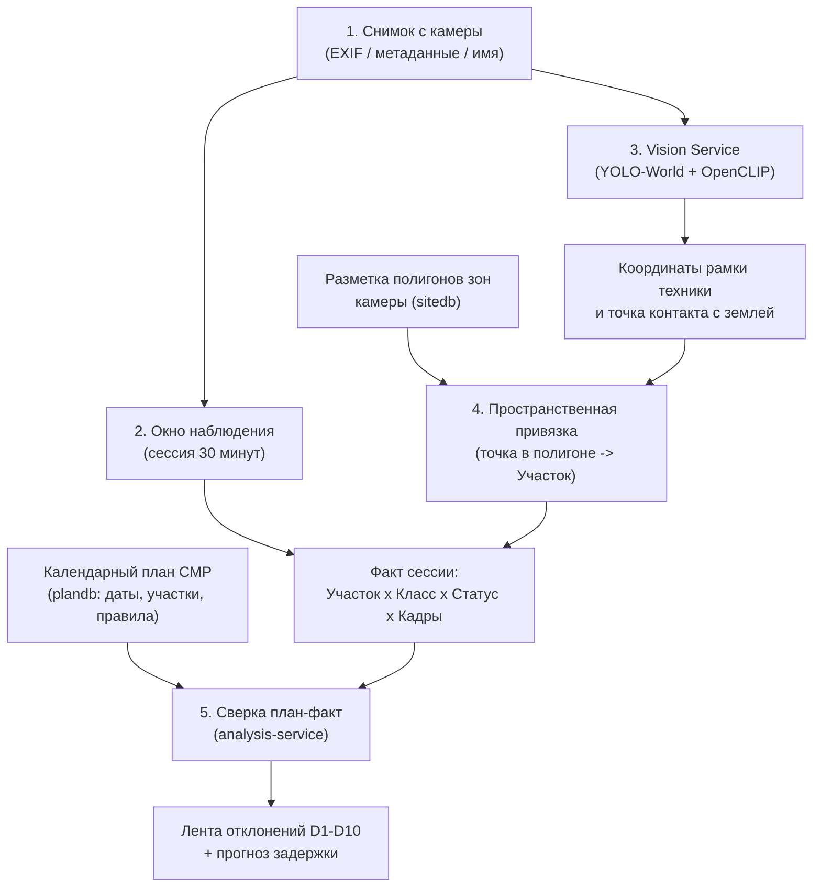
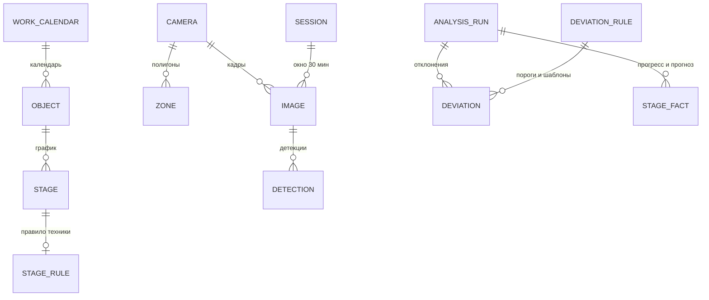

# Техническое задание: Автоматизированный сервис поиска нарушений на строительных площадках Москвы

> **Конкурс:** «Лидеры цифровой трансформации» (ЛЦТ) 2026, кейс 07.  
> **Заказчик:** Департамент градостроительной политики города Москвы (Градостроительный комплекс Москвы).  
> **Статус документа:** Актуализировано под целевое состояние кодовой базы ветки `main`.  
> **Назначение:** Сопоставление требований официального ТЗ конкурса с реализованной архитектурой, моделями данных, алгоритмами и интерфейсом системы.

---

## 1. Контекст, актуальность и цели проекта

### 1.1. Проблема и актуальность
Управление строительными проектами в Москве опирается на утвержденный календарный график производства строительно-монтажных работ (СМР). На практике контроль соблюдения графика ведется преимущественно вручную: инженеры просматривают видеокамеры, запрашивают справки у подрядчиков и визуально оценивают обстановку. Такой подход трудоёмок, субъективен и приводит к запоздалой реакции на срывы сроков.

На объектах Москвы уже развернута сеть стационарных камер видеонаблюдения (согласно требованиям постановления Правительства Москвы № 299-ПП). Снимки с камер содержат объективные данные о наличии техники, ее перемещении и фактической стадии строительства.

### 1.2. Цель решения
Разработка программного сервиса «СтройКонтроль», который:
1. Автоматически обрабатывает снимки со строительных камер.
2. Распознает присутствующую технику и ее рабочее состояние.
3. Сопоставляет фактическое присутствие техники с календарным планом на текущую дату.
4. Выявляет отклонения (отсутствие обязательных машин, неполный комплект, простой, работы вне графика, нарушения зон безопасности).
5. Прогнозирует дату завершения этапов и формирует объяснимые предупреждения с фотодоказательствами.

---

## 2. Обязательные функции системы (по разделу 2 ТЗ)

| Функция по ТЗ | Описание требования | Реализация в проекте (`main`) | Статус |
| :--- | :--- | :--- | :---: |
| **Обнаружение и классификация техники** | Обработка снимков с камер видеонаблюдения, распознавание базовых и дополнительных типов строительной техники | `vision-service`: нейросеть `ce-ulima-v1` (YOLO-World v2 small), 16 классов техники (8 базовых ТЗ + 8 дополнительных), порог уверенности 0.35 | Выполнено |
| **Сопоставление с графиком** | Привязка техники к этапам СМР по методике правил «этап работ → необходимая техника» | `analysis-service` + `plan-service`: движок правил сопоставления (`stage_rule`), календарь рабочих дней, сверка факта 30-минутных сессий с планом на дату | Выполнено |
| **Визуализация результатов** | Интерфейс для демонстрации всех обязательных функций системы | `apps/web`: React 18 SPA (дашборд объекта, интерактивный Гант план-факт, лента отклонений со снимками и рамками детекций, просмотр камер с полигонами зон, редактор правил и зон) | Выполнено |
| **Выявление отклонений** | Автоматическое обнаружение аномалий: нехватка техники, несоответствие этапу, простой, нарушение зон безопасности | `analysis-service`: 10 типов отклонений D1–D10, каждое предупреждение содержит формулу расчета, правило, числовые факты (`facts`) и снимки-доказательства (`evidence`) | Выполнено |

---

## 3. Программно-аппаратные требования (по разделу 3 ТЗ)

### 3.1. Аппаратные требования
- **Базовый режим (демо/ноутбук):** стандартный ПК или ноутбук x86_64, от 16 ГБ ОЗУ, 35 ГБ свободного места на диске. Полная поддержка работы на CPU (`VISION_DEVICE=cpu`).
- **Режим с ускорением (GPU):** видеокарта NVIDIA с поддержкой CUDA (Pascal и новее, от 6 ГБ VRAM, проверено на GTX 1060 и RTX 3060 Laptop). Оверлей `docker-compose.gpu.yml`.
- **Производительность:**
  - Обработка 1 снимка на GPU: **29 мс** (медиана), **58 мс** (p90) — требование ТЗ (≤ 100 мс) выполняется с двукратным запасом.
  - Обработка 1 снимка на CPU: **900 мс** (медиана), **985 мс** (p90) — укладывается в требование ТЗ (≤ 1–2 с).

### 3.2. Программные требования и стек
- **Архитектура:** микросервисная, развертывание в Docker-контейнерах через `docker-compose.yml`.
- **Backend:** Python 3.12, FastAPI, Pydantic v2, SQLAlchemy 2.0 (asyncio + asyncpg), Alembic.
- **Frontend:** TypeScript 5, React 18, Vite, Tailwind CSS, TanStack Query.
- **База данных:** PostgreSQL 16 (три изолированные базы: `plandb`, `sitedb`, `analysisdb`). Межсервисные связи строятся строго через HTTP REST по UUID без внешних ключей.
- **Хранилище снимков и отчетов:** SeaweedFS (легковесное S3-совместимое объектное хранилище).
- **Машинное обучение и CV:** Ultralytics YOLO-World v2, PyTorch 2.4, OpenCLIP (`ViT-B-32-quickgelu`), OpenCV.
- **Интеллектуальное резюме (LLM):** локальная модель Gemma 4 E4B в контейнере `llm` (llama.cpp server). Модель используется строго для формирования связного текста по проверенным числовым фактам; генерация чисел нейросетью запрещена (ADR-0008).
- **Шлюз и документация API:** Nginx (маршрутизация API, раздача статики и SPA), Swagger UI с мультиспецификацией по пути `/docs/`.

---

## 4. Методика сопоставления «план-факт» и выявления отклонений

### 4.1. Таксономия строительной техники
Всего поддерживается 16 классов техники (`packages/contracts/equipment_classes.yaml`):
1. **Базовые классы по ТЗ (8 классов):**
   - Самосвал (`dump_truck`) — транспортировка грунта и материалов.
   - Экскаватор (`excavator`) — разработка выемок и траншей.
   - Каток (`roller`) — уплотнение грунтовых оснований и асфальта.
   - Кран-манипулятор (`manipulator_crane`) — разгрузка и монтаж легких конструкций.
   - Автобетоносмеситель (`concrete_mixer`) — доставка готовой бетонной смеси.
   - Бульдозер (`bulldozer`) — планировка площадки и перемещение грунта.
   - Грузовик (`truck`) — бортовые и тентованные грузовые автомобили.
   - Автокран (`truck_crane`) — погрузочно-разгрузочные и монтажные работы.
2. **Расширенные классы (8 классов):**
   - Башенный кран (`tower_crane`) — ключевой маркер возведения надземного каркаса.
   - Автобетононасос (`concrete_pump`) — непрерывная укладка бетона в монолит.
   - Буровая / сваебойная установка (`pile_driver`) — устройство свайного основания и шпунтового ограждения.
   - Погрузчик (`loader`) — перемещение сыпучих материалов.
   - Асфальтоукладчик (`asphalt_paver`) — устройство дорожных покрытий.
   - Грейдер (`grader`) — профилирование дорожного полотна.
   - Человек / рабочий (`person`) — контроль нахождения персонала в опасных зонах.
   - Малотоннажный грузовик (`light_truck`) — вспомогательный транспорт.

### 4.2. Статусы техники и пространственная привязка
- **Привязка к зоне:** точка контакта машины с опорной поверхностью определяется по середине нижнего края рамки детекции (`bottom_center = ((xmin + xmax) / 2, ymax)`). По этой точке алгоритм луча сопоставляет объект с полигоном зоны на эталонном кадре.
- **Статус работы:**
  - `WORKING` (работает): машина находится в активной рабочей зоне этапа.
  - `WORKS_IN_PLACE` (работает стоя): башенные краны, развернутые автокраны и бетононасосы на выносных опорах считаются работающими даже при отсутствии перемещения по кадрам.
  - `IDLE` (простой): машина находится в зоне складирования или въезда, либо не перемещается между окнами наблюдения более допустимого порога.
  - `OUT_OF_ZONE` (вне зон): техника обнаружена на площадке вне размеченных рабочих зон.

### 4.3. Классификатор отклонений (D1–D10)

| Код | Отклонение | Условие срабатывания | Серьезность |
| :--- | :--- | :--- | :--- |
| **D1** | Нет обязательной техники | Этап активен по графику, но на участке N сессий подряд отсутствует обязательная техника | Средняя / Высокая (через 1 день) |
| **D2** | Неполный комплект техники | Присутствует только часть обязательного набора (например, экскаватор без самосвалов) | Средняя / Высокая (через 3 дня) |
| **D3** | Техника не по этапу | На участке работает техника, не предусмотренная активными этапами (сигнал опережения или ошибки) | Средняя |
| **D4** | Простой техники | Техника находится вне рабочей зоны либо неподвижна N сессий подряд | Низкая / Средняя |
| **D5** | Техника на неактивном участке | Машины находятся на участке, где по плану работы не ведутся | Средняя |
| **D6** | Нарушение опасной зоны | Техника или персонал зафиксированы в опасной зоне (под стрелой крана, у бровки котлована) | Критическая |
| **D7** | Несоответствие стадии по фото | Визуальная стадия готовности по OpenCLIP отстает от плановой или опережает ее | Высокая |
| **D8** | Этап затянулся | Признаки работ этапа продолжают фиксироваться после плановой даты его завершения | Высокая |
| **D9** | Этап не начат в срок | По наступлении плановой даты на участке отсутствуют признаки начала работ | Высокая |
| **D10** | Участок вне контроля ИИ | Снимок с камеры отсутствует, закрыт помехой или освещенность недостаточна для анализа | Информационная |

### 4.4. Расчет фактического прогресса и прогноз сроков
1. **Сессия наблюдения:** 30-минутное временное окно, объединяющее кадры всех камер объекта.
2. **Индекс суточной активности ($I_{act}$):** отношение числа продуктивных рабочих сессий (где техника присутствовала и работала) к общему числу рабочих сессий за день.
3. **Эффективные дни ($D_{eff}$):** накопленная сумма индексов активности за все дни этапа:  
   $$D_{eff} = \sum I_{act}$$
4. **Фактический прогресс ($P$):** отношение эффективных дней к нормативной длительности этапа с ограничением по визуально подтвержденной стадии:  
   $$P = \min\left(\frac{D_{eff}}{D_{norm}}, P_{visual\_cap}\right)$$
5. **Индекс соблюдения графика ($SPI$):** отношение фактического прогресса к плановому на текущую дату:  
   $$SPI = \frac{P_{fact}}{P_{plan}}$$
6. **Прогнозная дата окончания:** расчет остаточной трудоемкости делением оставшегося объема на скользящее среднее активности за последние 5 рабочих дней с последующим переносом задержки по графу связей этапов (метод критического пути CPM).

---

## 5. Схема связывания снимков камер с этапами календарного графика

Связывание выполняется в пять последовательных шагов без жесткого зашивания параметров в исходный код:

1. **Прием кадра:** извлечение идентификатора камеры и метки времени съемки (EXIF `DateTimeOriginal`, парсер шаблона имени файла либо ручной ввод).
2. **Формирование сессии:** группировка снимков всех камер площадки в дискретные 30-минутные интервалы.
3. **Детекция и классификация:** получение ограничивающих рамок техники и класса с оценкой надежности.
4. **Привязка к участку:** вычисление опорной точки контакта и определение зоны на площадке. Зоны нескольких камер объединяются в сквозные физические участки объекта (`area_name`, например `PIT:Котлован`, `FRAME:Пятно застройки`).
5. **Сопоставление с планом:** сопоставление фактического набора работающей техники на участке с требованиями правила `stage_rule` для этапов, активных по графику в данную дату.

---

## 6. Модель данных и организация хранения

Система использует три независимые базы данных PostgreSQL 16 и объектное S3-хранилище:

1. **`plandb` (сервис плана):**
   - `object`: карточка стройплощадки, тип объекта (жилье монолит/панель, общественное здание, дорога), ТЭП (площадь, этажность, свайность), календарь, версия плана.
   - `work_calendar`: рабочие дни, выходные и праздники.
   - `work_type`: нормативный классификатор строительных работ (на основе 4-уровневого справочника ЛЦТ).
   - `stage`: этапы СМР с плановыми датами начала/окончания, связями предшествования, привязкой к участку площадки и статусом критического пути.
   - `stage_rule`: правила «этап → техника» (обязательная техника с минимальным количеством, допустимая техника, сигнатура фактического старта, минимальное число сессий).
2. **`sitedb` (сервис площадки и наблюдений):**
   - `camera`: стационарные камеры объекта, RTSP-адреса, эталонные кадры.
   - `zone`: полигоны разметки (в относительных координатах 0..1), типы зон (рабочая, склад, въезд, опасная, слепая) и названия участков.
   - `image`: метаданные снимков, время съемки, ссылка на файл в S3, статус обработки, метрики качества (размытие, пересвет, яркость).
   - `detection`: результаты распознавания (класс техники, рамка, опорная точка, привязанная зона, уверенность детектора, версия модели).
   - `observation_window` (сессия): 30-минутные интервалы наблюдения с агрегированными фактами по участкам и технике.
   - `area_visibility`: контроль видимости участков (признак затенения или отсутствия кадров).
3. **`analysisdb` (сервис аналитики и сопоставления):**
   - `analysis_run`: журнал запусков аналитического прогона с отметкой даты среза.
   - `deviation_rule`: настраиваемые параметры предикатов D1–D10, пороги эскалации и шаблоны формулировок.
   - `deviation`: зафиксированные отклонения (тип D1–D10, серьезность, этап, участок, формулировка, структурированные факты `facts`, ссылки на подтверждающие снимки `evidence_image_ids`, статус и вердикт оператора).
   - `stage_fact`: фактические показатели этапа (дата фактического старта, эффективные дни, прогресс, SPI, прогнозное окончание, задержка в днях).
   - `report`: реестр сформированных официальных отчетов с ссылками на PDF в S3.
4. **Хранилище SeaweedFS (S3):**
   - Бакет `images` — оригиналы загруженных фотографий с камер.
   - Бакет `reports` — сгенерированные PDF-отчеты с диаграммами и фототаблицами.

---

## 7. Условия, ограничения и качество машинного обучения

### 7.1. Обучающие и тестовые наборы данных
- **Базовый детектор:** YOLO-World v2 small (`ce-ulima-v1`), дообученный на открытом наборе Construction Equipment и валидированный на хронологическом датасете стационарных камер ЖК «Лима».
- **Метрики качества детекции:**
  - На отложенной выборке стройплощадки Лима: **mAP50 = 0.81** (у базовой zero-shot модели без дообучения — 0.07).
  - На выборке организаторов хакатона (100 снимков различных объектов): модель `ce-ulima-v1` на рабочем пороге 0.35 выдает минимальное число ложных срабатываний (15 ложных рамок на 100 кадров против более чем 500 ложных срабатываний у открытых zero-shot детекторов).
- **Классификация стадии:** модель OpenCLIP zero-shot (`ViT-B-32-quickgelu`), сопоставляющая текстовые промпты стадий строительной готовности (котлован, свайное поле, фундаментная плита, надземный каркас, фасад, благоустройство) с общим видом площадки.
- **Ограничения:**
  - При сильном загрязнении объектива, плотном тумане или отсутствии искусственного освещения ночью кадры отсеиваются модулем контроля качества кадра и переводят соответствующий участок в статус D10 («вне контроля ИИ»).
  - Детекция лиц и номеров автомобилей намеренно исключена из контура обработки в целях соблюдения требований к обезличиванию данных.

---

## 8. Нормативная база расчета продолжительности работ

Для обеспечения юридической и инженерной достоверности генератор календарного графика опирается на официальные нормативы Москвы и РФ:
- **МРР-3.2.81-12:** «Рекомендации по определению норм продолжительности строительства зданий и сооружений, строительство которых осуществляется с привлечением средств бюджета города Москвы» (Москомэкспертиза, приказ № 50 от 12.09.2012). Нормы задают предельные сроки в месяцах по типам зданий, этажности, площадям, типам конструкций и сменности.
- **СНиП 1.04.03-85\* и МДС 12-43.2008:** федеральные нормативы технологической последовательности периодов (подготовительный, нулевой цикл, надземная часть, отделка).
- **Постановление Правительства Москвы № 299-ПП:** регламент обустройства строительных площадок и требований к организации видеонаблюдения.

---

## 9. Рекомендации по установке камер видеонаблюдения на объектах

На основе анализа ракурсов и слепых зон сформулированы рекомендации для строительных организаций:
1. **Высота и точка монтажа:** обзорные камеры необходимо размещать на высоте **10–15 метров** (на мачтах освещения, стационарных опорах ограждения или конструкциях башенного крана выше зоны стрелы). Это минимизирует взаимное перекрытие крупной техники.
2. **Перекрестный обзор ключевых зон:** зоны котлована, монтажного горизонта и складирования материалов должны перекрываться минимум **двумя камерами** с противоположных сторон.
3. **Контроль въездных групп:** отдельные камеры должны быть направлены на въездные/выездные ворота для надежной фиксации транзитных машин (самосвалы, автобетоносмесители) и учета рейсов.
4. **Стационарность и оптика:** использование фиксированных камер (без постоянного панорамирования PTZ), чтобы разметка полигонов зон оставалась валидной во времени.
5. **Съемка и метаданные:** частота кадров 1 снимок в 15–30 минут, обязательное включение точного штампа времени (NTP-синхронизация) в EXIF-метаданные кадра.

---

## 10. Пути масштабирования и развития решения

1. **Подключение прямого видеопотока (RTSP):** адаптация `site-worker` для прямого захвата ключевых кадров из потоков камер в режиме реального времени без промежуточной выгрузки файлов.
2. **Интеграция с цифровыми информационными моделями (BIM / IFC):** автоматическое построение пространственных полигонов зон на основе 3D-координат элементов цифровой информационной модели здания.
3. **Расширение реестра типовых объектов:** добавление профилей социальных объектов (школы, детские сады, поликлиники) и линейных объектов дорожно-мостового строительства по таблицам МРР-3.2.81-12.
4. **Горизонтальное масштабирование:** распределенная обработка очередей снимков с использованием пула бессерверных GPU-воркеров для одновременного мониторинга сотен строительных площадок города.
