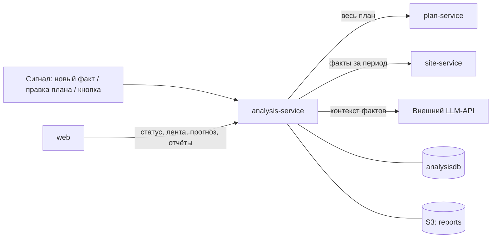

# analysis-service — сервис сверки план-факт

## 1. Назначение

Отвечает на главный вопрос системы: **идёт ли объект по графику, и если нет — почему
и насколько**. Сравнивает план (что должно происходить) с фактом (что видно на снимках) и
делает **все выводы системы**:
- рабочее ли время;
- работает ли техника или простаивает;
- отклонения D1–D10 с объяснением и доказательствами;
- прогресс, SPI и прогноз завершения;
- статус объекта.

Здесь же формируются PDF-отчёт и текстовое резюме.

Сервис **не владеет первичными данными**: план и факт он читает по API, каждый одним запросом.
Его состояние — только выводы, и оно целиком пересчитывается с нуля. Поэтому методику можно
править в любой момент, в том числе на демонстрации.

## 2. Место в системе



- **Вызывает:** `plan-service` и `site-service` (только чтение), внешний LLM (только текст).
- **Вызывают:** `web`; `site-service` и `plan-service` — сигналом «пересчитай».

## 3. API

Префикс: `/api/v1/analysis`. Контракт прогона —
[packages/contracts/interservice.md](../../packages/contracts/interservice.md), раздел 4.
Что уже реализовано, видно по [docs/board.md](../../docs/board.md).

| Метод | Путь | Описание |
| :--- | :--- | :--- |
| `POST` | `/runs` | Запустить прогон или подать сигнал: `{object_id, triggered_by?, as_of?}`; `?wait=true` — дождаться результата |
| `GET` | `/runs/{id}` | Результат прогона: `as_of`, версии входных данных, статистика |
| `GET` | `/objects/{id}/status` | Сводный статус объекта для дашборда |
| `GET` | `/objects/{id}/progress` | Прогресс, SPI и прогноз по каждому этапу — данные для Ганта |
| `GET` | `/objects/{id}/equipment` | Загрузка техники по дням и классам (F10) |
| `GET` | `/deviations` | Лента: фильтры `object_id`, `code`, `severity`, `status`, `verdict`, `stage_id`, `area`, `from`, `to`; `code`, `severity`, `status`, `verdict` повторяются для нескольких значений; `verdict` — `CONFIRMED` / `REJECTED` независимо от статуса (закрытое с вердиктом остаётся `RESOLVED`); `sort` — `last_seen_at`, `first_seen_at`, `severity` (минус — по убыванию, по умолчанию `-last_seen_at`) |
| `GET` | `/deviations/{id}` | Карточка отклонения |
| `GET` | `/deviations/{id}/explain` | **Полное объяснение:** действующая настройка правила, сессии эпизода с фактами участка (от site-service), снимки со ссылкой `image_path` |
| `PATCH` | `/deviations/{id}` | Вердикт оператора: `{status: CONFIRMED / REJECTED, comment}`, кто — из `X-Actor` |
| `GET` | `/deviation-rules` | Настройки D1–D10 (страница, по номеру кода) |
| `GET` `PATCH` | `/deviation-rules/{code}` | Пороги, серьёзность и тексты правила без правки кода; `params` сливаются по ключам, `null` удаляет ключ; `X-Actor` — в журнал |
| `POST` | `/reports` | Сформировать PDF-отчёт: `{object_id, period_from?, period_to?}` — местные дни включительно; по умолчанию `REPORT_DEFAULT_DAYS` дней по день момента анализа. `201` с ключом, ссылкой, источником резюме и числом вставленных и пропущенных снимков |
| `GET` | `/reports?object_id=` | Отчёты объекта, новые сверху, со ссылками (страница) |
| `GET` | `/reports/{key}` | Presigned-ссылка на готовый файл; `key` — из списка, вида `{object_id}/{дата}T{ЧЧММСС}-{начало}_{конец}.pdf` |
| `POST` | `/summary` | Резюме за период без PDF: `{object_id, period_from?, period_to?}` → текст, `generated_by` (`LLM` / `TEMPLATE`), источник и `llm_rejected` — почему текст нейросети отброшен |

### Пример: статус объекта

```json
{
  "object_id": "0f3a…", "computed_at": "2026-10-20T10:02:11Z", "as_of": "2026-10-20T10:00:00Z",
  "status": "DELAY", "delay_days": 12, "spi": 0.63, "confidence": "MEDIUM",
  "stages": {"total": 12, "not_started": 8, "in_progress": 2, "done": 1, "late": 1},
  "deviations": {"HIGH": 1, "MEDIUM": 3, "LOW": 2, "INFO": 1},
  "blind_areas": 1,
  "stages_at_risk": [
    {"stage_id": "7c1e…", "name": "Разработка котлована",
     "plan_end": "2026-11-20", "forecast_end": "2026-12-04", "delay_days": 12}
  ]
}
```

Пример отклонения с `facts` и `evidence` — [docs/methodology.md](../../docs/methodology.md), раздел 12.

### Коды ошибок

`OBJECT_NOT_FOUND`, `DEVIATION_NOT_FOUND`, `RUN_NOT_FOUND`, `INVALID_VERDICT`,
`PLAN_SERVICE_UNAVAILABLE`, `SITE_SERVICE_UNAVAILABLE`, `NO_DATA_FOR_PERIOD` (отчёт за период без
наблюдений), `RENDER_FAILED`. Недоступная LLM ошибкой не считается: резюме строится по шаблону.

Прогон дополнительно: `PLAN_NOT_READY` (409 — у объекта нет ни даты начала СМР, ни этапов),
`ANALYSIS_INPUT_INVALID` (422 — план или факты нельзя посчитать: цикл связей, факты чужого
объекта, испорченная настройка правила), `VALIDATION_FAILED` (400 — `triggered_by` не из
`analysis_trigger`). Любая ошибка прогона записывается в его строку: `status = FAILED`,
`error = {code, message}`; лента и срезы при этом не меняются.

Чтение выводов: `OBJECT_NOT_ANALYZED` (404 — по объекту ещё не было успешного прогона).
Настройки правил: `DEVIATION_RULE_NOT_FOUND` (404), `DEVIATION_RULE_INVALID` (400 — неизвестная
серьёзность, `min_sessions < 1`, доля вне 0…1, шаблон не разбирается или с неизвестным форматом).
Поля шаблона с `facts` заранее не сверяются: их знает только предикат, и промах всплывёт ошибкой
прогона `ANALYSIS_INPUT_INVALID`.

Отчёты: `OBJECT_NOT_ANALYZED` (404 — выводов ещё нет, оформлять нечего), `OBJECT_NOT_FOUND` и
`PLAN_SERVICE_UNAVAILABLE` (без плана нет названий и дат этапов), `VALIDATION_FAILED` (400 — начало
периода позже конца), `NO_DATA_FOR_PERIOD` (422 — site-service ответил, и за период нет ни одной
сессии наблюдения), `RENDER_FAILED` (500 — вёрстка PDF упала, подробности в логе),
`REPORT_NOT_FOUND` (404), `STORAGE_UNAVAILABLE` (503 — S3-хранилище недоступно). Недоступный
site-service и пропавшие снимки ошибкой не считаются: отчёт выходит, «Ограничения» называют пробел.

Лента: `DEVIATION_NOT_FOUND` (404), `VALIDATION_FAILED` (400 — значение фильтра не из
`enums.yaml`, `verdict` не `CONFIRMED` / `REJECTED` или сортировка по неподдерживаемому полю), `INVALID_VERDICT` (400 — вердикт не
`CONFIRMED` / `REJECTED`), `VERDICT_CONFLICT` (409 — отклонённое переводится в
подтверждённое, а по его ключу уже открыто более новое).

Вердикт принимает и закрытое отклонение: статус остаётся `RESOLVED`, вердикт пишется в поле
`verdict` (methodology.md, раздел 9, правило 3). У открытого вердикт становится и статусом.

`X-Actor` с именем по-русски передаётся в URL-кодировке: заголовки HTTP — только ASCII
([api-guidelines.md](../../docs/api-guidelines.md), раздел 6).

## 4. Как устроен прогон

```
POST /runs {object_id, triggered_by, as_of?}
  ├─ прогон по объекту уже идёт → отметить rerun_requested, ответить coalesced: true
  ├─ plan-service: весь план                             → фиксируем plan_version
  ├─ site-service: факты [plan_start, as_of]             → фиксируем zones_version
  ├─ as_of по умолчанию = конец последней сессии с фактами
  ├─ core/calendar.py        рабочие дни и рабочие сессии по календарю объекта
  ├─ core/plan_on_date.py    активные этапы на дату, этапы в работе, отметка «выполнен»
  ├─ core/rules.py           группы required (any_of/min), транзитное окно, allowed, сигнатура
  ├─ core/equipment_state.py статус техники: WORKING / IDLE / OUT_OF_ZONE / UNKNOWN
  ├─ core/context.py         контекст прогона: рабочие сессии до as_of, серии «подряд»
  ├─ core/predicates.py      D1–D10 с параметрами из deviation_rule, реестр предикатов; D1, D2, D8;
  │                          D3–D6 (участок × класс) — core/equipment_predicates.py;
  │                          D7, D9, D10 — core/stage_predicates.py
  ├─ core/activity.py        фактический старт, индекс активности, эффективные дни
  ├─ core/forecast.py        прогресс с ограничением по стадии, SPI, прогноз, перенос по связям,
  │                          статус объекта, уверенность
  ├─ core/explain.py         текст из шаблона и facts
  ├─ core/run.py             всё вышеперечисленное одной чистой функцией analyze(...)
  ├─ запись: deviation (UPSERT по ключу), stage_fact, daily_activity, daily_equipment, object_status
  └─ rerun_requested → ещё один прогон
```

Всё, что в `core/`, — **чистые функции**: на вход план и факты, на выход выводы. Ни одного
обращения к БД или сети. Поэтому всю методику можно прогнать на фикстурах за доли секунды
и объяснить построчно.

**Как пишется результат** (`services/runs.py`). Прогон живёт в своих транзакциях, а не в
транзакции запроса: строка `RUNNING` фиксируется сразу, отметка `FAILED` сохраняется, даже когда
запрос отвечает ошибкой. Без `?wait=true` прогон идёт фоновой задачей после ответа `202`.
Срезы (`stage_fact`, `daily_activity`, `daily_equipment`, `object_status`) заменяются целиком;
лента сверяется по эпизодам (`core/ledger.py`): эпизод с тем же ключом и пересекающимся временем —
та же строка; закончившийся эпизод закрывает её (`RESOLVED`); `REJECTED` остаётся отклонённым,
пока условие держится; закончившиеся эпизоды без строки попадают в историю сразу закрытыми.
Строка без вердикта, которая целиком лежит в пересчитанном периоде `[начало фактов, as_of]`,
но не пересекается ни с одним эпизодом, удаляется. Это эпизод, пересмотренный пересчётом
фактов или правкой правила (methodology.md, раздел 9, правило 2): прогон по неполному окну
не должен оставлять в истории отклонение, которого не было.
Правила D1–D10 при каждом старте и прогоне дополняются из YAML недостающими кодами — правленые
через API строки не затираются.

**Схлопывание сигналов.** Прогон заводится под advisory-блокировкой объекта в PostgreSQL, поэтому
два одновременных сигнала не заведут два прогона. Сигнал во время прогона ставит идущему
`rerun_requested` и получает `coalesced: true` с его номером. По окончании прогона — успешном или
нет — отметка снимается атомарно и запускается ровно один повтор на момент по умолчанию: `as_of`
схлопнутого сигнала не хранится, а сигналы site и plan приходят без него. Отметка снимается
и повтор заводится одной транзакцией под той же блокировкой. `?wait=true` при схлопывании ждёт,
пока по объекту нет ни идущих прогонов, ни закончившихся с неснятой отметкой (повтор, который
учтёт сигнал, ещё не заведён), и отдаёт последний; не дождался за
`RUN_WAIT_TIMEOUT_S` — `202`. Прогон, зависший в `RUNNING` (процесс упал), через
`RUN_STALE_AFTER_S` помечается `FAILED` с кодом `RUN_ABANDONED`.

Идемпотентность: открытое отклонение однозначно определяется ключом
`(object_id, stage_id, area, code, equipment_class)`. Повторный прогон обновляет `last_seen_at` и
`occurrences`. Если условие перестало выполняться, отклонение получает статус `RESOLVED`, а
строка остаётся в истории.

## 5. Отчёт и резюме (модуль `src/report/`)

Модуль появился на месте отдельного report-service
([ADR-0011](../../docs/decisions/0011-generator-and-reports-as-modules.md)). Сам он ничего не
считает: все числа берутся из выводов этого же сервиса.

**Состав PDF-отчёта:**
1. Титул: объект, период, дата формирования, статус и задержка.
2. Резюме (LLM или шаблон) с явной пометкой источника — сразу за титулом: его читают первым.
   Ссылки на отклонения (`[bac02fc0]`) — внутренние ссылки PDF на строку таблицы отклонений.
3. Сводка: SPI, прогресс по фазам, этапы в зоне риска.
4. Диаграмма Ганта план-факт с фактическими стартами и прогнозными окончаниями.
5. График загрузки техники по дням и классам.
6. Таблица отклонений: код, серьёзность, этап, участок, текст, даты.
7. Снимки-доказательства по ключевым отклонениям с рамками, нарисованными в шаблоне; ID в
   подписи ведёт к строке таблицы.
8. «Ограничения»: слепые участки за период, снимки без времени, уверенность выводов.

Восьмой раздел обязателен. Отчёт, умалчивающий о том, чего система не видела, —
недобросовестный отчёт, а заказчик — город.

**Технология:** Jinja2 → HTML → WeasyPrint. Графики — SVG, встроенные в HTML. Файл кладётся в
бакет `reports` по детерминированному ключу.

**Как устроен модуль.** Сборка — чистые функции без базы и сети, как `core/`:
- `report/model.py` — вход: срезы последнего прогона (статус, этапы, загрузка техники, лента),
  план, факты периода, число снимков без времени и уже подготовленные снимки;
- `report/context.py` — контекст разделов: отклонения, пересекающиеся с периодом (местные
  сутки календаря объекта), прогресс фаз с весами нормативных длительностей, выбор снимков
  (от серьёзных к лёгким, без признанных ложными, по одному на отклонение) и «Ограничения»:
  уверенность с числами, слепые участки по рабочим сессиям периода с причиной, D10, этапы с
  прогрессом по плану, снимки без времени, нераспознанные снимки, анализ старше периода,
  невставленные снимки, оговорка о темпе;
- `report/charts.py` — SVG Ганта (те же обозначения, что на экране) и загрузки техники;
- `report/html.py`, `report/templates/` — HTML и шаблонное резюме. Тексты — в шаблонах,
  русские названия значений перечислений — в `data/report_labels.yaml`, типов зон — из
  `enums.yaml`. `StrictUndefined`: опечатка в шаблоне — ошибка, а не пустое место в отчёте.

Шаблонное резюме ссылается на отклонения первыми восемью знаками ID и не содержит чисел,
которых нет в остальном отчёте (unit-тест).

**Формирование** (`services/reports.py`, синхронно, на демо-объекте ~2 с и ~1 МБ):
1. срезы последнего прогона и отклонения, пересекающиеся с периодом, — из своей базы;
2. план — у plan-service; факты периода и число снимков без времени — у site-service;
3. снимки-доказательства по контракту 6 (interservice.md): карточка снимка с рамками и файл по
   внутренней ссылке; `report/images.py` поворачивает кадр по EXIF, как vision, ужимает до
   `REPORT_IMAGE_MAX_PX` и встраивает data URI — отдельные «кадры с рамками» не хранятся;
4. контекст, резюме и HTML → PDF (`report/pdf.py`, WeasyPrint) в пуле потоков;
5. файл — в бакет `reports` по ключу
   `{object_id}/{местные дата и время формирования}-{начало}_{конец}.pdf`, например
   `…/2026-09-27T194738-2026-10-16_2026-10-22.pdf`. Каждое формирование — отдельный файл: отчёт —
   документ на свой момент, а между двумя формированиями за день меняются вердикты, правила и
   отметки этапов. Ключи без времени (`…/2026-09-27-…pdf`, до 27.09) по-прежнему читаются. Списка в
   базе нет: список отчётов — содержимое бакета, чужие файлы в нём пропускаются.

WeasyPrint в образе требует Pango и HarfBuzz, кириллицу даёт шрифт DejaVu (`Dockerfile`). Без
S3-хранилища сервис стартует и считает анализ; `/health/ready` показывает `s3: fail` как
деградацию, а не отказ.

**Правила LLM** ([ADR-0008](../../docs/decisions/0008-llm-narrative-only.md)):
1. В промпт попадает **только** JSON-контекст: статус, этапы с SPI и прогнозом, отклонения с ID и
   `facts`. Никаких свободных данных и изображений.
2. Модель обязана ссылаться на ID отклонений.
3. После генерации текст проверяется: **каждое число из текста должно встречаться в контексте**.
   Не прошло — текст отбрасывается, выдаётся шаблонное резюме, `generated_by = TEMPLATE`.
4. `LLM_ENABLED=false`, таймаут или ошибка — сразу шаблон.
5. Промпт лежит в `prompts/summary.ru.md`, не в коде.

Шаблонное резюме — не заглушка, а полноценный текст: те же факты, собранные по шаблонам.
Поле `generated_by` (`LLM` / `TEMPLATE`) всегда показывается в интерфейсе.

**Как это устроено** (T35):
- `report/summary.py` — чистые функции: JSON для модели из контекста отчёта (те же
  отформатированные строки и числа, что в PDF, до 12 отклонений), очистка Markdown, проверка
  текста. Проверка: каждое число текста есть в контексте (разрешены и части чисел контекста —
  «22.10» и «2026» из «22.10.2026»; «0,98» = «0.98»; «09» = «9»), каждая ссылка из восьми
  шестнадцатеричных знаков — ID отклонения контекста, и хотя бы одна такая ссылка есть;
- `clients/llm_client.py` — `POST {LLM_BASE_URL}/chat/completions`, температура 0,2, без
  повторов. На этом API говорят облачные провайдеры и локальные серверы (llama.cpp, Ollama,
  vLLM): сменить модель — значит поменять адрес, модель и ключ в `.env`;
- `services/summary.py` — шаблон строится всегда; текст модели заменяет его, только пройдя
  проверку. Причины отказа — в журнале (`summary.llm_rejected` с текстом модели) и в
  `llm_rejected` ответа `/summary`; в PDF — только общими словами: выдуманному числу не место
  в отчёте даже в пояснении.

На стенде модель локальная: Gemma 4 E4B (Q4_K_M) в `llama-server` на хосте, runbook, раздел 4.
На демо-объекте ответ — 3–5 с на RTX 3060 Laptop рядом с vision, 5 из 5 текстов прошли
проверку (26.09).

## 6. Модель данных (`analysisdb`)

`analysis_run`, `deviation`, `deviation_rule`, `stage_fact`, `daily_activity`, `daily_equipment`,
`object_status`. Подробно — [docs/data-model.md, раздел 3](../../docs/data-model.md).
Методика целиком — [docs/methodology.md](../../docs/methodology.md).

Таблица `deviation_rule` при первом старте заполняется из `data/deviation_rules.yaml`:
предикат, серьёзность, параметры, шаблоны заголовка и текста для D1–D10. Дальше она
правится через API. В шаблонах подставляются поля `facts` отклонения, форматы
`{поле:date}`, `{поле:counts}`, `{поле:groups}`, `{поле:list}` описаны в шапке YAML.
Другая формулировка того же кода (D3 «возможное опережение») — `params.variants`: предикат
выбирает её полем `facts.template_variant`, а текст остаётся в данных.

## 7. Конфигурация

| Переменная | По умолчанию | Смысл |
| :--- | :--- | :--- |
| `ANALYSIS_DB_DSN` | — | Подключение к `analysisdb` |
| `PLAN_URL` / `SITE_URL` | внутренние адреса | Источники плана и факта |
| `UPSTREAM_TIMEOUT_S` / `UPSTREAM_RETRIES` | `10` / `2` | Таймаут и повторы чтения плана и фактов |
| `CONTRACTS_DIR` | `/contracts` | Каталог с `enums.yaml`: роли типов зон, порядок стадий |
| `DEVIATION_RULES_FILE` | `data/deviation_rules.yaml` | Начальные настройки D1–D10; относительный путь — от корня сервиса |
| `RUN_STALE_AFTER_S` | `900` | Прогон в `RUNNING` дольше этого срока считается брошенным (`RUN_ABANDONED`) и объект не блокирует |
| `RUN_WAIT_TIMEOUT_S` / `RUN_WAIT_POLL_S` | `120` / `0.5` | Сколько `?wait=true` ждёт чужой прогон по объекту и как часто проверяет |
| `EXPLAIN_MAX_SESSIONS` | `64` | Сколько последних сессий эпизода показывает `/explain` (два рабочих дня) |
| `TRANSIENT_WINDOW_SESSIONS` | `4` | Окно присутствия транзитной техники, в рабочих сессиях |
| `MIN_STAGE_CONF` | `0.5` | С какой уверенности стадия по фото считается уверенной |
| `MIN_ACTIVITY` | `0.1` | Нижняя граница темпа в прогнозе |
| `FORECAST_WINDOW_DAYS` | `5` | Окно усреднения активности |
| `MIN_DAYS_FOR_FORECAST` | `3` | Меньше дней наблюдений — прогноз не строится; столько же дней нужно для `MEDIUM` |
| `ON_TRACK_TOLERANCE_DAYS` | `2` | Порог статуса «в графике» |
| `CONFIDENCE_HIGH_DAYS` | `5` | Дней наблюдений для уверенности `HIGH` |
| `CONFIDENCE_HIGH_VISIBLE` / `CONFIDENCE_MEDIUM_VISIBLE` | `0.8` / `0.5` | Доля видимых сессий для `HIGH` / `MEDIUM` |
| `UNKNOWN_BLIND_SHARE` | `0.5` | Больше этой доли слепых сессий — статус объекта `UNKNOWN` |
| `S3_ENDPOINT`, `S3_PUBLIC_ENDPOINT`, `S3_BUCKET_REPORTS` | `http://s3:8333`, `http://localhost:8333`, `reports` | Хранилище отчётов; ссылка для браузера подписывается на публичный адрес |
| `S3_ACCESS_KEY`, `S3_SECRET_KEY` | `s3admin` / — | Ключи S3 (в стенде — из `.env`) |
| `S3_PRESIGN_TTL_S` | `3600` | Срок жизни ссылки на отчёт |
| `REPORT_LABELS_FILE` | `data/report_labels.yaml` | Русские названия значений перечислений в отчёте |
| `REPORT_DEFAULT_DAYS` | `7` | Период отчёта по умолчанию, местных дней по день момента анализа |
| `REPORT_IMAGE_MAX_PX` | `1280` | Длинная сторона снимка в PDF: оригиналы по 1–2 МБ раздули бы файл |
| `LLM_ENABLED` | `true` | `false` → только шаблонные резюме |
| `LLM_BASE_URL`, `LLM_MODEL` | — | Адрес OpenAI-совместимого API (с `/v1`) и имя модели; пустой адрес — шаблон |
| `LLM_API_KEY` | — | **Настоящий секрет.** Только в `.env`, никогда в git и в скриншотах; локальному серверу не нужен |
| `LLM_TIMEOUT_S` | `30` | По истечении — шаблон |
| `LLM_PROMPT_FILE` | `prompts/summary.ru.md` | Инструкция модели — в данных, не в коде |
| `REPORT_MAX_EVIDENCE_IMAGES` | `12` | Снимков-доказательств в отчёте не больше этого — ограничение размера PDF |

Пороги D1–D10 живут в таблице `deviation_rule` и правятся через API и интерфейс.

## 8. Зависимости

PostgreSQL (`analysisdb`), `plan-service`, `site-service`, S3-хранилище; LLM — по желанию.
Если план или факты недоступны, прогон завершается со статусом `FAILED` и понятным кодом.
Частичных, «додуманных» выводов не бывает никогда.

## 9. Запуск и тесты

```bash
docker compose up -d analysis-service
make test s=analysis                 # на Windows — см. docs/runbook.md, раздел 3
```

API-тесты (`tests/api/`) пишут в базу своими транзакциями и очищают таблицы перед каждым тестом,
а миграционный тест откатывает схему до нуля. Поэтому `TEST_DB_DSN` должен смотреть на отдельную
базу, а не на рабочую `analysisdb`: на стенде это `analysisdb_test` (владелец `analysis_user`),
в CI — база контейнера `postgres`. plan и site в тестах — заглушки (`tests/conftest.py`).

Обязательное покрытие `src/core/` — это главный тестовый набор проекта:

- каждый предикат D1–D10: срабатывает, не срабатывает, граничный случай;
- группы `any_of` и транзитное окно: самосвалы, видимые раз в 2 часа, не дают ложного D2;
- инвариант: ни одно отклонение не создаётся без `facts` и `evidence` (кроме D10, когда снимков
  нет по определению: этап без размеченного участка или участок без единого кадра);
- инвариант: по слепому участку не создаётся ничего, кроме D10;
- инвариант: отклонения не создаются по сессиям вне рабочего времени;
- активность, прогресс, SPI, прогноз, включая деление на ноль, полный простой и `as_of` в прошлом;
- идемпотентность прогона: повторный запуск не плодит дублей;
- валидатор чисел LLM: пропускает корректный текст, отбрасывает выдуманное число.

Фикстуры — ответы двух контрактов из `packages/contracts/interservice.md`, разложенные на
демо-дни, лежат в `tests/fixtures/`.

## 10. Допущения и ограничения

- **Выводы строятся только по рабочим сессиям с видимыми участками.** Слепой участок никогда
  не трактуется как «техники нет».
- **Окно транзитной техники отмеряется по времени:** `TRANSIENT_WINDOW_SESSIONS` окон по
  30 минут назад от текущего, а не N записей списка. Поэтому ночной перерыв или пропуск
  снимков не переносит вчерашний самосвал в утреннюю сессию (`core/rules.py`).
- **Несколько участков одного типа складываются.** Если у объекта два котлована, единицы
  на них суммируются: это разные места площадки, а не разные камеры одного места.
  Класс, которого нет в `equipment_classes` плана, считается нетранзитным.
- **«Подряд» — по наблюдаемым сессиям.** Сессия, где участок этапа не виден, серию условия
  не рвёт и в неё не входит: «не видно» не значит ни «есть», ни «нет» (`core/predicates.py`).
- **D3 только там, где есть с чем сравнить.** Техника «не по этапу» ищется на рабочем
  участке, где активен этап его типа и у каждого такого этапа есть правило. Нет активного этапа
  типа — это D5, а не D3; этап без правила не говорит, какая техника ему нужна.
  «Будущий этап» для формулировки «возможное опережение» — ближайший по `plan_start` этап
  того же типа участка, в правиле которого есть этот класс (`core/equipment_predicates.py`).
- **D3–D6 считаются по присутствию в самой сессии,** без окна транзитной техники: иначе один
  рейс миксера растянулся бы на `TRANSIENT_WINDOW_SESSIONS` сессий и сам себе собрал серию.
- **«Вне зон» видно, если в сессии есть хотя бы один пригодный кадр.** Иначе сессия для D4
  по `OUTSIDE` не наблюдалась и серию не рвёт.
- **D9 ждёт первые `k_days` рабочих дней этапа, включая `plan_start`** (выходной старт
  сдвигается на ближайший рабочий день), и проверяется, когда они прошли к `as_of`.
  «Начался» — значит собрался фактический старт: сигнатура `min_sessions` сессий подряд,
  а не один кадр. Старт после срока закрывает D9 в момент старта.
- **Для индекса активности этап активен в своих сессиях и после `plan_end`.** Иначе по
  таблице статусов техника затянувшегося этапа была бы «вне зоны», и этап не набирал бы
  прогресс, пока его доделывают (`core/activity.py`). Этап без групп `required` индекса не имеет.
- **Загрузка техники за сессию — сумма по участкам и «вне зон»**, без опасных зон (они лежат
  поверх остальных) и без класса `person`.
- **D10 по участку доказывается тёмными кадрами** непригодных камер окна: связи камеры с
  участком в фактах нет, поэтому берутся все непригодные кадры сессии. Если участок слепой
  потому, что камеры не прислали ни кадра (`NO_IMAGES`), D10 создаётся без снимков с
  причиной в `facts.evidence_absent_reason` (docs/methodology.md, раздел 12).
- **Пустой участок доказывается снимком.** У D1 рамок нет, поэтому evidence — пригодные
  снимки сессии из `cameras[].image_ids`. Если site-service их не прислал, D1 не создаётся.
- **«Не видно» — не «не начато».** Этап без правила или этап, чей участок с `plan_start` ни
  разу не был виден, идёт по плану со сдвигом только по связям: `facts.basis = PLAN`,
  уверенность `LOW`, в SPI объекта не входит. Этап, участок которого видели, а старта нет,
  опаздывает: раньше `as_of` он уже не начнётся (`core/forecast.py`).
- **До начала наблюдений этап идёт по плану** (methodology.md, 10.3a). Этап, чьё окно
  закончилось до первой сессии с видимым участком его типа, а сигнатура после не появлялась, —
  `basis = PLAN`, выполнен. Этап, начатый до начала наблюдений, получает `credited_days` —
  плановый прогресс за ненаблюдённые дни; `actual_start` у него пуст,
  `facts.started_before_observation = true`, ожидаемое начало — плановое.
- **Отметка оператора «этап выполнен» сильнее снимков** (methodology.md, 10.3b,
  [ADR-0015](../../docs/decisions/0015-stage-completion-mark.md)). Действует, если
  `completed_on` не позже местной даты `as_of`: этап `DONE`, прогресс 1, окончание — дата
  отметки, уверенность `HIGH`, `facts.basis = OPERATOR` с автором и комментарием; в SPI объекта
  входит. Фактический старт — только по сигнатуре, собравшейся до отметки включительно. Со
  следующего дня этап не активен: D1, D2, D7, D8, D10 по нему не ищутся, его правило не
  участвует в D3 и D5, индекс активности не считается. D9 по этапу, отмеченному не позже срока
  старта, не ищется; отмеченному позже без старта — закрывается последней сессией дня отметки.
  В PDF такие этапы перечислены в «Ограничениях» с датой и автором.
- **Связи и лаги — в рабочих днях календаря объекта.** FS с лагом 0 — следующий рабочий
  день после окончания предшественника; начатый этап по связям не сдвигается, его конец —
  только по FF и SF.
- **Средний темп — по дням с известным индексом.** День без снимков или с невидимым участком
  в окне `FORECAST_WINDOW_DAYS` в среднее не входит; дней наблюдений — дни с известным индексом.
- **SPI объекта — по нормативным длительностям:** Σ прогресс × норма / Σ плановый прогресс ×
  норма по наблюдаемым этапам, у которых плановый прогресс больше нуля.
- **Статус этапа:** `DONE` — прогресс 1 или отметка оператора; не начат при видимом участке после `plan_start` —
  `LATE`; начат — `LATE` / `AHEAD` по задержке прогноза с допуском `ON_TRACK_TOLERANCE_DAYS`,
  без прогноза — `IN_PROGRESS`. Завершённые этапы в `stages_at_risk` не попадают.
- **D7 сравнивает с этапом, задающим плановую стадию** (активный с `visual_stage` и наибольшим
  `seq`); он и становится ключом отклонения.
- **Строки активности — у начатых этапов и в пределах плана.** Не начатый этап после
  `plan_end` дал бы только дни «не видно»; его опоздание видно по статусу и прогнозу
  (`core/run.py`). Слепые участки в счётчиках дашборда — участки, не видимые в последней
  рабочей сессии до `as_of`.
- **Числа статуса объекта лежат в `object_status.counters.facts`** (дни наблюдений, доля видимых
  сессий, задержка по критическому пути): отдельной колонки `facts` у `object_status` нет.
  Ожидаемые даты этапа с учётом связей — в `stage_fact.facts.expected_start / expected_end`.
- **Фильтр ленты по времени — пересечение эпизода с `[from, to)`**; дата без времени — полночь
  UTC: календаря объекта у ленты под рукой нет.
- **`/explain` показывает сессии эпизода, а не «засчитанные» сессии.** Это все окна site-service
  между `first_seen_at` и `last_seen_at` с фактами участка отклонения, включая слепые: какие из
  них вошли в серию, видно по видимости участка. Без site-service объяснение всё равно отдаётся,
  `sessions: null` и причина в `sessions_unavailable_reason`.
- **Прогноз линеен:** предполагается, что сохранится средний темп последних рабочих дней.
  Сезонность, погода и поставки материалов не моделируются. Интерфейс говорит об этом
  формулировкой «при сохранении текущего темпа».
- **`UNKNOWN` — полноценный статус.** При нехватке данных система обязана сказать «пока не знаю»,
  а не выдать уверенное число.
- **Прогресс ограничен сверху видимой стадией объекта.** Работающая техника без визуального
  продвижения по стадиям прогресса не даёт.
- **Проверка чисел — эвристика по цифрам.** Число, написанное словами («пять дней»), она не
  видит; число, случайно совпавшее с другим числом контекста, пропустит. Смысловую ошибку
  («отклонения в зоне риска» вместо этапов) не ловит вовсе — поэтому в отчёте рядом всегда те же
  факты таблицами, а источник резюме подписан.
- **Маленькая локальная модель пишет проще и иногда повторяется.** Это плата за работу без
  облака и денег; облачная модель подключается сменой `LLM_BASE_URL` без правки кода.
- **Облачная LLM — зависимость от сети.** На показе это закрывается локальной моделью, заранее
  сформированным отчётом и `LLM_ENABLED=false`. Прямой доступ к OpenAI и Anthropic из РФ без
  прокси не работает, провайдера нужно проверить с демо-машины.
