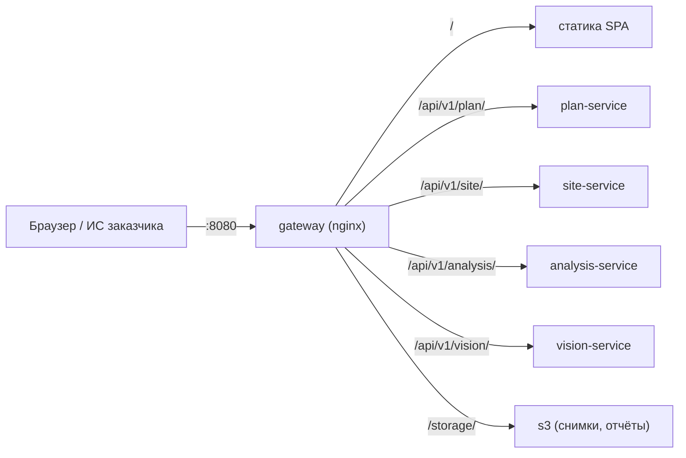

# gateway — единая точка входа

## 1. Назначение

Единственный порт, который система открывает наружу. Отдаёт собранный интерфейс,
маршрутизирует запросы по префиксу сервиса, проставляет `X-Request-Id` и публикует
сводную страницу Swagger по всем сервисам.

**В gateway нет бизнес-логики и нет кода** — это конфигурация nginx. Любая попытка
«заодно посчитать что-нибудь в gateway» отклоняется на ревью.

## 2. Место в системе



## 3. Маршрутизация

Путь **не переписывается**: префикс сервиса одинаков снаружи и внутри
([ADR-0009](../../docs/decisions/0009-api-prefix-per-service.md)).

| Внешний путь | Назначение |
| :--- | :--- |
| `/` | Статика SPA (`apps/web` после сборки), fallback на `index.html` для маршрутов роутера |
| `/api/v1/plan/…` | `plan-service:8000` |
| `/api/v1/site/…` | `site-service:8000` |
| `/api/v1/analysis/…` | `analysis-service:8000`, включая отчёты `/api/v1/analysis/reports` |
| `/api/v1/vision/…` | `vision-service:8000` (закрыт для внешнего доступа в `prod`) |
| прочие `/api/…` | `404 NOT_FOUND` в едином конверте ошибки, без проксирования |
| `/storage/…` | `s3:8333` без префикса `/storage`, с `Host: s3:8333` — снимки и отчёты по presigned-ссылкам |
| `/docs` | Сводный Swagger UI с выбором сервиса из выпадающего списка |
| `/health` | Живость самого gateway |

Добавление нового ресурса **не требует правки gateway** — конфигурация знает только
о сервисах, а не об их эндпоинтах.

Снимки и отчёты браузер берёт через gateway ([ADR-0017](../../docs/decisions/0017-storage-through-gateway.md)).
Сервисы подписывают presigned-ссылку на внутренний адрес `S3_ENDPOINT` и отдают путь без хоста —
`/storage/<бакет>/<ключ>?X-Amz-…`. Браузер открывает его по тому адресу, по которому открыт
интерфейс, gateway отрезает `/storage` и передаёт запрос в хранилище. Подпись S3 проверяет
`Host`, путь и параметры, поэтому:

- путь и параметры уходят из `$request_uri` байт в байт, без раскодирования;
- `Host` подменяется на `s3:8333` — он обязан совпадать с хостом из `S3_ENDPOINT`;
- `X-Forwarded-*`, `Forwarded`, `Authorization` и `Cookie` не передаются: SeaweedFS учитывает
  `X-Forwarded-Host/Proto/Port` при проверке подписи, а туннель (cloudflared) их ставит.

Ключ API для этих путей не нужен: доступ даёт сама подпись, и живёт она `S3_PRESIGN_TTL_S`.

## 4. Что делает gateway

| Задача | Как |
| :--- | :--- |
| Трассировка | Генерирует `X-Request-Id`, если его нет, и передаёт дальше |
| CORS | Разрешён только для `dev`; в `prod` фронтенд отдаётся с того же адреса |
| Ограничение размера тела | `client_max_body_size` под пакетную загрузку снимков |
| Таймауты | Увеличенные для `/api/v1/site/images` и `/api/v1/vision/` — распознавание долгое |
| Сжатие и кэш | gzip для JSON и статики; долгий кэш для хэшированных ассетов SPA |
| Сводный Swagger | Статическая страница swagger-ui с массивом `urls` по всем сервисам |

Аутентификацию gateway **не выполняет**: `X-API-Key` проверяет каждый сервис сам.
Так сервис остаётся защищённым и при прямом обращении внутри сети.
Точка расширения на OIDC — [ADR-0010](../../docs/decisions/0010-auth.md).

## 5. Конфигурация

| Переменная | По умолчанию | Смысл |
| :--- | :--- | :--- |
| `GATEWAY_PORT` | `8080` | Внешний порт |
| `MAX_BODY_MB` | `256` | Предел размера пакета снимков |
| `UPSTREAM_TIMEOUT_S` | `120` | Таймаут проксирования |
| `ENV` | `dev` | В `prod` закрывает `/docs` и `/api/v1/vision/` наружу |

## 6. Структура

```text
gateway/
├── Dockerfile          # nginx:alpine + конфиг + собранная статика SPA
├── nginx.conf          # маршруты, таймауты, заголовки
└── swagger/index.html  # сводная страница Swagger UI
```

## 7. Запуск и проверка

```bash
docker compose up -d gateway
curl -s localhost:8080/health
curl -s -H "X-API-Key: $API_KEY" localhost:8080/api/v1/plan/objects | head
```

## 8. Допущения и ограничения

- HTTPS терминируется контуром заказчика; в compose работает HTTP.
- Балансировки между репликами сверх стандартного round-robin nginx нет.
- Ограничения частоты запросов (rate limiting) не настроены: внутренний контур,
  один ключ. Точка расширения — стандартный `limit_req` nginx.
