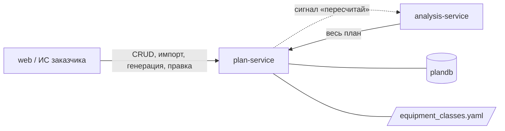

# plan-service — сервис плана

## 1. Назначение

Хранит **всё, что должно произойти на объекте**: сам объект, справочник строительных работ,
календарный график (этапы с плановыми датами и связями), правила «этап → техника» и рабочий
календарь. Это источник истины для плановой части системы и единственное место, где план
можно изменить. График сюда попадает импортом из файла или генератором по нормативам МРР.

Сервис не знает ничего про снимки, камеры и распознавание.

## 2. Место в системе



- **Вызывает:** `analysis-service` — только сигнал `POST /api/v1/analysis/runs` после правки
  этапов, правил или календаря.
- **Вызывают:** `web`, `analysis-service` (контракт «весь план»).
- **Не вызывает:** `site-service`, `vision-service` — план не зависит от факта.

## 3. API

Префикс: `/api/v1/plan`. Межсервисный контракт «весь план» —
[packages/contracts/interservice.md](../../packages/contracts/interservice.md), раздел 1.

### Объекты

| Метод | Путь | Описание |
| :--- | :--- | :--- |
| `POST` | `/objects` | Создать объект: наименование, тип, адрес, дата начала, параметры для генератора |
| `GET` | `/objects` | Список с фильтрами `status`, `object_type` |
| `GET` | `/objects/{id}` | Карточка объекта |
| `PATCH` | `/objects/{id}` | Изменить реквизиты или параметры |
| `DELETE` | `/objects/{id}` | Перевести в `ARCHIVED` (физически не удаляется) |

### График

| Метод | Путь | Описание |
| :--- | :--- | :--- |
| `GET` | `/objects/{id}/plan` | **Весь план** — межсервисный контракт: этапы, связи, правила, календарь, классы техники |
| `POST` | `/objects/{id}/plan/import` | Импорт графика из CSV/XLSX: код, наименование, начало, окончание (+ необязательно тип участка, визуальная стадия, связи, фаза); недостающее и правила — из шаблона этапов; `force=true` заменяет существующий график |
| `POST` | `/objects/{id}/plan/generate` | Сгенерировать график по МРР из типа объекта и параметров. Тело необязательно: `{tep, start_date}` дополняют карточку объекта и сохраняются в ней. `force=true` перезаписывает ручные правки. Ответ: `{object_id, plan_version, stages, rules, critical_stages, plan_start, plan_end, total_months, basis}` |
| `GET` | `/objects/{id}/stages` | Этапы объекта по `seq`, в общем формате страницы |
| `PATCH` | `/stages/{id}` | Изменить даты, тип участка (только роль `WORK`), нормативную длительность, `visual_stage` (`null` снимает); отметка «этап выполнен» — `completed_on` (последний день работ) и `completion_note`, автор — из `X-Actor`, `completed_on: null` снимает отметку с автором и комментарием ([ADR-0015](../../docs/decisions/0015-stage-completion-mark.md)); `plan_version` растёт, уходит сигнал «пересчитай» |

### Правила и справочники

| Метод | Путь | Описание |
| :--- | :--- | :--- |
| `GET` `POST` | `/rules` | Правила «этап → техника» в форме `stages[].rule` контракта «весь план»; фильтры `stage_id`, `object_id`. У этапа не больше одного правила |
| `GET` `PATCH` `DELETE` | `/rules/{id}` | Правило; правка (списки и сигнатура заменяются целиком) и удаление поднимают версию правила и `plan_version`, шлют сигнал «пересчитай» |

Коды классов в `required`, `allowed` и `signature.equipment` сверяются с
`equipment_classes.yaml`, повтор класса в одном списке — опечатка (`core/stage_rules.py`).
`X-Actor` (имя в URL-кодировке) попадает в журнал правок: в лог `stage_rule.*`, а у отметки
выполнения — ещё и в поле `completed_by` этапа (лог `stage.completed` / `stage.reopened`).
Отметка уходит в analysis в составе «всего плана»; замена графика генерацией или импортом
создаёт новые этапы, и отметки старых пропадают вместе с ними.
`GET /objects/{id}/stages` и `PATCH /stages/{id}` отдают этап вместе с его правилом (`rule`).
| `GET` | `/equipment-classes` | Классы техники из `equipment_classes.yaml` (только чтение), в порядке файла; фильтры `group`, `transient` |
| `GET` | `/work-types` | Справочник работ в порядке файла; фильтры `level` (1…4), `parent_code` |
| `POST` | `/work-types/import` | Импорт справочника из XLSX с восстановлением кодов; справочник заменяется целиком. Ответ: `{work_types, rows_without_code, restored_codes: [{row, cell, code}]}` |
| `GET` `POST` | `/calendars` | Рабочие календари: выходные, праздники, рабочие часы (`HH:MM`, местное время) |
| `GET` `PATCH` | `/calendars/{id}` | Календарь; правка (кроме названия) поднимает `plan_version` всех объектов на нём и шлёт им сигнал. Код не меняется |

Новый объект получает календарь `DEFAULT_CALENDAR` (поле `calendar_id` карточки объекта).

### Коды ошибок

`OBJECT_NOT_FOUND`, `STAGE_NOT_FOUND`, `STAGE_RULE_NOT_FOUND`, `UNKNOWN_EQUIPMENT_CLASS`
(код класса не найден в `equipment_classes.yaml`), `PLAN_ALREADY_EXISTS` (импорт или генерация
без `force` поверх существующего графика), `PLAN_IMPORT_INVALID` (с номерами строк файла), `INVALID_DATE_RANGE`,
`PLAN_CYCLE` (цикл в связях этапов), `NORMS_NOT_AVAILABLE` (для типа объекта нет норм или
этажность и площадь вне пределов таблицы — используйте импорт), `GENERATOR_PARAMS_INVALID`
(в `tep` нет `floors` или `total_area`, неверная сменность, нет даты начала),
`WORK_TYPES_IMPORT_INVALID` (справочник работ не разобран; `details.errors` — строки и столбцы),
`STAGE_RULE_ALREADY_EXISTS` (второе правило у этапа), `STAGE_RULE_INVALID` (класс повторяется
в группе, `allowed` или сигнатуре), `INVALID_ZONE_TYPE` (этап на участке не с ролью `WORK`),
`INVALID_COMPLETION` (комментарий к отметке «выполнен» без её даты),
`CALENDAR_NOT_FOUND`,
`CALENDAR_ALREADY_EXISTS` (повтор кода), `CALENDAR_INVALID` (неизвестный часовой пояс,
выходные вне 1…7 или все семь дней, конец рабочих часов не позже начала).

## 4. Модель данных (`plandb`)

`object`, `work_type`, `work_calendar`, `stage`, `stage_rule`. Поля и индексы —
[docs/data-model.md, раздел 1](../../docs/data-model.md). Классов техники в базе нет: они
читаются из `equipment_classes.yaml` при старте ([ADR-0014](../../docs/decisions/0014-equipment-classes-file.md)).

### Парсер справочника работ

Модуль `core/reference_import.py` разбирает XLSX «Сводный перечень строительных работ ЛТЦ»
(файл — `data/reference/`, его устройство — [data/README.md](../../data/README.md)):
- восстанавливает коды, которые Excel превратил в даты: дата `d.m.2025` → код `d.m`
  (19 кодов: `10.1`…`10.12`, `12.1`…`12.7`); число `12` → `12`; точку в конце кода отбрасывает;
- относит строки без кода к 4-му уровню ближайшего кода сверху и даёт им код
  `<код родителя>/<n>` (`12.3.4/1`): косая черта отличает придуманный код от кода из файла
  и не совпадёт с кодом, который заказчик может добавить позже (`12.3.4.1`);
- читает отметку обязательности `˅` (U+02C5) по столбцам типов объектов. Столбцы берутся из
  шапки файла (сейчас девять, от «Жильё» до «Дороги»), поэтому новый тип объекта кода не требует.

Уровень строки с кодом — число частей кода, родитель — код без последней части; он обязан
стоять в файле выше. Ошибкой файла считаются: строка без кода выше первого кода, пустое
наименование, отметка не `˅` (латинская `v` тоже), код-дробь (`12.1` могло быть и `12.10`),
повтор кода, уровень больше 4, код без родителя. Ошибки собираются по всему файлу, справочник
в базе при этом не меняется.

В `work_type.source` пишутся файл, лист и номер строки: любую строку можно проверить по
первоисточнику. `GET /work-types` отдаёт строки в порядке кодов, как в файле: `10.2` раньше
`10.10`, строки без кода — сразу за своим кодом (`core/reference_import.py::code_sort_key`).
На файле заказчика разбираются все 377 строк: 250 без кода, 19 кодов восстановлены из дат.

### Генератор графика

Модуль `core/schedule_generator.py` — чистая функция, реализующая ТЗ, п. 8 ([ADR-0011](../../docs/decisions/0011-generator-and-reports-as-modules.md)).
Его задача — дать правдоподобный черновик графика, к которому можно привязывать снимки.

1. **Вход.** Тип объекта, параметры и дата начала. Параметры — ключи `tep`: `floors`
   (этажность) и `total_area` (общая площадь квартир, м², п. 5.1.2) обязательны; `sections`
   (1), `piles` (0) и `shifts` (сменность: `1.5`, `2` или `3`, по умолчанию `1.5`) — нет.
2. **Периоды по МРР** (`core/mrr_norms.py`, `data/mrr_norms.json`). Сроки подготовительного
   периода, подземной и надземной части и отделки — из табл. 1 п. 5.1.21. Площадь между
   строками — интерполяция, за краями — экстраполяция 0,3 % срока на 1 % площади в пределах
   ×0,5…×2 (п. 4.9, 5.1.3–5.1.4). Этажность между группами таблицы — интерполяция, вне таблицы
   (меньше 7 или больше 25 этажей) — `NORMS_NOT_AVAILABLE`: экстраполяцию п. 4.9 задаёт только
   для показателя мощности. Сменность — коэффициент 0,9 или 0,8 ко всем периодам (п. 4.10).
3. **Раскладка на этапы** (`core/schedule_generator.py`). Периоды идут подряд от даты начала,
   месяцы МРР откладываются по обычному календарю (`core/calendar.py::add_months`: 21.09 +
   1 мес. = 21.10, дробная часть — доля следующего месяца в днях). Рабочие дни периода
   считаются по календарю объекта: выходные и праздники. Этап берёт
   долю `share` рабочих дней своего периода (`phase_columns` в `mrr_norms.json` связывает фазу
   этапа с периодом). Доли — наше экспертное допущение из `data/wbs_templates.json`, для
   подземной части — пример из ТЗ, п. 8. Этап свай (`piles: true`) длится 10 рабочих дней на
   100 свай × 0,5 до четырёх секций включительно или × 0,3 при большем числе секций (п. 5.1.6).
   Без свай она выпадает, и её последователи наследуют её связи.
4. **Даты и критический путь.** Даты — прямой проход по связям шаблона (семантика связей как в
   `core/cpm.py`), затем по ним считается критический путь.
5. **Правила этапов.** Каждый этап получает правило «этап → техника» из шаблона. Шаблоны
   повторяют таблицу ТЗ, п. 5.2, включая группы «любой из».

В `stage.basis` каждого этапа записано, откуда срок: строка таблицы, интерполяция или
экстраполяция, коэффициент, рабочие дни периода и доля. На демо-объекте (17 этажей, 10 000 м²,
2 секции, 200 свай) это 8,7 мес. = 1,0 + 1,5 + 4,7 + 1,5 (стр. 1.18) плюс 10 рабочих дней на сваи.

**Монолит считается по таблице для панели.** Таблица 1 дана для крупнопанельных домов
(п. 5.1.1). Поправочный коэффициент перехода к монолиту Кст = 1,1 в МРР есть только для
школ и ДОУ (п. 5.2.3) и здравоохранения (п. 5.3.1), для жилья его нет. Переносить его на жильё
значило бы выдумать норматив, поэтому монолитный дом считается без поправки, и основание каждой
этапы называет тип «Крупнопанельные».

Правила данных генератора:
- **Редакция норм.** Используется **последняя редакция МРР-3.2.81**.
- **Источник каждого числа.** У каждого числа в `mrr_norms.json` есть ссылка на пункт и
  таблицу документа (поле `source`). Числа без ссылки не используются (CONTRIBUTING.md, правило 7).
- **Если норм нет.** Для типа объекта без норм генератор отвечает `NORMS_NOT_AVAILABLE`, и
  график импортируется из файла. Сейчас нормы есть только у `RESIDENTIAL_MONOLITH`.
- **Запись графика** — та же, что у импорта (`services/plan_writer.py`): график заменяется
  целиком вместе с правилами, поверх существующего — только с `force=true`, затем резервы,
  рост `plan_version` и сигнал «пересчитай». Этапы получают `source = GENERATED`.
- **Чего нет в генераторе.** Подбора марок машин, расчёта машино-часов и московских регламентов
  (299-ПП, закон № 42) нет: заказчик назвал ПОС ненужным.

### Импорт графика

`POST /objects/{id}/plan/import` (multipart, поле `file`) принимает `.csv` (UTF-8 или cp1251,
разделитель «;», «,» или табуляция — определяется по шапке) и `.xlsx` (первый лист).
Разбор — `core/plan_import.py`.

| Столбец | Обязателен | Что в нём |
| :--- | :--- | :--- |
| `код` | да | Код этапа по справочнику (`12.3.1`) или диапазон (`10.4-10.8`) |
| `наименование` | да | |
| `начало`, `окончание` | да | `ГГГГ-ММ-ДД`, `ДД.ММ.ГГГГ` или дата Excel; обе включительно |
| `тип участка` | нет | `zone_type` с ролью `WORK` |
| `визуальная стадия` | нет | `stage_label` |
| `связи` | нет | `12.3.1`, `12.3.1 FS`, `12.3.1 SS+2`; несколько — через запятую; `-` — связей нет |
| `фаза` | нет | `construction_phase` |

- **Шаблон этапа.** Строка, чей код есть в шаблоне типа объекта (`data/wbs_templates.json`),
  берёт оттуда то, чего нет в файле: фазу, тип участка, визуальную стадию, коды работ, связи и
  правило «этап → техника». Столбцы файла главнее шаблона. Связи шаблона на этапы, которых нет
  в файле, не ставятся. Строка без шаблона обязана указать фазу и тип участка, правила у неё
  нет.
- **Длительность.** `norm_duration_days` — число рабочих дней между датами по календарю
  объекта. Этап, целиком попавший на выходные, — ошибка.
- **Код, испорченный Excel.** Если Excel превратил код в дату, дата `d.m.<год>` читается как
  код `d.m`; число `12.0` читается как `12`. Код вида `12.10`, ставший числом `12.1`,
  восстановить нельзя, поэтому столбец кодов в Excel нужно хранить как текст.
- **Ошибки** собираются по всему файлу сразу: `PLAN_IMPORT_INVALID`, в `details.errors` —
  список `{row, column, message}` с номером строки, как его видит человек в Excel.
- **Замена графика.** Импорт заменяет график объекта целиком вместе с правилами. Поверх
  существующего графика он выполняется только с `force=true`, иначе `409 PLAN_ALREADY_EXISTS`.
  Если у объекта не было `plan_start`, он берётся по самому раннему этапу. Затем
  пересчитываются резервы, растёт `plan_version` и уходит сигнал «пересчитай». Ответ:
  `{object_id, plan_version, stages, rules, critical_stages}`.

### Шаблон этапов (`data/wbs_templates.json`)

Двенадцать этапов жилого монолита по таблице ТЗ, п. 5.2: коды работ и правила — оттуда, включая
группы «любой из». Тип участка, визуальная стадия и связи — наше экспертное допущение по
столбцу «Сигнатура факта». Чего в шаблоне нет и почему:
- автовышки из строки «Стены, кровля, фасад»: такого класса нет в `equipment_classes.yaml`;
- сигнатуры «любой из» («каток / асфальтоукладчик»): в сигнатуре все классы должны появиться
  одновременно, поэтому берётся первый класс;
- кода у этапа «Монтаж башенного крана»: в справочнике работ его нет, этап заведён с кодом
  `монтаж-крана` и пустым `work_codes`.

Доли этапов (`share`) и признак этапа свай (`piles`) нужны генератору, импорт их не использует.
Шаблон проверяется при старте (`core/templates.py`): фаза, рабочий тип участка, стадии, коды
классов, связи без циклов, доля от 0 до 1, у этапа свай доли нет.
Испорченный шаблон не даёт сервису стартовать.

### Критический путь

`core/cpm.py` считает полный резерв каждого этапа в рабочих днях календаря объекта. Даты этапов
при этом **не пересчитываются**: они — план из импорта или генератора. Считается только
обратный проход от самой поздней даты окончания графика. Он показывает, насколько поздно
этап может закончиться, не сдвинув конец объекта. Резерв `0` — этап на критическом пути,
отрицательный резерв — даты уже нарушают связи. Такой этап тоже критический.

Связи понимаются так же, как в переносе сдвига в analysis-service
([methodology.md](../../docs/methodology.md), 10.6). Обе даты этапа включительно, лаг — в
рабочих днях. `FS` с лагом 0 значит «следующий рабочий день после конца», `SS` — начало не
раньше начала предшественника плюс лаг, `FF` — конец не раньше конца плюс лаг, `SF` — конец
не раньше начала плюс лаг. Резервы пересчитываются после импорта, правки дат этапа и правки
календаря (`services/critical_path.py`). Цикл, ссылка на отсутствующий этап или
неизвестный тип связи — ошибка `PLAN_CYCLE`.

### Версия плана

`object.plan_version` растёт при любой правке этапов, правил или календаря — одним `UPDATE`
в той же транзакции, что и правка (`services/plan_version.py`). После фиксации транзакции
сервис шлёт `POST /api/v1/analysis/runs` с `triggered_by: PLAN_CHANGED` по каждому объекту не
в архиве: сигнал до фиксации заставил бы analysis считать старый план под новым номером.
Сигнал — одна попытка с таймаутом `SIGNAL_TIMEOUT_S`, ошибка только пишется в лог
(`analysis.signal_failed`). Отдельной истории правок нет. Кто подтвердил отклонение,
фиксируется в analysis-service.

### Календарь `moscow-6day`

Заводится миграциями: часовой пояс `Europe/Moscow`, выходной — воскресенье (`[7]`), рабочие
часы 07:00–23:00. Праздники (миграция `0002`) — нерабочие праздничные дни по **ТК РФ, ст. 112,
ч. 1** (ред. Федерального закона от 23.04.2012 № 35-ФЗ) на 2026–2028 годы: 1–8 января,
23 февраля, 8 марта, 1 и 9 мая, 12 июня, 4 ноября.

## 5. Конфигурация

| Переменная | По умолчанию | Смысл |
| :--- | :--- | :--- |
| `PLAN_DB_DSN` | — | Строка подключения к `plandb` |
| `ANALYSIS_URL` | `http://analysis-service:8000` | Куда слать сигнал «пересчитай» |
| `SIGNAL_TIMEOUT_S` | `2.0` | Таймаут сигнала; повторов нет (interservice.md, раздел 4) |
| `WBS_TEMPLATES_FILE` | `data/wbs_templates.json` | Шаблоны этапов, путь от каталога сервиса |
| `MRR_NORMS_FILE` | `data/mrr_norms.json` | Нормы МРР для генератора; сверяются с шаблоном этапов при старте |
| `PLAN_IMPORT_MAX_MB` | `5` | Предел размера загружаемого файла: графика и справочника работ |
| `CONTRACTS_DIR` | `/contracts` | Каталог с `equipment_classes.yaml` и `enums.yaml` |
| `DEFAULT_CALENDAR` | `moscow-6day` | Календарь по умолчанию для новых объектов |
| `API_KEY`, `LOG_LEVEL`, `RUN_MIGRATIONS` | см. [runbook](../../docs/runbook.md) | |

## 6. Зависимости

PostgreSQL (`plandb`), файлы `packages/contracts/*.yaml`. `analysis-service` не обязателен:
если сигнал не дошёл, правка всё равно сохраняется, а пересчёт произойдёт при следующем прогоне.

## 7. Запуск и тесты

```bash
docker compose up -d plan-service         # только этот сервис
make test s=plan                          # тесты (на Windows — см. docs/runbook.md, раздел 3)
make migrate s=plan m="описание"          # новая миграция
```

Unit-тесты на `src/core/` запускаются без докера и без зависимостей:
`PYTHONPATH=. pytest tests/unit`. API-тесты требуют PostgreSQL (`TEST_DB_DSN`); без базы они
пропускаются с понятным сообщением, а не падают. Миграционный тест откатывает схему до нуля,
поэтому `TEST_DB_DSN` смотрит на отдельную базу: на стенде это `plandb_test` (владелец
`plan_user`), в CI — база контейнера `postgres`. Справочные файлы тесты берут из
`packages/contracts`, если не задан `CONTRACTS_DIR`.

Обязательное покрытие `src/core/`:
- парсер справочника, включая испорченные коды и строки без кода;
- проверка графика: даты, связи, циклы;
- критический путь;
- генератор на эталонном объекте;
- проверка кодов классов в правилах;
- расчёт рабочих дней по календарю.

## 8. Допущения и ограничения

- **Даты графика синтетические.** Нормативы МРР даны для панельных домов и являются
  **предельно допустимыми**. Поправки на монолит для жилья в МРР нет (раздел 4), поэтому
  график генератора — черновик под ручную правку. Это заявлено в интерфейсе.
- **Связи между этапами** берутся из шаблона генератора или из файла импорта. Добавлять связи
  в интерфейсе в MVP нельзя.
- **Один объект — один активный график.** Сценарии «вариантов графика» не реализуются.
- **Классы техники в интерфейсе только для чтения.** Новый класс добавляется в
  `equipment_classes.yaml`.
- **Справочные файлы читаются один раз при старте** (`src/reference.py`) и проверяются
  (`core/reference.py`): код в `lower_snake_case`, без повторов, группа из `equipment_group`,
  `transient` — логическое значение, необязательный `works_in_place` (по умолчанию `false`) —
  тоже. Испорченный файл не даёт сервису стартовать: лучше
  упасть при запуске, чем молча работать с пустым справочником.
- **Праздники — только с источником.** Переносы выходных (ТК РФ, ст. 112, ч. 2, и
  постановления Правительства РФ) и праздники после 2028 года не заведены: документа в
  `data/reference/` нет. Их добавляет оператор через `PATCH /calendars/{id}` (список
  `holidays` заменяется целиком).
- **Выключенное правило (`is_active: false`) уходит в «весь план» как `rule: null`**: для
  анализа его нет, по этапу не проверяются D1, D2, D8, D9. В `/rules` и в списке этапов оно
  видно, чтобы его можно было включить.
- **Перечисления в схемах API — из `enums.yaml`.** Типы `Literal` строятся при старте, копий
  списков в коде нет (CONTRIBUTING.md, раздел 7); Swagger показывает допустимые значения. Новое
  значение — строка в `enums.yaml` и перезапуск.
