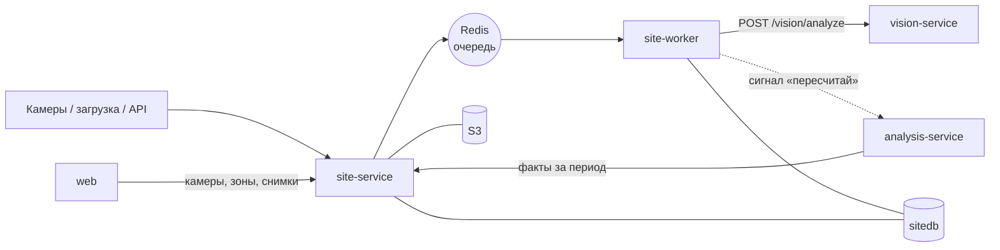

# site-service — сервис площадки (факт)

## 1. Назначение

Хранит **всё, что реально видно на площадке**: камеры, зоны, снимки, окна наблюдения,
детекции техники, видимость участков. Управляет конвейером распознавания и отдаёт факты
за период.

Сервис не знает ни про график, ни про рабочее время, ни про отклонения. Он отвечает на вопрос
«что видно», а не «хорошо это или плохо». Например: «экскаватор на участке «Котлован», с прошлого
окна не сдвигался». Решение «это простой» принимает analysis-service
([ADR-0012](../../docs/decisions/0012-facts-without-judgement.md)).

## 2. Место в системе



- **Вызывает:** `vision-service` (из воркера); сигнал `POST /api/v1/analysis/runs` после
  пересчёта факта окна.
- **Вызывают:** `web`, `analysis-service` (контракт «факты за период»), внешние источники снимков.

Сервис разворачивается двумя процессами из одного образа: API (`uvicorn src.main:app`)
и воркер (`arq src.worker.WorkerSettings`). Воркеров может быть сколько угодно.

## 3. API

Префикс: `/api/v1/site`. Межсервисный контракт «факты за период» —
[packages/contracts/interservice.md](../../packages/contracts/interservice.md), раздел 2.

### Камеры и зоны

| Метод | Путь | Описание |
| :--- | :--- | :--- |
| `GET` `POST` | `/cameras` | Камеры; фильтры `object_id`, `is_active`. `code` совпадает с именем папки при пакетной загрузке и в объекте не повторяется; название по умолчанию — код |
| `GET` `PATCH` `DELETE` | `/cameras/{id}` | Камера; правка названия, эталонного кадра (`reference_image_id` — снимок этой камеры), параметров установки; деактивация вместе с её зонами. Код не меняется |
| `GET` `POST` | `/zones` | Зоны: тип, название участка, полигон 0…1; фильтры `object_id`, `camera_id`, `include_inactive`. Название по умолчанию — `zone_type_name` из `enums.yaml`. В ответе — ключ участка `area` |
| `GET` `PATCH` `DELETE` | `/zones/{id}` | Зона; правка полигона, типа или названия; деактивация. Версия растёт, только если что-то поменялось |
| `POST` | `/zones/import` | Загрузить камеры и зоны объекта: формат `data/seed/cameras.json` плюс `object_id`. Камеры сверяются по коду, зоны камеры — по подписи участка; повторный импорт того же файла ничего не меняет. Ответ — счётчики и участки объекта |
| `GET` | `/objects/{id}/areas` | Участки объекта: ключ, роль типа, камеры и зоны, на которых он размечен; `zones_version` |
| `POST` | `/zones/reapply` | `{object_id}` → `202 {object_id, queued}`: заново отнести детекции к зонам и пересчитать факты окон — без повторного распознавания. Создание, правка и деактивация зон, импорт с изменениями и смена активности камеры ставят этот пересчёт сами; вручную он нужен, если очередь была недоступна |

### Снимки

| Метод | Путь | Описание |
| :--- | :--- | :--- |
| `POST` | `/images` | Пакетная загрузка (multipart: `files` до 200 штук, `object_id`, необязательно `camera_code` и `captured_at`). Частичный успех `202`: `{accepted, rejected}` |
| `POST` | `/images/import` | Импорт из папки `IMPORT_DIR/<path>` (`{object_id, path}`): первая подпапка = код камеры, скрытые файлы пропускаются. Ответ тот же, что у пакета |
| `GET` | `/images` | Список с фильтрами `object_id`, `camera_id`, `from`, `to` (полуинтервал по времени съёмки), `status`; по времени съёмки, снимки без времени — в конце |
| `GET` | `/images/{id}` | Метаданные, EXIF, качество кадра, presigned-ссылка для браузера (путь `/storage/images/…` на gateway), детекции с рамками, точкой контакта и зоной, стадия по снимку. `?link=internal` — ссылка на `S3_ENDPOINT` для других сервисов: так снимки берёт PDF-отчёт analysis (interservice.md, контракт 6) |
| `PATCH` | `/images/{id}` | `{captured_at}` — время съёмки вручную, только для статуса `NEEDS_TIME`: снимок получает окно, статус `PENDING` и источник `MANUAL` |
| `POST` | `/images/reanalyze` | `{object_id, camera_id?}` → `202 {object_id, images}`: повторное распознавание после смены модели или порога. Снимки `ANALYZED` и `FAILED` снова получают `PENDING` и идут в очередь |

### Факты и окна

| Метод | Путь | Описание |
| :--- | :--- | :--- |
| `GET` | `/objects/{id}/facts?from=&to=` | **Факты за период** — межсервисный контракт: окна, участки × классы, видимость, стадия по фото. `from` и `to` обязательны, полуинтервал по началу окна |
| `GET` | `/sessions` | Окна за период (фильтры `object_id`, `from`, `to`): сколько снимков и камер, стадия по фото |
| `GET` | `/sessions/{id}` | Состав окна: камеры (с `camera_id`) и пригодность их кадров, факт окна в форме контракта, все снимки окна в любом статусе |

### Коды ошибок

`CAMERA_NOT_FOUND`, `CAMERA_ALREADY_EXISTS` (повтор кода камеры в объекте), `ZONE_NOT_FOUND`,
`IMAGE_NOT_FOUND` (в том числе эталонный кадр — не снимок этой камеры), `IMAGE_ALREADY_EXISTS` (в пакете —
строка в `rejected` с ID существующего снимка), `UNSUPPORTED_MEDIA_TYPE`, `IMAGE_TOO_LARGE`,
`CAMERA_REQUIRED` (в пакете: нет ни `camera_code`, ни подпапки с кодом камеры),
`IMAGE_BATCH_TOO_LARGE` (больше 200 файлов за запрос), `INVALID_CAPTURED_AT` (ручное время не
разобрано), `IMAGE_TIME_ALREADY_SET` (ручное время для снимка не в статусе `NEEDS_TIME`), `IMPORT_DIR_NOT_FOUND` (папки нет
или она вне `IMPORT_DIR`),
`INVALID_POLYGON` (при импорте — `details.errors` с путём `cameras[i].zones[j].polygon` по
всему файлу), `INVALID_PERIOD`, `SESSION_NOT_FOUND`, `VISION_UNAVAILABLE`, `STORAGE_UNAVAILABLE`,
`QUEUE_UNAVAILABLE` (`POST /zones/reapply`: Redis недоступен, пересчёт не поставлен).

## 4. Конвейер обработки

```
POST /images
  ├─ время: EXIF → имя файла → поле формы → иначе статус NEEDS_TIME (снимок не теряется)
  ├─ камера: поле формы → подпапка; новая камера заводится автоматически
  ├─ формат по содержимому, размер, EXIF                           (core/image_meta.py)
  ├─ дедупликация по sha256 в пределах объекта
  ├─ оригинал в S3: бакет images, ключ {object}/{camera}/{дата UTC | no-time}/{image}.{jpeg|png|webp}
  ├─ image (status=PENDING или NEEDS_TIME), привязка к окну сессии (core/sessions.py),
  │  пересчёт числа снимков и камер окна; первый снимок камеры — её эталонный кадр
  └─ после ответа (то есть после commit) — задача analyze_image в очередь Redis

analyze_image(image_id)                     # site-worker, services/recognition.py
  ├─ PENDING → PROCESSING одним UPDATE: снимок берёт ровно один воркер
  ├─ POST /api/v1/vision/analyze {image_url}  → рамки, стадия по фото, качество кадра
  │    недоступен (3 попытки) → снова PENDING; отказ по снимку → FAILED с причиной
  ├─ замок на строку окна: снимки одного окна пересчитывают его по очереди
  ├─ пригодность кадра по MIN_BRIGHTNESS / MAX_BLUR → image.usable   (core/aggregation.py)
  ├─ для каждой рамки: anchor, основная зона                         (core/zones.py)
  ├─ смещение относительно прошлого окна той же камеры              (core/movement.py)
  ├─ пересчёт факта окна целиком: участки × классы, максимум по камерам, опасные зоны
  │  поверх, неподвижность, видимость участков, стадия за окно (services/window_facts.py)
  ├─ image.status = ANALYZED
  └─ сигнал POST /api/v1/analysis/runs {FACTS_UPDATED}

sweep()                                      # site-worker, каждые SWEEP_INTERVAL_S
  └─ в очередь — все PENDING и PROCESSING старше STALE_PROCESSING_MINUTES

правка зон или активности камеры (после commit) и POST /zones/reapply
  └─ в очередь — reapply_zones(object_id)

reapply_zones(object_id)                     # site-worker, WindowFacts.reapply
  ├─ окна объекта с распознанными снимками, по времени, каждое — под замок
  ├─ детекции окна заново привязываются к активным зонам своей камеры  (core/zones.py)
  ├─ пересчёт факта окна целиком                          (services/window_facts.py)
  ├─ всё в одной транзакции: факты не бывают наполовину по старой разметке
  └─ сигнал POST /api/v1/analysis/runs {FACTS_UPDATED}

POST /images/reanalyze
  └─ ANALYZED и FAILED → PENDING одним UPDATE → после commit в очередь analyze_image
```

- **Источник истины — `image.status` в БД**, а не очередь. Потерянную задачу (упал Redis,
  воркер, vision) подбирает проход по базе: данные не теряются, а перезапускать ничего не нужно.
- **Повтор ставится в очередь тем же ID задачи** (`analyze_image:<id>`): пока задача ждёт или
  выполняется, второй такой же не появится; результат задач не хранится, поэтому снимок можно
  поставить снова сразу после завершения.
- **Таймера закрытия окна нет.** Поздний снимок просто пересчитывает своё окно заново.

Правила счёта (максимум по камерам, неподвижность, видимость) —
[docs/methodology.md](../../docs/methodology.md), разделы 3–4.

## 5. Модель данных (`sitedb`)

`camera`, `zone`, `image`, `session`, `detection`, `stage_observation`, `area_visibility`,
`session_fact`. Подробно — [docs/data-model.md, раздел 2](../../docs/data-model.md).

Ключевые решения:

- **Нормированные координаты.** Полигоны зон и рамки детекций хранятся в долях 0…1 от размера
  кадра и не зависят от разрешения камеры ([ADR-0006](../../docs/decisions/0006-zones-in-image-space.md)).
- **Участки по подписи.** Участок — все зоны объекта с одинаковыми типом и названием, ключ
  `ТИП:Название`. Камеры связаны только общей подписью ([ADR-0013](../../docs/decisions/0013-zones-and-areas.md)).
- **Материализованный факт.** `session_fact` и `area_visibility` пересчитываются при каждом
  новом снимке окна и при правке зон.
- **Воспроизводимость.** У каждой детекции хранится `model_version`, поэтому вывод можно
  воспроизвести.

## 6. Конфигурация

| Переменная | По умолчанию | Смысл |
| :--- | :--- | :--- |
| `SITE_DB_DSN` | — | Подключение к `sitedb` |
| `VISION_URL` / `VISION_TIMEOUT_S` / `VISION_RETRIES` | `http://vision-service:8000` / `30` / `2` | CV-сервис: таймаут и повторы распознавания |
| `ANALYSIS_URL` / `ANALYSIS_TIMEOUT_S` | `http://analysis-service:8000` / `2` | Куда слать сигнал «пересчитай»; без повторов |
| `REDIS_URL` | `redis://redis:6379/0` | Очередь задач; без неё загрузка работает, `/health/ready` показывает `redis: fail` |
| `SWEEP_INTERVAL_S` | `30` | Проход воркера по базе; делит минуту нацело |
| `STALE_PROCESSING_MINUTES` | `10` | Снимок в `PROCESSING` дольше — воркер упал, снимок берётся заново |
| `REAPPLY_TIMEOUT_S` | `600` | Предел задачи `reapply_zones`: пересчёт фактов всех окон объекта после правки зон |
| `S3_ENDPOINT` | `http://s3:8333` | S3-хранилище внутри сети: загрузка файлов и подпись всех ссылок |
| `S3_PUBLIC_PATH` | `/storage` | Путь на gateway, под которым браузер получает ссылку на снимок: `/storage/images/…` без хоста ([ADR-0017](../../docs/decisions/0017-storage-through-gateway.md)) |
| `S3_*` | см. [runbook](../../docs/runbook.md) | Ключи, бакеты, срок жизни ссылок |
| `CONTRACTS_DIR` | `/contracts` | Каталог с `enums.yaml` |
| `SESSION_WINDOW_MINUTES` | `30` | Длина окна сессии; должна делить сутки нацело |
| `CAMERA_TIMEZONE` | `Europe/Moscow` | Пояс часов камер: время из EXIF без смещения, из имени файла и из поля формы без смещения считается местным для этого пояса |
| `MAX_IMAGE_MB` | `20` | Предел размера файла |
| `MAX_FILES_PER_REQUEST` | `200` | Предел числа файлов в одном `POST /images` |
| `IMPORT_DIR` | `/import` | Папка для `POST /images/import`; в compose — `./data/seed/images`, только чтение |
| `WORKER_CONCURRENCY` | `4` | Параллелизм воркера |
| `MOVE_THRESHOLD` | `0.01` | Смещение центра рамки (доля диагонали кадра), начиная с которого единица считается сдвинувшейся |
| `MIN_BRIGHTNESS` / `MAX_BLUR` | `0.15` / `0.6` | Пригодность кадра |

## 7. Зависимости

PostgreSQL (`sitedb`), S3-хранилище, Redis, `vision-service`. Если распознавание недоступно, снимки
копятся в статусе `PENDING` и обрабатываются позже, а загрузка не блокируется. Если недоступен
`analysis-service`, сигнал теряется без вреда.

## 8. Запуск и тесты

```bash
docker compose up -d site-service site-worker
make test s=site                     # на Windows — см. docs/runbook.md, раздел 3
make logs s=site-worker f=1
```

Обязательное покрытие `src/core/`:
- разбор времени из EXIF и имени файла, включая нестандартные форматы;
- точка в полигоне: граница, перекрытие зон, опасная зона поверх рабочей, вне всех зон;
- смещение между окнами, включая отсутствие прошлого окна;
- факт окна: максимум по камерам, непригодный кадр, видимость `OK` / `PARTIAL` / `BLIND`.

## 9. Допущения и ограничения

- **Камеры неподвижны.** Зоны размечаются один раз на эталонном кадре, сдвиг камеры требует
  переразметки. Это соответствует рекомендациям по камерам из ТЗ.
- **В MVP зоны приходят из файла.** Камера заводится автоматически при импорте папки
  (подпапка = код камеры), эталонным кадром становится первый снимок этой камеры, а зоны
  загружаются из `data/seed/cameras.json` ([data/README.md](../../data/README.md)). Интерфейс их
  отрисовывает; редактор полигонов — приоритет Could.
- **Дедупликация между камерами приближённая:** берётся максимум по камерам участка. Две разные
  машины одного класса, каждая видимая только своей камерой, считаются одной.
- **Привязка к зонам ведётся в плоскости кадра**, и перспектива даёт ошибку у границ зон.
  Ошибка смягчается разметкой с запасом. Точка контакта на границе полигона считается внутри
  зоны; из перекрывающихся зон одной площади выбирается меньшая по ключу участка — выбор не
  зависит от порядка строк в базе (`core/zones.py`).
- **Полигон проверяется при сохранении:** не меньше трёх вершин, координаты 0…1 (пиксели —
  ошибка `INVALID_POLYGON`), без самопересечений и не на одной прямой.
- **Типы зон, их роли и названия — из `enums.yaml`** (`core/reference.py`): опасной считается
  зона с ролью `SAFETY`, а не тип, записанный в коде.
- **Объект не проверяется в plan-service.** `object_id` камеры — внешняя ссылка по значению:
  site-service не вызывает plan (раздел 2), поэтому опечатка в `object_id` заводит камеры
  «ничьего» объекта. Их видно в `GET /cameras?object_id=`.
- **Эталонный кадр из `cameras.json` пока не читается:** поле `reference_image` принимается,
  но эталонным кадром становится первый загруженный снимок камеры (раздел 4) или снимок,
  указанный в `PATCH /cameras/{id}`.
- **Деактивация камеры деактивирует её зоны** с ростом версии: участки объекта и
  `zones_version` меняются так же, как при удалении зон по одной.
- **Снимок без времени не участвует в план-факте:** статус `NEEDS_TIME` держится до ручного ввода.
- **Время снимка** (`core/timestamp.py`): EXIF `DateTimeOriginal` (или `DateTime`) → дата и
  время в имени файла (`20261020_090000`, `IMG_20261020_090000`, `2026-10-20_09-00-00` и
  подобные; подпапка — это камера, а не время) → поле формы (ISO-8601). Берётся первое
  правдоподобное — не раньше 2000 года: сброшенные часы камеры не должны ставить снимок в
  1980 год. Верхней границы нет: демо-хронология живёт в датах графика, которые бывают позже
  дня загрузки. `OffsetTimeOriginal` из EXIF и смещение в поле формы главнее `CAMERA_TIMEZONE`.
- **Файл в S3 пишется до строки в базе.** Если после записи файла строка не сохранилась,
  в бакете остаётся объект без снимка; обратного случая — снимка без файла — не бывает.
- **Формат кадра — по содержимому** (`core/image_meta.py`, Pillow): JPEG, PNG, WebP; иначе
  `UNSUPPORTED_MEDIA_TYPE`, даже если расширение `.jpg`.
- **Неподвижность — не трекинг.** Рамка сопоставляется с ближайшей рамкой того же класса
  прошлого окна. Этого достаточно для вывода «ничего не сдвинулось», но не для учёта
  конкретных машин (`core/movement.py`). Смещение считается в пикселях кадра, делённых на
  диагональ: координаты нормированы по ширине и высоте отдельно, и без пропорций кадра сдвиг
  вдоль длинной стороны занижался бы.
- **`static` считает только сравнимые единицы** (`core/aggregation.py`): единица без пары в
  прошлом окне неподвижной не считается, а `static = null` — только если сравнить не с чем ни
  одну. Обвинять в простое можно то, что видно стоящим.
- **Прошлое окно камеры** — последнее более раннее окно, где у этой камеры есть распознанный
  пригодный кадр, а не обязательно соседнее по времени: утренний кадр сравнивается с вечерним,
  если ночью камера была тёмной. Смещение считается один раз при распознавании: поздний снимок
  раннего окна не пересчитывает смещения следующих окон.
- **Рамки нормированы к кадру, повёрнутому по EXIF** (так их отдаёт vision), поэтому смещение
  считается по размерам кадра из ответа vision, а не из метаданных файла.
- **Ошибка записи результата** — снимок получает `FAILED` с причиной, а не зависает в
  `PROCESSING`: иначе проход по базе брал бы его по кругу.
- **Причина непригодности кадра:** темнота проверяется раньше размытости — у тёмного кадра нет
  перепадов яркости, и он всегда выглядит ещё и размытым.
- **Равенство при максимуме по камерам** решается по коду камеры, внутри камеры — по ID снимка:
  факт окна не зависит от порядка строк в базе. Причины и стадия при равенстве выбираются по
  алфавиту.
- **Факты за период читают материализованный факт окна** (`services/facts.py`): участки,
  видимость и техника — такие, какими их посчитал последний пересчёт окна. Камеры окна
  собираются при чтении из распознанных снимков (`core/aggregation.py`, `camera_states`), по
  тем же правилам, что и видимость участков. `cameras[].images` и `image_ids` — только
  распознанные снимки; ждущие распознавания видны в `pending_images` и в `/sessions/{id}`.
- **Пересчёт после правки зон ставится в очередь, и его можно потерять:** если Redis
  недоступен, правка сохраняется, а факты остаются по старой разметке до `POST /zones/reapply`
  (в лог пишется `queue.unavailable`). Задача пересчёта без фиксированного ID: правка во время
  идущего пересчёта ставит ещё один, а не теряется.
- **Пересчёт зон не трогает смещение** (`moved`, `displacement`): оно считается между рамками
  одной камеры и от зон не зависит.
- **Во время повторного распознавания факты неполные:** окно пересчитывается по мере того, как
  распознаются его снимки, а ждущие снимки в факт не входят; это видно по `pending_images > 0`.
- **Время без смещения в `from` и `to` считается UTC** — так договорено для всех контрактов;
  местное время камеры (`CAMERA_TIMEZONE`) относится только к времени съёмки снимков.
