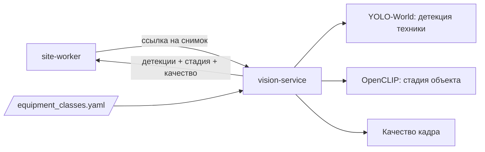

# vision-service — сервис компьютерного зрения

## 1. Назначение

Единственное место в системе, где происходит распознавание. На вход — изображение, на выход —
детекции строительной техники, стадия объекта по внешнему виду и оценка качества кадра.

Сервис **не знает ничего о предметной области**: ни про объекты, ни про зоны, ни про график.
Он не ходит в базу и не хранит состояние. Это чистая функция «картинка → факты о картинке»,
которую можно масштабировать репликами и заменить другой моделью без последствий для остальной
системы.

## 2. Место в системе



Единственный потребитель — `site-worker`. Сервис не вызывает никого.

## 3. API

Префикс: `/api/v1/vision`. Контракт — [packages/contracts/interservice.md](../../packages/contracts/interservice.md),
раздел 3. Что уже реализовано, видно по [docs/board.md](../../docs/board.md).

| Метод | Путь | Описание |
| :--- | :--- | :--- |
| `POST` | `/analyze` | Детекция, стадия и качество за один вызов. JSON `{"image_url": ...}` или `multipart` с полем `file` |
| `GET` | `/model` | Что загружено: детектор, классификатор, фактическое устройство, версия и словарь классов, метки стадий, пороги детектора |

Координаты рамок **нормированы 0…1**. Это тот же формат, что у полигонов зон, поэтому
привязка к зонам не зависит от разрешения камеры. Кадр поворачивается по EXIF до распознавания:
размеры в ответе (`image`) — уже повёрнутого кадра.

Форматы — JPEG, PNG, WebP, как при загрузке в site-service. `inference_ms` — время самих
моделей, без скачивания, декодирования и ожидания очереди.

### Коды ошибок

| Код | HTTP | Когда |
| :--- | :--- | :--- |
| `UNSUPPORTED_MEDIA_TYPE` | 400 | Тело не JSON и не форма; формат изображения не JPEG, PNG, WebP |
| `IMAGE_DECODE_FAILED` | 400 | Файл не читается как изображение: битый, обрезанный |
| `IMAGE_TOO_LARGE` | 413 | Больше `VISION_MAX_MB`; по ссылке скачивание обрывается на пределе |
| `SCHEMA_VALIDATION_FAILED` | 422 | Нет `image_url` или поля `file`, ссылка не `http(s)://` |
| `UPSTREAM_UNAVAILABLE` | 503 | Снимок по ссылке не скачался: хранилище недоступно, ссылка истекла. Вызывающий повторяет |
| `MODEL_NOT_LOADED` | 503 | Модели ещё грузятся или не загрузились (причина — в логе) |
| `INFERENCE_FAILED` | 500 | Ошибка внутри модели, например нехватка видеопамяти |

## 4. Модели

| Задача | Модель по умолчанию | Обоснование |
| :--- | :--- | :--- |
| Детекция техники | **YOLO-World** (`yolov8s-worldv2`) — open-vocabulary, классы задаются текстовыми промптами | Работает без обучения: в COCO нет ни экскаватора, ни крана, ни миксера, а разметка сотен кадров дороже, чем обучение |
| Стадия объекта | OpenCLIP zero-shot; при наличии разметки — линейная голова поверх эмбеддингов | Работает без большой разметки |
| Люди в опасной зоне | Тот же детектор, класс `person` | Отдельная модель не нужна |
| Качество кадра | Классические метрики: средняя яркость, размытость по дисперсии Лапласа | Без модели, мгновенно |

- **Классы детектора — это данные.** Промпты берутся из `equipment_classes.yaml`, файл
  смонтирован в `CONTRACTS_DIR` ([ADR-0014](../../docs/decisions/0014-equipment-classes-file.md)).
  Добавить класс — значит добавить запись в файл и перезапустить сервис, без переобучения и
  без правки кода. Английские промпты работают заметно лучше русских.
- **Промпты кодирует текстовый энкодер OpenAI CLIP ViT-B/32** — тот, на котором обучен
  YOLO-World. Его веса (`data/models/clip/ViT-B-32.pt`) качает `fetch_models.py`; в образе
  каталог весов Ultralytics (`weights_dir`) — `/models`, поэтому контейнеру сеть не нужна.
- **Метки стадий и их промпты для CLIP** лежат в `data/stage_prompts.yaml`. Набор меток
  совпадает с `stage_label` в `enums.yaml` — это проверяется при старте. Промпты одной метки
  усредняются (ансамбль), вероятности — softmax по сходству снимка с метками.
- **Один объект — одна рамка.** Детектор подавляет пересечения только внутри промпта, и одну
  машину возвращает несколькими рамками: «excavator» и «digger» или даже разными классами
  («tipper truck», «knuckle boom truck», «truck» — на снимках lct-raw). Рамки с IoU выше
  `VISION_DET_IOU` склеиваются независимо от класса, остаётся самая уверенная. Человек у машины
  не теряется: его рамка мала, IoU с рамкой машины низкий.
- **Для работы нужна дообученная модель.** Zero-shot на размеченных кадрах стройки даёт mAP50
  0,07 и 8,6 ложной рамки на кадр: бытовки и контейнеры он называет самосвалами. Дообученный
  на датасете Лимы YOLO-World (`yolov8s-worldv2-ulima-v3.pt`) даёт на отложенном тесте 0,77 и
  0,1 ложной рамки на кадр ([docs/metrics.md](../../docs/metrics.md)). С 27.09 на стенде —
  `yolov8s-worldv2-ce-ulima-v1.pt` (ещё и Construction Equipment): 0,81 на тесте Лимы. На снимках
  организаторов он находит каждую седьмую машину (metrics.md, §2). Дообучается сам
  YOLO-World ([`ml/`](../../ml/README.md)), поэтому классы по-прежнему задаются промптами, а
  веса подставляются переменной `VISION_DET_WEIGHTS` без правки кода. По умолчанию в
  `.env.example` остаются zero-shot веса: дообученные не скачиваются `fetch_models.py`.

## 5. Конфигурация

| Переменная | По умолчанию | Смысл |
| :--- | :--- | :--- |
| `VISION_DEVICE` | `cuda` | `cuda` на демо-стенде, `cpu` — запасной путь |
| `VISION_DET_WEIGHTS` | `/models/yolov8s-worldv2.pt` | Веса детектора; путь к дообученным подставляется сюда же |
| `VISION_DET_CONF` | `0.35` | Порог уверенности |
| `VISION_DET_IOU` | `0.5` | Порог NMS и склейки рамок одного класса |
| `VISION_DET_IMGSZ` | `1280` | Размер входа; главный рычаг «скорость против качества» |
| `VISION_STAGE_MODEL` | `openclip-vit-b32` | Классификатор стадии: имя и каталог весов в `VISION_MODELS_DIR` |
| `VISION_STAGE_ARCH` | `ViT-B-32` | Архитектура OpenCLIP для этих весов |
| `VISION_STAGE_ENABLED` | `true` | Можно выключить для ускорения; тогда `stage: null` |
| `VISION_MODELS_DIR` | `/models` | Каталог весов (`data/models` на хосте) |
| `VISION_MAX_MB` | `20` | Предел размера изображения |
| `VISION_FETCH_TIMEOUT_S` | `10` | Таймаут скачивания снимка по ссылке |
| `VISION_QUALITY_SIDE` | `512` | Длинная сторона кадра для метрик качества |
| `VISION_BLUR_REF` | `100` | Дисперсия Лапласиана, при которой `blur` = 0,5 |
| `CONTRACTS_DIR` | `/contracts` | Каталог с `equipment_classes.yaml` и `enums.yaml` |
| `VISION_TORCH_INDEX_URL` | `…/whl/cu128` | **Сборка образа:** индекс колёс PyTorch; `…/whl/cpu` — образ без CUDA |

Смена модели — это смена переменных окружения, а не кода.

**Качество кадра.** `brightness` — средняя яркость в оттенках серого. `blur` —
`VISION_BLUR_REF / (VISION_BLUR_REF + D)`, где D — дисперсия Лапласиана кадра, приведённого к
`VISION_QUALITY_SIDE`: однотонный кадр даёт 1, резкий стремится к 0. Приведение к одному
размеру обязательно — иначе резкость 4K и 720p сравнивалась бы нечестно.

## 6. Зависимости

Других сервисов и БД нет. Нужны файлы весов (`make models` → `data/models/`, монтируются в
`/models`) и `equipment_classes.yaml`. `/health/ready` отвечает `ok` только после загрузки
моделей в память.

Справочные файлы читаются при старте синхронно: испорченный файл — ошибка старта. Веса грузятся
в фоне с прогревом на пустом кадре: `/health` отвечает сразу, `/health/ready` и распознавание
(`MODEL_NOT_LOADED`) ждут. Если загрузка упала, сервис остаётся живым и не готовым, причина —
в логе `vision.models_failed`.

Код устроен как у остальных сервисов (AGENTS.md, раздел 3) плюс слой `src/models/`: адаптеры
к Ultralytics и OpenCLIP. torch и модели импортируются только там, поэтому тесты с заглушками
идут без них, а тяжёлые зависимости — в `requirements-ml.txt`, который ставится только в образ.

## 7. Запуск и тесты

```bash
make models                              # скачать веса
docker compose up -d vision-service      # с картой: -f docker-compose.yml -f docker-compose.gpu.yml
curl -F file=@sample.jpg -H "X-API-Key: $API_KEY" http://localhost:8004/api/v1/vision/analyze
make test s=vision                       # на Windows — см. docs/runbook.md, раздел 3
```

Тестам нужны только `requirements-dev.txt` и `packages/contracts` (путь — `CONTRACTS_DIR`, по
умолчанию берётся из рабочей копии): ни torch, ни весов, ни базы.

Покрытие:
- постобработка: нормировка координат, фильтр по уверенности, классы из файла, склейка дублей;
- словарь детектора и промпты стадий: разбор, версия, сверка с `enums.yaml`;
- метрики качества кадра; декодирование, EXIF, форматы;
- API: форма ответа, битый файл, недоступная ссылка, предел размера, модели не загружены.

Сама модель в тестах подменяется заглушкой. Качество модели проверяется не unit-тестами, а
метриками на собственном тестовом наборе — [ml/README.md](../../ml/README.md).

## 8. Производительность

Целевой стенд — ноутбук с RTX 3060 Laptop 6 ГБ (Ryzen 5 5600H, 32 ГБ), Windows 10, Docker Desktop
на WSL2. Видеокарта отдана под распознавание целиком: LLM в неё не загружается.

| Конфигурация | Требование ТЗ | Измерено (`inference_ms`) |
| :--- | :--- | :--- |
| GPU, YOLO-World `s`, вход 1280, со стадией | ≤ 100 мс на снимок | медиана 56 мс, p90 76 мс (100 снимков) |
| CPU, вход 960, со стадией | ≤ 1–2 с на снимок | медиана 900 мс, p90 985 мс (30 снимков) |

Замер 24.09.2026 на целевом стенде (RTX 3060 Laptop, драйвер 596.21, Docker Desktop, WSL2 с
лимитом 4 ГБ и 2 ядрами) по снимкам `ml/datasets/lct-raw/` (~1220×810 PNG). `inference_ms` —
детектор и классификатор стадии вместе, без декодирования и передачи. Полный запрос с загрузкой
файла через порт сервиса на GPU — медиана 100 мс, p90 142 мс. Первый снимок после простоя
бывает до ~320 мс: карта выходит из энергосбережения.

Память: на GPU процесс занимает ~1 ГБ ОЗУ, на CPU — ~1,4 ГБ; загрузка моделей с прогревом —
около 40 с. Сборка образа с CUDA — 26 минут, из них ~10 минут Docker распаковывает слои
(образ 12,4 ГБ). Контейнер работает без сети: проверено запуском с `--network none`.

**GPU в Docker на Windows.** Docker Desktop с бэкендом WSL2 пробрасывает видеокарту сам: нужен
только свежий драйвер NVIDIA для Windows, а `nvidia-container-toolkit` отдельно не ставится.
Проверка: `docker run --rm --gpus all nvidia/cuda:12.4.1-base-ubuntu22.04 nvidia-smi`. Если
контейнер карту не видит, сервис молча уходит на CPU. Поэтому `GET /model` показывает фактическое
устройство.

**Цена GPU-сборки.** Образ с PyTorch и CUDA весит несколько гигабайт и собирается долго. Поэтому
на демо-стенде образ скачивается (`make pull`), а не собирается. ONNX Runtime дал бы образ
легче, но у open-vocabulary детектора при экспорте в ONNX список классов запекается внутрь, и
правило «добавление класса — правка данных» без переэкспорта перестаёт работать.

## 9. Допущения и ограничения

- **Модель по умолчанию — zero-shot, и на стройке она не годится** (раздел 4). Дообученная
  знает только одну площадку в Лиме. Экскаватор, каток, грейдер и другие классы, которых нет в
  датасете, она распознаёт так же плохо, как zero-shot, или хуже. Её качество на снимках
  организаторов не измерено. Метрики публикуются как есть, без приукрашивания.
- **Новый класс техники — это данные, но распознавать его модель научится только после
  дообучения.** Запись в `equipment_classes.yaml` сразу даёт промпт, но без размеченных кадров
  этого класса zero-shot качество у него будет таким же слабым.
- **Ночь и зима.** Качество на ночных и зимних кадрах ниже дневного, оно измеряется отдельной
  подвыборкой.
- **`truck` против `dump_truck`.** Класс `truck` — это «всё грузовое, кроме самосвала и миксера».
  Их путаница — известное слабое место, оно отражено в матрице ошибок.
- **Только классы, не экземпляры.** Сервис не различает конкретные машины (номера, экземпляры).
  Это прямо вне границ ТЗ.
- **Годность кадра решает site.** vision только измеряет качество кадра, а порог годности —
  правило площадки, его применяет site-service.
- **Шкала размытости не откалибрована.** `VISION_BLUR_REF` задаёт масштаб шкалы, а не порог.
  Порог `MAX_BLUR` в site-service подбирается по распределению `blur` на своих снимках.
- **Один снимок за раз на реплику.** Предсказатель Ultralytics не потокобезопасен, а видеокарта
  одна: запросы проходят через модели по очереди. Пропускная способность растёт репликами.
- **Промпты стадий подобраны вручную.** Точность классификатора стадии измеряется на тестовом
  наборе, а не предполагается.
